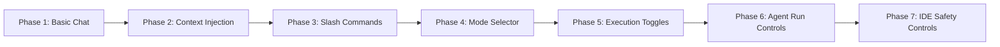

# COMPOSER_UX_COMPLETE_SPECIFICATION.md

**Version:** 1.0.0  
**Status:** AUTHORITATIVE SPECIFICATION  
**Audience:** Frontend Engineers, UX Designers, QA Engineers  
**Last Updated:** 2026-01-02  

---

## Table of Contents

1. [Executive Summary](#1-executive-summary)
2. [Progressive Disclosure Phases](#2-progressive-disclosure-phases)
3. [Component Inventory](#3-component-inventory)
4. [Layout Specifications](#4-layout-specifications)
5. [Keyboard Shortcuts](#5-keyboard-shortcuts)
6. [Accessibility Requirements](#6-accessibility-requirements)
7. [Animation & Transitions](#7-animation--transitions)
8. [Error States & Edge Cases](#8-error-states--edge-cases)
9. [Example User Flows](#9-example-user-flows)

---

## 1. Executive Summary

### 1.1 Purpose and Scope

This specification defines the complete user experience for the DevGuide Cockpit Chat Composer—a developer-focused AI chat interface with progressive disclosure features. The composer serves as the primary interaction surface for developers communicating with AI agents across all dashboard contexts.

**Scope includes:**
- All 7 progressive disclosure phases
- Complete component inventory with states
- Layout configurations (narrow and power-user modes)
- Keyboard shortcuts and accessibility requirements
- Animation specifications and error handling
- Implementation-ready specifications for Elm frontend

**Out of scope:**
- Backend API specifications (see ARTIFACT_04)
- Database schemas (see ARTIFACT_05)
- Security requirements (see ARTIFACT_13)

### 1.2 Target Audience

| Audience | Role | Use of This Document |
|----------|------|---------------------|
| Frontend Engineers | Implement UI components | Primary reference for all Elm code |
| UX Designers | Validate implementation | Verify design intent preserved |
| QA Engineers | Write test cases | Define acceptance criteria |
| Product Managers | Prioritize features | Understand phase dependencies |
| Accessibility Specialists | Audit compliance | Verify WCAG requirements |

### 1.3 Key Principles

**"Narrow, Learnable, and Power-User Fast"**

This guiding principle manifests in three design pillars:

| Principle | Implementation |
|-----------|---------------|
| **Narrow** | Start with minimal controls; add complexity only as needed |
| **Learnable** | Each phase teaches one new concept before introducing the next |
| **Power-User Fast** | Full keyboard control; muscle memory optimization; zero mouse requirement |

**Design Philosophy:**
- Progressive disclosure reduces cognitive load for new users
- Power users access all features without traversing menus
- Every control earns its place through demonstrated user need
- Consistency across all surfaces (Inputs, Reasoning, Outputs)

### 1.4 Visual Reference

The composer appears within the Reasoning surface of the tri-surface workbench:

```
┌─────────────────────────────────────────────────────────────────────────────┐
│  DevGuide Cockpit — Chat Workbench                    Token: 45K/100K      │
├─────────────────────────────────────────────────────────────────────────────┤
│                                                                             │
│  ┌─────────┐  ┌───────────────────────────────────────────┐  ┌──────────┐  │
│  │ INPUTS  │  │              REASONING                    │  │ OUTPUTS  │  │
│  │(surface)│  │  (Active Surface with Composer)           │  │(surface) │  │
│  │         │  │                                           │  │          │  │
│  │ Vertical│  │  [Chat messages with checkboxes]          │  │ Vertical │  │
│  │ "INPUTS"│  │                                           │  │"OUTPUTS" │  │
│  │ label   │  │  ┌───────────────────────────────────┐    │  │ label    │  │
│  │ when    │  │  │ Type @ to add context, / for cmd │    │  │ when     │  │
│  │collapsed│  │  ├───────────────────────────────────┤    │  │collapsed │  │
│  │         │  │  │ + Tools    [Web] [Fast]  [Send]  │    │  │          │  │
│  │         │  │  └───────────────────────────────────┘    │  │          │  │
│  │         │  │  @ PRD.md  @ spec.yaml  Skill: X  Mode:Y │  │          │  │
│  └─────────┘  └───────────────────────────────────────────┘  └──────────┘  │
├─────────────────────────────────────────────────────────────────────────────┤
│  THE BIN    ⚠ Update formatter... [View Diff] [Accept] [Reject]  2 Pending │
└─────────────────────────────────────────────────────────────────────────────┘
```

---

## 2. Progressive Disclosure Phases

Progressive disclosure introduces composer features incrementally across 7 phases. Each phase unlocks upon demonstrated user proficiency or explicit activation.

### 2.1 Phase Overview



| Phase | Name | Unlock Trigger | User Capability |
|-------|------|----------------|-----------------|
| 1 | Basic Chat | Default | Send messages, attach files |
| 2 | Context Injection | First @ typed | Reference files/folders |
| 3 | Slash Commands | First / typed | Execute commands |
| 4 | Mode Selector | 10 messages sent | Switch Ask/Edit/Agent/Plan |
| 5 | Execution Toggles | Mode changed 3x | Control Web/Effort |
| 6 | Agent Run Controls | First agent task | Stop, monitor progress |
| 7 | IDE Safety Controls | First code edit | Apply/Review checkpoints |

---

### 2.2 Phase 1: Basic Chat (Send + Attach)

**User Capability Unlocked:**  
Users can type messages and attach files to send to the AI agent.

**UI Components Added:**

| Component | Location | Purpose |
|-----------|----------|---------|
| Input Field | Center | Auto-growing text input (1-8 lines) |
| Send Button | Right Rail | Submit message to agent |
| Attach Button | Left Rail | Open file picker dialog |

**Visual Specification:**

```
┌──────────────────────────────────────────────────────────────────┐
│  Type your message here...                                       │
├──────────────────────────────────────────────────────────────────┤
│  [+ Attach]                                             [Send]   │
└──────────────────────────────────────────────────────────────────┘
```

**UX Requirements:**

| ID | Requirement | Rationale |
|----|-------------|-----------|
| P1-01 | Input field SHALL auto-grow from 1 to 8 lines maximum | Prevents scroll fatigue; maintains context visibility |
| P1-02 | Input field SHALL collapse to single line when empty | Maximizes chat history visibility |
| P1-03 | Send button SHALL be disabled when input is empty | Prevents accidental empty submissions |
| P1-04 | Send button SHALL show loading spinner during submission | Provides immediate feedback |
| P1-05 | Attach button SHALL support drag-and-drop onto input field | Matches developer mental model |
| P1-06 | Attached files SHALL appear as removable chips below input | Provides clear attachment status |
| P1-07 | Enter key SHALL send message (single line mode) | Matches chat muscle memory |
| P1-08 | Shift+Enter SHALL insert newline | Enables multi-line composition |
| P1-09 | Cmd/Ctrl+Enter SHALL always send regardless of line count | Predictable send shortcut |

**Accessibility Considerations:**

| Requirement | Implementation |
|-------------|---------------|
| Input field | `role="textbox"` with `aria-label="Message input"` |
| Send button | `aria-label="Send message"` with disabled state announced |
| Attach button | `aria-label="Attach file"` |
| Focus order | Attach → Input → Send (left to right) |
| Screen reader | Announce "Message sent" on successful submission |

**Example User Flow:**

1. User clicks input field or presses Tab to focus
2. User types "How do I implement authentication?"
3. Input field grows to accommodate text (max 8 lines)
4. Send button becomes enabled (orange fill appears)
5. User presses Enter or clicks Send
6. Input clears, spinner shows briefly
7. Message appears in chat history
8. Focus returns to input field

**Success Metrics:**

| Metric | Target | Measurement |
|--------|--------|-------------|
| Message submission success rate | ≥99.5% | Messages sent / Messages attempted |
| Time to first message | <30 seconds | Onboarding funnel timing |
| Attachment success rate | ≥95% | Files attached / Attachment attempts |

---

### 2.3 Phase 2: Context Injection (@ Mentions + Chips)

**User Capability Unlocked:**  
Users can reference specific files, folders, or artifacts using @-mention syntax.

**UI Components Added:**

| Component | Location | Purpose |
|-----------|----------|---------|
| @-mention Trigger | Input Field | Activates context picker |
| Context Picker | Dropdown | Searchable file/folder list |
| Context Chips | Below Input | Shows attached context items |

**Visual Specification:**

```
┌──────────────────────────────────────────────────────────────────┐
│  Please review @│                                                │
│  ┌──────────────────────────┐                                    │
│  │ 📄 README.md             │                                    │
│  │ 📁 src/                  │                                    │
│  │ 📄 package.json          │                                    │
│  │ 📄 PRD.md          ★     │                                    │
│  └──────────────────────────┘                                    │
├──────────────────────────────────────────────────────────────────┤
│  [+ Attach]                                             [Send]   │
├──────────────────────────────────────────────────────────────────┤
│  @ PRD.md  ×   @ src/  ×   @ README.md  ×                        │
└──────────────────────────────────────────────────────────────────┘
```

**UX Requirements:**

| ID | Requirement | Rationale |
|----|-------------|-----------|
| P2-01 | @ character SHALL trigger context picker immediately | No delay for power users |
| P2-02 | Context picker SHALL appear inline, below cursor position | Minimizes eye movement |
| P2-03 | Context picker SHALL support type-ahead filtering | Fast navigation for large projects |
| P2-04 | Arrow keys SHALL navigate picker options | Keyboard-first workflow |
| P2-05 | Enter/Tab SHALL confirm selection | Standard autocomplete pattern |
| P2-06 | Escape SHALL dismiss picker without selection | Easy cancel mechanism |
| P2-07 | Selected contexts SHALL appear as chips below input | Clear visual confirmation |
| P2-08 | Chips SHALL include × button for removal | Easy context management |
| P2-09 | Chips SHALL show token count on hover | Cost awareness |
| P2-10 | Maximum 10 context items per message | Prevent context overflow |
| P2-11 | Context picker SHALL show recently used items first | Accelerates repeat workflows |
| P2-12 | ★ indicator SHALL mark frequently used items | Pattern recognition assist |

**Chip Visual States:**

| State | Background | Border | Icon |
|-------|------------|--------|------|
| Default | `gray-800` | `gray-600` | file/folder icon |
| Hover | `gray-700` | `gray-500` | × button visible |
| Focused | `gray-700` | `orange-500` | × button visible |
| Removing | `red-900` | `red-500` | × animating |

**Accessibility Considerations:**

| Requirement | Implementation |
|-------------|---------------|
| Context picker | `role="listbox"` with `aria-label="Select context"` |
| Picker options | `role="option"` with `aria-selected` state |
| Context chips | `role="list"` with individual `role="listitem"` |
| Chip removal | `aria-label="Remove [filename] from context"` |
| Token count | `aria-describedby` for hover tooltip content |
| Announcements | "Context picker opened", "Selected [filename]" |

**Example User Flow:**

1. User types "Can you review @"
2. Context picker appears showing recent/relevant files
3. User types "prd" to filter
4. "PRD.md" option highlights
5. User presses Enter to select
6. "@PRD.md" inserts into input, picker closes
7. PRD.md chip appears below input
8. User continues typing "and suggest improvements"
9. User presses Send
10. Message includes full PRD.md content as context

**Success Metrics:**

| Metric | Target | Measurement |
|--------|--------|-------------|
| Context selection completion rate | ≥90% | Selections confirmed / Picker opened |
| Average contexts per message | 1.5-3 | Context chips / Messages sent |
| Time to select context | <3 seconds | Picker open → Selection confirmed |

---

### 2.4 Phase 3: Slash Commands (/ Palette)

**User Capability Unlocked:**  
Users can execute predefined commands via slash syntax.

**UI Components Added:**

| Component | Location | Purpose |
|-----------|----------|---------|
| /-command Trigger | Input Field | Activates command palette |
| Command Palette | Dropdown | Searchable command list |
| Command Preview | Palette Item | Shows command description |

**Visual Specification:**

```
┌──────────────────────────────────────────────────────────────────┐
│  /│                                                              │
│  ┌──────────────────────────────────────────────────────────────┐│
│  │ /explain     Explain selected code in detail                 ││
│  │ /refactor    Suggest refactoring improvements                ││
│  │ /test        Generate unit tests for selection               ││
│  │ /fix         Fix errors in selected code                     ││
│  │ /summarize   Summarize document or conversation              ││
│  │ ─────────────────────────────────────────────────────────────││
│  │ /custom      Create custom command...                        ││
│  └──────────────────────────────────────────────────────────────┘│
├──────────────────────────────────────────────────────────────────┤
│  [+ Tools]                                              [Send]   │
└──────────────────────────────────────────────────────────────────┘
```

**UX Requirements:**

| ID | Requirement | Rationale |
|----|-------------|-----------|
| P3-01 | / character at start of input SHALL trigger command palette | IDE-familiar pattern |
| P3-02 | / character mid-sentence SHALL NOT trigger palette | Allows natural typing |
| P3-03 | Command palette SHALL categorize commands (Built-in, Custom, Recent) | Organized discovery |
| P3-04 | Each command SHALL display name + short description | Self-documenting |
| P3-05 | Type-ahead filtering SHALL match command name and description | Fuzzy finding |
| P3-06 | Tab SHALL insert command with placeholders if parameters needed | Guided completion |
| P3-07 | Commands with parameters SHALL show inline hints | Clear expectations |
| P3-08 | Invalid commands SHALL show "Command not found" error | Clear feedback |
| P3-09 | Custom commands section SHALL link to command editor | Extensibility path |
| P3-10 | Recent commands (last 5) SHALL appear at top of palette | Accelerated repeat use |

**Command Categories:**

| Category | Icon | Examples |
|----------|------|----------|
| Code | `</>` | /explain, /refactor, /test, /fix |
| Writing | `📝` | /summarize, /expand, /simplify |
| Navigation | `🔍` | /find, /goto, /search |
| Agent | `🤖` | /agent, /plan, /execute |
| Custom | `âš¡` | User-defined commands |

**Accessibility Considerations:**

| Requirement | Implementation |
|-------------|---------------|
| Command palette | `role="listbox"` with `aria-label="Command palette"` |
| Command items | `role="option"` with description in `aria-describedby` |
| Categories | `role="group"` with `aria-label="[Category] commands"` |
| Keyboard nav | Arrow keys navigate, Enter selects, Escape closes |
| Announcements | "Command palette opened, X commands available" |

**Example User Flow:**

1. User positions cursor at start of empty input
2. User types "/"
3. Command palette appears with categorized commands
4. User types "test" to filter
5. "/test" option highlights
6. User presses Tab
7. Input shows "/test [select code to test]"
8. User selects code context using @
9. User presses Send
10. Agent generates unit tests for selected code

**Success Metrics:**

| Metric | Target | Measurement |
|--------|--------|-------------|
| Command discovery rate | ≥40% | Unique commands used / Total commands available |
| Command completion rate | ≥85% | Commands executed / Commands started |
| Custom command creation | ≥10% users | Users with ≥1 custom command |

---

### 2.5 Phase 4: Mode Selector (Ask/Edit/Agent/Plan)

**User Capability Unlocked:**  
Users can switch between interaction modes optimized for different tasks.

**UI Components Added:**

| Component | Location | Purpose |
|-----------|----------|---------|
| Mode Selector | Left Rail | Radio button group for modes |
| Mode Indicator Chip | Below Input | Shows current active mode |

**Visual Specification:**

```
┌──────────────────────────────────────────────────────────────────┐
│  Type your message here...                                       │
├──────────────────────────────────────────────────────────────────┤
│  [+ Tools]  [Mode ▾]                         [Web] [Fast] [Send] │
│             ┌────────────────────┐                               │
│             │ ○ Ask    (default) │                               │
│             │ ● Edit             │                               │
│             │ ○ Agent            │                               │
│             │ ○ Plan             │                               │
│             └────────────────────┘                               │
├──────────────────────────────────────────────────────────────────┤
│  @ PRD.md  ×     Mode: Edit                                      │
└──────────────────────────────────────────────────────────────────┘
```

**Mode Definitions:**

| Mode | Purpose | Agent Behavior | Token Usage |
|------|---------|----------------|-------------|
| **Ask** | Q&A, explanations, analysis | Responds directly, no file changes | Low |
| **Edit** | Code/content modification | Proposes diffs, awaits approval | Medium |
| **Agent** | Autonomous multi-step tasks | Executes steps, reports progress | High |
| **Plan** | Strategy and architecture | Outlines approach, awaits confirmation | Medium |

**UX Requirements:**

| ID | Requirement | Rationale |
|----|-------------|-----------|
| P4-01 | Mode selector SHALL default to "Ask" mode | Safest default behavior |
| P4-02 | Mode chip SHALL persist below input showing active mode | Constant awareness |
| P4-03 | Mode change SHALL NOT require confirmation | Fluid workflow |
| P4-04 | Mode change during active task SHALL warn user | Prevent confusion |
| P4-05 | Each mode SHALL have distinct visual indicator color | Quick recognition |
| P4-06 | Mode descriptions SHALL appear on hover | Self-documenting |
| P4-07 | Keyboard shortcut Cmd/Ctrl+M SHALL cycle modes | Power user acceleration |
| P4-08 | Mode selector dropdown SHALL close on selection | Clean interaction |
| P4-09 | Current mode SHALL be announced to screen readers | Accessibility compliance |
| P4-10 | "Agent" mode SHALL show warning on first selection | Cost/safety awareness |

**Mode Visual Indicators:**

| Mode | Chip Color | Icon | Keyboard Hint |
|------|------------|------|---------------|
| Ask | Blue | `?` | Cmd+M → 1 |
| Edit | Yellow | `✏️` | Cmd+M → 2 |
| Agent | Purple | `🤖` | Cmd+M → 3 |
| Plan | Green | `📋` | Cmd+M → 4 |

**Accessibility Considerations:**

| Requirement | Implementation |
|-------------|---------------|
| Mode selector | `role="radiogroup"` with `aria-label="Interaction mode"` |
| Mode options | `role="radio"` with `aria-checked` state |
| Mode chip | `role="status"` with `aria-live="polite"` |
| Mode descriptions | `aria-describedby` for each option |
| Announcements | "Mode changed to [mode name]" |

**Example User Flow:**

1. User has been using Ask mode for 10 messages (unlock trigger)
2. Mode selector appears in left rail
3. User clicks Mode dropdown
4. Options appear: Ask (selected), Edit, Agent, Plan
5. User hovers over "Edit" - tooltip shows "Proposes diffs, awaits approval"
6. User clicks "Edit"
7. Dropdown closes, Mode: Edit chip appears below input
8. User types "Refactor this function to use async/await"
9. Agent responds with proposed diff
10. Diff appears in The Bin for review

**Success Metrics:**

| Metric | Target | Measurement |
|--------|--------|-------------|
| Mode switching adoption | ≥30% users | Users who switch modes / Total users |
| Edit mode usage | ≥20% of sessions | Sessions with Edit mode / Total sessions |
| Agent mode completion rate | ≥75% | Agent tasks completed / Agent tasks started |

---

### 2.6 Phase 5: Execution Toggles (Web + Fast/Deep)

**User Capability Unlocked:**  
Users can control web access and processing depth for AI responses.

**UI Components Added:**

| Component | Location | Purpose |
|-----------|----------|---------|
| Web Toggle | Right Rail | Enable/disable web search |
| Effort Toggle | Right Rail | Switch between Fast/Deep processing |

**Visual Specification:**

```
┌──────────────────────────────────────────────────────────────────┐
│  Type your message here...                                       │
├──────────────────────────────────────────────────────────────────┤
│  [+ Tools]  [Mode: Ask]                      [Web] [Fast] [Send] │
│                                               ┌─────────────────┐│
│                                               │ ○ Fast (default)││
│                                               │ ● Deep          ││
│                                               └─────────────────┘│
└──────────────────────────────────────────────────────────────────┘
```

**Toggle Definitions:**

| Toggle | States | Purpose | Token Impact |
|--------|--------|---------|--------------|
| **Web** | On/Off | Include live web search results | +20-50% tokens |
| **Effort** | Fast/Deep | Processing depth and reasoning | Deep = 2-3x tokens |

**UX Requirements:**

| ID | Requirement | Rationale |
|----|-------------|-----------|
| P5-01 | Web toggle SHALL default to OFF | Cost control |
| P5-02 | Effort toggle SHALL default to "Fast" | Speed optimization |
| P5-03 | Toggle states SHALL persist per session | Consistent behavior |
| P5-04 | Web toggle SHALL show globe icon with on/off state | Clear visual indicator |
| P5-05 | Effort toggle SHALL show gauge icon (half/full) | Intuitive metaphor |
| P5-06 | Toggles SHALL update token estimate in real-time | Cost transparency |
| P5-07 | Deep mode SHALL show tooltip explaining impact | Informed decisions |
| P5-08 | Web toggle ON SHALL show active indicator dot | State visibility |
| P5-09 | Keyboard shortcut Cmd+W SHALL toggle Web | Power user shortcut |
| P5-10 | Keyboard shortcut Cmd+D SHALL toggle Effort | Power user shortcut |

**Toggle Visual States:**

| Toggle | State | Background | Border | Icon Color |
|--------|-------|------------|--------|------------|
| Web | Off | `gray-800` | `gray-600` | `gray-400` |
| Web | On | `blue-900` | `blue-500` | `blue-400` |
| Effort | Fast | `gray-800` | `gray-600` | `gray-400` |
| Effort | Deep | `purple-900` | `purple-500` | `purple-400` |

**Accessibility Considerations:**

| Requirement | Implementation |
|-------------|---------------|
| Web toggle | `role="switch"` with `aria-checked` state |
| Effort toggle | `role="switch"` with `aria-checked` state |
| Labels | `aria-label="Web search [on/off]"`, `aria-label="Processing depth [fast/deep]"` |
| Token impact | `aria-describedby` for estimated token change |
| Announcements | "Web search enabled", "Deep processing enabled" |

**Example User Flow:**

1. User has changed modes 3 times (unlock trigger)
2. Web and Effort toggles appear in right rail
3. User hovers over Web toggle - tooltip shows "Include live web search results (+20-50% tokens)"
4. User clicks Web toggle - it turns blue with active indicator
5. Token estimate updates from "~2K" to "~3K"
6. User clicks Effort toggle dropdown
7. Selects "Deep"
8. Token estimate updates to "~7K"
9. User types question about recent news
10. Agent searches web, provides comprehensive analysis

**Success Metrics:**

| Metric | Target | Measurement |
|--------|--------|-------------|
| Web toggle adoption | ≥25% users | Users who enable Web / Total users |
| Deep mode usage | ≥15% of queries | Queries with Deep / Total queries |
| Token estimate accuracy | ±20% | Estimated vs actual tokens |

---

### 2.7 Phase 6: Agent Run Controls (Stop, Progress, Queue)

**User Capability Unlocked:**  
Users can monitor and control multi-step agent tasks.

**UI Components Added:**

| Component | Location | Purpose |
|-----------|----------|---------|
| Stop Button | Right Rail (replaces Send) | Cancel running task |
| Progress Indicator | Input Area | Shows current step/total |
| Queue Indicator | Secondary Strip | Shows pending tasks |

**Visual Specification:**

```
┌──────────────────────────────────────────────────────────────────┐
│  Agent is working... Step 3 of 7: Analyzing dependencies         │
│  ████████████░░░░░░░░░░░░░░░░░░░░░░░░░░░░░ 42%                   │
├──────────────────────────────────────────────────────────────────┤
│  [+ Tools]  [Mode: Agent]                    [Web] [Deep] [Stop] │
├──────────────────────────────────────────────────────────────────┤
│  Queue: 2 tasks pending                                          │
└──────────────────────────────────────────────────────────────────┘
```

**UX Requirements:**

| ID | Requirement | Rationale |
|----|-------------|-----------|
| P6-01 | Send button SHALL morph to Stop button during agent execution | Context-appropriate action |
| P6-02 | Stop button SHALL be red with square icon | Universal stop convention |
| P6-03 | Progress bar SHALL show determinate progress when steps known | Expectation setting |
| P6-04 | Progress bar SHALL show indeterminate animation when steps unknown | Activity indication |
| P6-05 | Current step description SHALL display above progress bar | Transparency into process |
| P6-06 | Queue indicator SHALL show count of pending tasks | Workload awareness |
| P6-07 | Clicking queue indicator SHALL expand queue panel | Task management access |
| P6-08 | Stop SHALL request graceful cancellation first | Safe termination |
| P6-09 | Stop SHALL force cancel after 5 second timeout | Escape hatch |
| P6-10 | Completed steps SHALL remain visible in chat | Audit trail |
| P6-11 | Escape key SHALL trigger Stop action | Keyboard emergency stop |

**Button State Transitions:**

```
Send (idle) → Stop (running) → Send (complete)
     ↓              ↓              ↓
  [orange]      [red pulse]    [orange]
```

**Accessibility Considerations:**

| Requirement | Implementation |
|-------------|---------------|
| Progress bar | `role="progressbar"` with `aria-valuenow`, `aria-valuemin`, `aria-valuemax` |
| Progress description | `aria-label="Step 3 of 7: Analyzing dependencies"` |
| Stop button | `aria-label="Stop agent task"` |
| Queue indicator | `role="status"` with `aria-live="polite"` |
| Announcements | "Agent started", "Step X of Y: [description]", "Agent stopped" |

**Example User Flow:**

1. User starts first Agent mode task (unlock trigger)
2. Send button morphs to red Stop button
3. Progress bar appears: "Step 1 of 5: Reading codebase"
4. Progress updates as each step completes
5. User queues second task while first runs
6. Queue indicator shows "1 task pending"
7. First task completes, second auto-starts
8. User presses Escape to stop second task
9. Confirmation appears: "Stop current task?"
10. User confirms, agent gracefully stops

**Success Metrics:**

| Metric | Target | Measurement |
|--------|--------|-------------|
| Agent task completion rate | ≥80% | Tasks completed / Tasks started |
| Stop button usage | <15% | Tasks stopped / Tasks started |
| Queue utilization | ≥20% | Sessions with queued tasks |

---

### 2.8 Phase 7: IDE Safety Controls (Apply/Review + Checkpoints)

**User Capability Unlocked:**  
Users can review and approve code changes with checkpoint management.

**UI Components Added:**

| Component | Location | Purpose |
|-----------|----------|---------|
| Apply Button | The Bin | Execute approved changes |
| Review Button | The Bin | Open diff viewer |
| Checkpoint Indicator | Header | Show current checkpoint state |
| Rollback Option | Checkpoint Menu | Revert to previous state |

**Visual Specification:**

```
┌─────────────────────────────────────────────────────────────────────────────┐
│  DevGuide Cockpit — Chat Workbench           🔖 Checkpoint: 3    Token: 45K │
├─────────────────────────────────────────────────────────────────────────────┤
│                                                                             │
│  [Chat messages above...]                                                   │
│                                                                             │
├─────────────────────────────────────────────────────────────────────────────┤
│  THE BIN                                                         2 Pending  │
│  ┌───────────────────────────────────────────────────────────────────────┐ │
│  │  ⚠ Update auth.js (Impact: Medium)                                    │ │
│  │  [View Diff] [Accept] [Reject]                                        │ │
│  ├───────────────────────────────────────────────────────────────────────┤ │
│  │  ✏️ Create test_auth.js (Impact: Low)                                  │ │
│  │  [View Diff] [Accept] [Reject]                                        │ │
│  └───────────────────────────────────────────────────────────────────────┘ │
│                                      [Accept All] [Reject All] [Apply →]   │
└─────────────────────────────────────────────────────────────────────────────┘
```

**UX Requirements:**

| ID | Requirement | Rationale |
|----|-------------|-----------|
| P7-01 | All code changes SHALL route through The Bin for review | Safety by default |
| P7-02 | View Diff SHALL open side-by-side comparison | Clear change visibility |
| P7-03 | Accept SHALL mark change as approved (not applied) | Staged approval |
| P7-04 | Apply SHALL execute all accepted changes atomically | Consistent state |
| P7-05 | Reject SHALL remove change from queue with optional reason | Feedback loop |
| P7-06 | Checkpoint SHALL auto-create before Apply | Rollback safety net |
| P7-07 | Checkpoint indicator SHALL show current checkpoint number | State awareness |
| P7-08 | Clicking checkpoint SHALL show checkpoint menu | Access to history |
| P7-09 | Rollback SHALL revert to selected checkpoint | Recovery mechanism |
| P7-10 | Impact indicators (Low/Medium/High) SHALL appear on each change | Risk awareness |
| P7-11 | High impact changes SHALL require explicit confirmation | Extra safety |
| P7-12 | Accept All/Reject All SHALL be available for bulk operations | Efficiency for trusted changes |

**Impact Level Definitions:**

| Level | Color | Criteria | Action Required |
|-------|-------|----------|-----------------|
| Low | Green | New files, comments, tests | Accept/Reject |
| Medium | Yellow | Modify existing code | Accept/Reject |
| High | Red | Delete files, modify configs | Explicit confirmation |

**Accessibility Considerations:**

| Requirement | Implementation |
|-------------|---------------|
| Bin items | `role="listitem"` with `aria-label="[action] [filename], Impact: [level]"` |
| Diff viewer | Full keyboard navigation with line-by-line traversal |
| Accept/Reject buttons | `aria-label="Accept change to [filename]"` |
| Checkpoint indicator | `role="button"` with `aria-haspopup="menu"` |
| Rollback confirmation | Focus trap in confirmation dialog |
| Announcements | "Change accepted", "Checkpoint created", "Rolled back to checkpoint 2" |

**Example User Flow:**

1. User triggers first Edit mode change (unlock trigger)
2. Proposed change appears in The Bin with impact indicator
3. User clicks "View Diff"
4. Side-by-side diff opens showing before/after
5. User reviews changes, clicks "Accept"
6. Change moves to "Accepted" state (green checkmark)
7. User triggers second change, also accepts
8. User clicks "Apply →"
9. Confirmation: "Apply 2 changes? Checkpoint will be created."
10. User confirms, changes applied, checkpoint 4 created
11. User realizes mistake, clicks checkpoint indicator
12. Selects "Rollback to Checkpoint 3"
13. Changes reverted, The Bin cleared

**Success Metrics:**

| Metric | Target | Measurement |
|--------|--------|-------------|
| Change review rate | 100% | Changes reviewed / Changes proposed |
| Accept rate | ≥70% | Changes accepted / Changes proposed |
| Rollback rate | <10% | Rollbacks / Apply operations |
| Checkpoint utilization | ≥50% | Sessions with ≥1 rollback check |

---

## 3. Component Inventory

### 3.1 Left Rail Components

| Component | Purpose | States | Shortcut | ARIA Label |
|-----------|---------|--------|----------|------------|
| **+ Tools** | Open tools/attach menu | default, hover, active | Cmd+T | "Add tools or attachments" |
| **Mode Selector** | Switch interaction mode | default, hover, open, selected | Cmd+M | "Interaction mode" |
| **Prompt Hub** | Access agent/skill library | default, hover, active | Cmd+K | "Prompt Control Hub" |

**+ Tools Button Specification:**

```elm
type ToolsButtonState
    = Default
    | Hover
    | Active
    | Disabled

viewToolsButton : ToolsButtonState -> Html Msg
viewToolsButton state =
    button
        [ class (toolsButtonClass state)
        , onClick OpenToolsMenu
        , Attr.attribute "aria-label" "Add tools or attachments"
        , Attr.attribute "aria-haspopup" "menu"
        , tabindex 0
        ]
        [ Icons.plus
        , span [] [ text "Tools" ]
        ]
```

**Visual States:**

| State | Background | Border | Text |
|-------|------------|--------|------|
| Default | `transparent` | `gray-600` | `gray-300` |
| Hover | `gray-800` | `gray-500` | `white` |
| Active | `gray-700` | `orange-500` | `white` |
| Disabled | `transparent` | `gray-700` | `gray-500` |

---

### 3.2 Input Area Components

| Component | Purpose | States | Behavior |
|-----------|---------|--------|----------|
| **Text Input** | Message composition | empty, typing, multiline, disabled | Auto-grow 1-8 lines |
| **Placeholder** | Usage hint | visible (empty), hidden (typing) | "Type @ to add context, / for commands" |
| **Context Picker** | File/folder selection | closed, open, filtering | Dropdown below cursor |
| **Command Palette** | Command execution | closed, open, filtering | Dropdown overlay |

**Text Input Specification:**

```elm
type alias InputModel =
    { content : String
    , cursorPosition : Int
    , lineCount : Int
    , isFocused : Bool
    , isDisabled : Bool
    }

viewInput : InputModel -> Html Msg
viewInput model =
    textarea
        [ class (inputClass model)
        , value model.content
        , onInput UpdateContent
        , onFocus InputFocused
        , onBlur InputBlurred
        , rows (min model.lineCount 8)
        , placeholder "Type @ to add context, / for commands"
        , Attr.attribute "aria-label" "Message input"
        , Attr.attribute "aria-multiline" "true"
        , disabled model.isDisabled
        ]
        []
```

---

### 3.3 Right Rail Components

| Component | Purpose | States | Shortcut | ARIA Label |
|-----------|---------|--------|----------|------------|
| **Web Toggle** | Enable web search | off, on | Cmd+W | "Web search" |
| **Effort Toggle** | Set processing depth | fast, deep | Cmd+D | "Processing depth" |
| **Send Button** | Submit message | default, hover, loading, disabled | Enter | "Send message" |
| **Stop Button** | Cancel task | default, hover, stopping | Escape | "Stop agent task" |

**Send/Stop Button Specification:**

```elm
type ButtonMode
    = SendMode SendState
    | StopMode StopState

type SendState
    = SendDefault
    | SendHover
    | SendLoading
    | SendDisabled

type StopState
    = StopDefault
    | StopHover
    | StopStopping

viewActionButton : ButtonMode -> Html Msg
viewActionButton mode =
    case mode of
        SendMode state ->
            button
                [ class (sendButtonClass state)
                , onClick SendMessage
                , Attr.attribute "aria-label" "Send message"
                , disabled (state == SendDisabled)
                ]
                [ if state == SendLoading then
                    Icons.spinner
                  else
                    text "Send"
                ]
        
        StopMode state ->
            button
                [ class (stopButtonClass state)
                , onClick StopTask
                , Attr.attribute "aria-label" "Stop agent task"
                ]
                [ Icons.square
                , text "Stop"
                ]
```

**Send Button Visual States:**

| State | Background | Border | Text | Animation |
|-------|------------|--------|------|-----------|
| Default | `orange-600` | `none` | `white` | none |
| Hover | `orange-500` | `none` | `white` | none |
| Loading | `orange-700` | `none` | `spinner` | spin 1s linear infinite |
| Disabled | `gray-700` | `gray-600` | `gray-400` | none |

**Stop Button Visual States:**

| State | Background | Border | Text | Animation |
|-------|------------|--------|------|-----------|
| Default | `red-600` | `none` | `white` | pulse 2s ease-in-out infinite |
| Hover | `red-500` | `none` | `white` | none |
| Stopping | `red-700` | `none` | `spinner` | spin 1s linear infinite |

---

### 3.4 Secondary Strip Components

| Component | Purpose | Location | Visibility |
|-----------|---------|----------|------------|
| **Token Counter** | Show token usage | Top right header | Always |
| **Context Chips** | Display attached context | Below input | When context attached |
| **Mode Chip** | Show active mode | Below input | Phase 4+ |
| **Queue Indicator** | Show pending tasks | Below input | When tasks queued |

**Context Chips Specification:**

```elm
type alias ContextChip =
    { id : String
    , name : String
    , chipType : ChipType
    , tokenCount : Int
    , isRemovable : Bool
    }

type ChipType
    = FileChip
    | FolderChip
    | SkillChip
    | ModeChip

viewContextChips : List ContextChip -> Html Msg
viewContextChips chips =
    div
        [ class "context-chips"
        , Attr.attribute "role" "list"
        , Attr.attribute "aria-label" "Attached context"
        ]
        (List.map viewChip chips)

viewChip : ContextChip -> Html Msg
viewChip chip =
    span
        [ class (chipClass chip.chipType)
        , Attr.attribute "role" "listitem"
        , Attr.attribute "aria-label" (chipLabel chip)
        ]
        [ chipIcon chip.chipType
        , text chip.name
        , if chip.isRemovable then
            button
                [ class "chip-remove"
                , onClick (RemoveContext chip.id)
                , Attr.attribute "aria-label" ("Remove " ++ chip.name)
                ]
                [ Icons.x ]
          else
            text ""
        ]
```

---

### 3.5 Hidden/Advanced Components

Components available through Layout Edit Mode:

| Component | Default Visibility | Purpose |
|-----------|-------------------|---------|
| **Project Selector** | Hidden | Switch active project context |
| **Model Selector** | Hidden | Choose AI model variant |
| **Temperature Control** | Hidden | Adjust response creativity |
| **System Prompt Editor** | Hidden | Customize base instructions |

---

## 4. Layout Specifications

### 4.1 Default Layout (Narrow Mode)

The default layout optimizes for focused conversation with minimal visual clutter.

```
┌────────────────────────────────────────────────────────────────┐
│  COMPOSER (Default Layout - 600px min width)                   │
├────────────────────────────────────────────────────────────────┤
│                                                                │
│  ┌──────────────────────────────────────────────────────────┐  │
│  │  Input Field (auto-grow 1-8 lines)                       │  │
│  │  Placeholder: "Type @ to add context, / for commands"    │  │
│  └──────────────────────────────────────────────────────────┘  │
│                                                                │
│  ┌────────┐                              ┌─────┬─────┬──────┐  │
│  │+ Tools │                              │ Web │ Fast│ Send │  │
│  └────────┘                              └─────┴─────┴──────┘  │
│   Left Rail                                      Right Rail    │
│                                                                │
│  ┌──────────────────────────────────────────────────────────┐  │
│  │  Context Chips: @ file.md × | @ folder/ × | Mode: Ask    │  │
│  └──────────────────────────────────────────────────────────┘  │
│   Secondary Strip                                              │
│                                                                │
└────────────────────────────────────────────────────────────────┘
```

**Spacing Rules (Default Layout):**

| Element | Spacing | Value |
|---------|---------|-------|
| Composer padding | All sides | 16px |
| Input field margin | Bottom | 12px |
| Rail gap | Between left and right | flex-grow |
| Button gap | Between buttons | 8px |
| Chip gap | Between chips | 8px |
| Secondary strip margin | Top | 8px |

---

### 4.2 Advanced Layout (Power User Mode)

Power user mode exposes all controls simultaneously.

```
┌────────────────────────────────────────────────────────────────────────────┐
│  COMPOSER (Advanced Layout - 900px min width)                              │
├────────────────────────────────────────────────────────────────────────────┤
│                                                                            │
│  ┌────────────────────────────────────────────────────────────────────┐    │
│  │  Input Field (auto-grow 1-12 lines)                                │    │
│  └────────────────────────────────────────────────────────────────────┘    │
│                                                                            │
│  ┌──────┬──────┬────────┐                    ┌─────┬──────┬─────┬──────┐   │
│  │+ Tool│ Hub  │Mode ▾  │                    │ Web │ Deep │Token│ Send │   │
│  └──────┴──────┴────────┘                    └─────┴──────┴─────┴──────┘   │
│   Left Rail (Expanded)                        Right Rail (Expanded)        │
│                                                                            │
│  ┌────────────────────────────────────────────────────────────────────┐    │
│  │  @ file.md × | @ folder/ × | Skill: citations | Mode: Edit | Queue: 1  │
│  └────────────────────────────────────────────────────────────────────┘    │
│   Secondary Strip (Expanded)                                               │
│                                                                            │
└────────────────────────────────────────────────────────────────────────────┘
```

**Spacing Rules (Advanced Layout):**

| Element | Spacing | Value |
|---------|---------|-------|
| Composer padding | All sides | 20px |
| Input field margin | Bottom | 16px |
| Input max lines | Maximum | 12 lines |
| Rail gap | Between left and right | flex-grow |
| Button gap | Between buttons | 12px |
| Chip gap | Between chips | 10px |
| Secondary strip margin | Top | 12px |

---

### 4.3 Responsive Breakpoints

| Breakpoint | Width | Layout Changes |
|------------|-------|----------------|
| **Mobile** | < 600px | Stacked layout, collapsed rails |
| **Tablet** | 600-899px | Default layout, single row rails |
| **Desktop** | 900-1199px | Advanced layout available |
| **Wide** | ≥ 1200px | Full advanced layout |

**Mobile Adaptations:**

```
┌──────────────────────────┐
│  Input Field             │
├──────────────────────────┤
│  [+ Tools]       [Send]  │
├──────────────────────────┤
│  @ file × | Mode: Ask    │
└──────────────────────────┘
```

- Hide Web/Effort toggles (accessible via Tools menu)
- Collapse Mode selector to icon only
- Stack chips horizontally with scroll

---

### 4.4 Alignment Rules

| Rule | Description |
|------|-------------|
| **Vertical alignment** | All rail buttons align to bottom of input field |
| **Horizontal alignment** | Left rail left-aligned, Right rail right-aligned |
| **Chip alignment** | Left-aligned, wrap to new rows |
| **Input alignment** | Full width minus rail space |
| **Button alignment** | Vertically centered within rail |

---

## 5. Keyboard Shortcuts

### 5.1 Global Shortcuts

| Shortcut | Action | Context | Phase |
|----------|--------|---------|-------|
| `Enter` | Send message (single line) | Input focused | 1+ |
| `Shift+Enter` | Insert newline | Input focused | 1+ |
| `Cmd/Ctrl+Enter` | Send message (any mode) | Input focused | 1+ |
| `Escape` | Close picker/palette/stop task | Any | 1+ |
| `Tab` | Move to next element | Any | 1+ |
| `Shift+Tab` | Move to previous element | Any | 1+ |

### 5.2 Composer Shortcuts

| Shortcut | Action | Context | Phase |
|----------|--------|---------|-------|
| `@` | Open context picker | Input, start of word | 2+ |
| `/` | Open command palette | Input, start of line | 3+ |
| `Cmd/Ctrl+M` | Cycle modes | Any | 4+ |
| `Cmd/Ctrl+W` | Toggle Web | Any | 5+ |
| `Cmd/Ctrl+D` | Toggle Deep/Fast | Any | 5+ |
| `Cmd/Ctrl+K` | Open Prompt Hub | Any | 4+ |
| `Cmd/Ctrl+T` | Open Tools menu | Any | 1+ |

### 5.3 Navigation Shortcuts

| Shortcut | Action | Context |
|----------|--------|---------|
| `↑` / `↓` | Navigate picker options | Picker open |
| `←` / `→` | Navigate chips | Chips focused |
| `Delete` / `Backspace` | Remove selected chip | Chip focused |
| `Home` | Go to first option | Picker open |
| `End` | Go to last option | Picker open |

### 5.4 Conflict Resolution

| Conflict | Resolution |
|----------|------------|
| `Enter` (send vs newline) | Single line = send, Multi-line = newline |
| `Escape` (picker vs task) | Close picker first, then stop task |
| `Cmd+M` (OS conflict) | Use `Alt+M` on Windows/Linux |

### 5.5 Customization Options

Users can customize shortcuts via Settings:

```json
{
  "shortcuts": {
    "sendMessage": "Cmd+Enter",
    "openContextPicker": "@",
    "openCommandPalette": "/",
    "cycleMode": "Cmd+M",
    "toggleWeb": "Cmd+W",
    "toggleEffort": "Cmd+D"
  },
  "customShortcuts": {
    "focusInput": "Cmd+L",
    "clearInput": "Cmd+Shift+Backspace"
  }
}
```

---

## 6. Accessibility Requirements

### 6.1 WCAG 2.1 AA Compliance Checklist

| Criterion | Requirement | Implementation |
|-----------|-------------|----------------|
| **1.1.1** Text Alternatives | All icons have text labels | `aria-label` on all icon buttons |
| **1.3.1** Info and Relationships | Logical structure | Semantic HTML, ARIA landmarks |
| **1.4.1** Use of Color | Not color alone | Icons + text + patterns |
| **1.4.3** Contrast (Minimum) | 4.5:1 text, 3:1 UI | Verified in dark theme |
| **1.4.11** Non-text Contrast | 3:1 for controls | All buttons meet requirement |
| **2.1.1** Keyboard | All functions keyboard accessible | Complete keyboard navigation |
| **2.1.2** No Keyboard Trap | Can Tab out of all elements | Focus management verified |
| **2.4.1** Bypass Blocks | Skip links available | Skip to input, skip to chat |
| **2.4.3** Focus Order | Logical Tab sequence | Left-to-right, top-to-bottom |
| **2.4.7** Focus Visible | Clear focus indicators | 3px orange outline |
| **3.2.1** On Focus | No unexpected changes | Focus doesn't trigger actions |
| **3.3.1** Error Identification | Errors clearly described | Inline error messages |
| **4.1.2** Name, Role, Value | Programmatic identification | ARIA attributes complete |

### 6.2 Screen Reader Support

**Announcements (via `aria-live` regions):**

| Event | Announcement | Priority |
|-------|-------------|----------|
| Message sent | "Message sent" | Polite |
| Message received | "New message from [agent]" | Polite |
| Context added | "[filename] added to context" | Polite |
| Context removed | "[filename] removed from context" | Polite |
| Mode changed | "Mode changed to [mode]" | Polite |
| Toggle changed | "[toggle] [on/off]" | Polite |
| Task started | "Agent task started" | Assertive |
| Task completed | "Agent task completed" | Assertive |
| Error occurred | "Error: [message]" | Assertive |

### 6.3 Keyboard Navigation

**Tab Order:**

1. Skip link (hidden until focused)
2. Tools button
3. Mode selector (if visible)
4. Hub button (if visible)
5. Input field
6. Web toggle (if visible)
7. Effort toggle (if visible)
8. Send/Stop button
9. Context chips (each chip)
10. The Bin items (if visible)

### 6.4 Focus Management

| Scenario | Focus Behavior |
|----------|----------------|
| Page load | Focus on input field |
| Message sent | Return focus to input field |
| Picker opened | Focus on first option |
| Picker closed (selection) | Return focus to input field |
| Picker closed (escape) | Return focus to input field |
| Modal opened | Focus trap within modal |
| Modal closed | Return focus to trigger element |
| Task completed | Focus on result summary |

### 6.5 ARIA Labels and Roles

```elm
-- Composer container
div
    [ Attr.attribute "role" "region"
    , Attr.attribute "aria-label" "Message composer"
    ]

-- Input field
textarea
    [ Attr.attribute "role" "textbox"
    , Attr.attribute "aria-label" "Message input"
    , Attr.attribute "aria-multiline" "true"
    , Attr.attribute "aria-describedby" "input-hint"
    ]

-- Context picker
div
    [ Attr.attribute "role" "listbox"
    , Attr.attribute "aria-label" "Select file or folder"
    , Attr.attribute "aria-activedescendant" selectedId
    ]

-- Context chips
div
    [ Attr.attribute "role" "list"
    , Attr.attribute "aria-label" "Attached context"
    ]

-- Mode selector
div
    [ Attr.attribute "role" "radiogroup"
    , Attr.attribute "aria-label" "Interaction mode"
    ]

-- Progress bar
div
    [ Attr.attribute "role" "progressbar"
    , Attr.attribute "aria-valuenow" (String.fromInt percent)
    , Attr.attribute "aria-valuemin" "0"
    , Attr.attribute "aria-valuemax" "100"
    , Attr.attribute "aria-label" "Task progress"
    ]
```

---

## 7. Animation & Transitions

### 7.1 Timing and Easing Functions

| Animation | Duration | Easing | CSS |
|-----------|----------|--------|-----|
| Button hover | 150ms | ease-out | `transition: all 150ms ease-out` |
| Dropdown open | 200ms | ease-out | `transition: opacity 200ms ease-out, transform 200ms ease-out` |
| Dropdown close | 150ms | ease-in | `transition: opacity 150ms ease-in, transform 150ms ease-in` |
| Chip appear | 200ms | spring | `animation: chipAppear 200ms cubic-bezier(0.34, 1.56, 0.64, 1)` |
| Chip remove | 150ms | ease-in | `animation: chipRemove 150ms ease-in` |
| Progress bar | 300ms | ease-in-out | `transition: width 300ms ease-in-out` |
| Send → Stop morph | 200ms | ease-in-out | `transition: all 200ms ease-in-out` |
| Focus ring | 150ms | ease-out | `transition: box-shadow 150ms ease-out` |

### 7.2 Keyframe Definitions

```css
@keyframes chipAppear {
  from {
    opacity: 0;
    transform: scale(0.8) translateY(4px);
  }
  to {
    opacity: 1;
    transform: scale(1) translateY(0);
  }
}

@keyframes chipRemove {
  from {
    opacity: 1;
    transform: scale(1);
  }
  to {
    opacity: 0;
    transform: scale(0.8);
  }
}

@keyframes pulse {
  0%, 100% {
    opacity: 1;
  }
  50% {
    opacity: 0.7;
  }
}

@keyframes spin {
  from {
    transform: rotate(0deg);
  }
  to {
    transform: rotate(360deg);
  }
}

@keyframes slideDown {
  from {
    opacity: 0;
    transform: translateY(-8px);
  }
  to {
    opacity: 1;
    transform: translateY(0);
  }
}
```

### 7.3 Performance Considerations

| Guideline | Implementation |
|-----------|---------------|
| Use `transform` and `opacity` | Avoid animating `width`, `height`, `margin` |
| Use `will-change` sparingly | Only on elements about to animate |
| Avoid layout thrashing | Batch DOM reads/writes |
| Use CSS over JS animations | JS only for complex choreography |
| Limit concurrent animations | Max 3 simultaneous animations |

### 7.4 Reduced Motion Support

```css
@media (prefers-reduced-motion: reduce) {
  *,
  *::before,
  *::after {
    animation-duration: 0.01ms !important;
    animation-iteration-count: 1 !important;
    transition-duration: 0.01ms !important;
  }
}
```

**Elm implementation:**

```elm
type alias AnimationConfig =
    { enabled : Bool
    , duration : Int
    }

getAnimationConfig : Cmd Msg
getAnimationConfig =
    Browser.Dom.getElement "body"
        |> Task.andThen (\_ -> checkReducedMotion)
        |> Task.attempt GotAnimationConfig

viewWithAnimation : AnimationConfig -> Html Msg -> Html Msg
viewWithAnimation config content =
    if config.enabled then
        div [ class "animated" ] [ content ]
    else
        div [ class "no-animation" ] [ content ]
```

---

## 8. Error States & Edge Cases

### 8.1 Input Validation Errors

| Error | Trigger | UI Response | Message |
|-------|---------|-------------|---------|
| Empty message | Send with no content | Disable Send, no toast | N/A (prevented) |
| Too long | > 100,000 characters | Truncate, show warning | "Message truncated to 100K characters" |
| Invalid @ mention | @ followed by invalid path | Inline error below input | "File not found: [path]" |
| Invalid / command | / followed by unknown command | Inline error below input | "Unknown command: [command]" |
| Too many contexts | > 10 context items | Prevent addition | "Maximum 10 context items" |

**Visual Error State:**

```
┌──────────────────────────────────────────────────────────────────┐
│  Please review @nonexistent.file                                 │
├──────────────────────────────────────────────────────────────────┤
│  ⚠️ File not found: nonexistent.file                              │
├──────────────────────────────────────────────────────────────────┤
│  [+ Tools]                                              [Send]   │
└──────────────────────────────────────────────────────────────────┘
```

### 8.2 Network Failures

| Error | Trigger | UI Response | Recovery Action |
|-------|---------|-------------|-----------------|
| Send failed | Network timeout | Toast error, retain input | Retry button in toast |
| Context load failed | File fetch timeout | Chip shows error state | Click chip to retry |
| Agent disconnected | WebSocket dropped | Banner warning | Auto-reconnect, manual retry |
| Rate limited | Too many requests | Toast warning | Auto-retry with backoff |

**Network Error Toast:**

```
┌─────────────────────────────────────────────────────────┐
│  ❌ Failed to send message. Network error.              │
│  [Retry] [Dismiss]                                      │
└─────────────────────────────────────────────────────────┘
```

### 8.3 Rate Limiting

| Limit | Threshold | UI Response |
|-------|-----------|-------------|
| Messages per minute | 30 | Disable Send, show countdown |
| Tokens per hour | 100,000 | Warning at 80%, hard stop at 100% |
| Context items per message | 10 | Prevent addition |
| Concurrent agent tasks | 3 | Queue additional tasks |

**Rate Limit Warning:**

```
┌──────────────────────────────────────────────────────────────────┐
│  ⚠️ Approaching hourly token limit (82,000 / 100,000)            │
│  [Upgrade Plan] [Continue]                                       │
└──────────────────────────────────────────────────────────────────┘
```

### 8.4 Empty States

| State | Condition | UI Display |
|-------|-----------|------------|
| No context selected | Phase 2+, no @ mentions | Subtle hint below input |
| No commands available | Phase 3+, custom commands empty | "No custom commands. Create one?" |
| Queue empty | Phase 6+, no pending tasks | "No tasks in queue" |
| Bin empty | Phase 7+, no pending changes | "No changes pending review" |

### 8.5 Loading States

| Component | Loading UI | Duration Threshold |
|-----------|------------|-------------------|
| Context picker | Skeleton items (3) | Show after 200ms |
| Command palette | Skeleton items (5) | Show after 200ms |
| Send button | Spinner icon | Immediate on click |
| Agent progress | Indeterminate bar | When steps unknown |
| Diff viewer | Skeleton content | Show after 300ms |

**Loading Skeleton:**

```css
.skeleton {
  background: linear-gradient(
    90deg,
    var(--gray-800) 25%,
    var(--gray-700) 50%,
    var(--gray-800) 75%
  );
  background-size: 200% 100%;
  animation: skeleton-shimmer 1.5s ease-in-out infinite;
}

@keyframes skeleton-shimmer {
  0% { background-position: 200% 0; }
  100% { background-position: -200% 0; }
}
```

---

## 9. Example User Flows

### 9.1 Flow 1: First-Time User Sends Message (Phase 1)

**Scenario:** New user's first interaction with the composer.

**Steps:**

1. **Entry Point**
   - User opens DevGuide Cockpit for first time
   - Composer shows Phase 1 layout (Input + Send + Attach)
   - Input placeholder: "Type @ to add context, / for commands"

2. **Composition**
   - User clicks input field (or Tab navigates)
   - Focus indicator appears (orange outline)
   - User types: "What is this tool for?"

3. **Sending**
   - Send button activates (orange fill)
   - User presses Enter
   - Spinner appears on Send button
   - Input clears

4. **Response**
   - Message appears in chat history (user bubble)
   - Agent response streams in (agent bubble)
   - Focus returns to input field

**Expected Outcome:** User successfully sends first message, receives response.

---

### 9.2 Flow 2: Developer Adds File Context (Phase 2)

**Scenario:** Developer wants to discuss a specific file.

**Steps:**

1. **Trigger**
   - User types "Can you review @" in input
   - @ triggers context picker immediately

2. **Selection**
   - Dropdown appears below cursor
   - Shows recent files + folder tree
   - User types "auth" to filter
   - "auth.js" option highlights

3. **Confirmation**
   - User presses Enter
   - "@auth.js" inserts into input
   - Context picker closes
   - "@ auth.js ×" chip appears below input

4. **Additional Context**
   - User types " and suggest improvements"
   - User types "@" again
   - Selects "auth.test.js"
   - Second chip appears

5. **Sending**
   - User presses Cmd+Enter
   - Both files load as context
   - Agent analyzes and responds

**Expected Outcome:** Agent receives both files as context, provides relevant analysis.

---

### 9.3 Flow 3: Power User Executes Slash Command (Phase 3)

**Scenario:** Experienced developer uses command to generate tests.

**Steps:**

1. **Command Initiation**
   - User types "/" at start of empty input
   - Command palette appears

2. **Command Selection**
   - User types "test"
   - "/test" option highlights
   - User presses Tab
   - Input shows: "/test [select code to test]"

3. **Context Addition**
   - User types "@auth.js"
   - Selects file from picker
   - Input now: "/test @auth.js"

4. **Execution**
   - User presses Enter
   - Agent executes test generation
   - Generated tests appear in response

5. **Review**
   - Tests appear in The Bin for review
   - User reviews and accepts
   - Tests applied to project

**Expected Outcome:** Unit tests generated for selected file.

---

### 9.4 Flow 4: User Switches Modes for Refactoring (Phase 4)

**Scenario:** User wants to refactor code, not just ask questions.

**Steps:**

1. **Mode Discovery**
   - User has sent 10 messages (unlock trigger)
   - Mode selector appears in left rail

2. **Mode Change**
   - User clicks Mode dropdown
   - Options: Ask (selected), Edit, Agent, Plan
   - User hovers "Edit" - tooltip appears
   - User clicks "Edit"

3. **Mode Active**
   - Dropdown closes
   - "Mode: Edit" chip appears below input
   - Input placeholder updates: "Describe the edit you want..."

4. **Edit Request**
   - User types: "Refactor this to use async/await"
   - User adds context: "@legacy-api.js"
   - User presses Send

5. **Diff Proposal**
   - Agent responds with proposed changes
   - Changes appear in The Bin
   - User reviews diff, accepts changes

**Expected Outcome:** Code refactored with user approval.

---

### 9.5 Flow 5: User Enables Web Search (Phase 5)

**Scenario:** User needs current information not in training data.

**Steps:**

1. **Toggle Discovery**
   - User has switched modes 3 times (unlock trigger)
   - Web and Effort toggles appear in right rail

2. **Web Enable**
   - User hovers Web toggle - tooltip: "Include live web search results"
   - User clicks Web toggle
   - Toggle turns blue with active indicator
   - Token estimate increases

3. **Query**
   - User types: "What are the latest security vulnerabilities in npm packages?"
   - User presses Send

4. **Response**
   - Agent searches web
   - Response includes current CVEs with citations
   - Sources displayed with links

**Expected Outcome:** Response includes current web information.

---

### 9.6 Flow 6: User Manages Agent Task Queue (Phase 6)

**Scenario:** User starts multiple agent tasks.

**Steps:**

1. **First Task**
   - User in Agent mode
   - Requests: "Analyze all API endpoints for security issues"
   - Send button morphs to Stop button
   - Progress bar appears: "Step 1 of 12: Scanning routes..."

2. **Queue Second Task**
   - While first runs, user types new request
   - "Also generate documentation for each endpoint"
   - User presses Send
   - Queue indicator appears: "1 task pending"

3. **Monitor Progress**
   - Progress updates: "Step 5 of 12: Analyzing auth.js..."
   - User can view queue by clicking indicator

4. **Task Completion**
   - First task completes
   - Results appear in chat
   - Second task auto-starts
   - Progress resets: "Step 1 of 8..."

5. **Stop Task**
   - User decides to stop second task
   - Presses Escape
   - Confirmation dialog appears
   - User confirms stop
   - Task gracefully cancels

**Expected Outcome:** Multiple tasks managed without blocking.

---

### 9.7 Flow 7: User Reviews and Applies Code Changes (Phase 7)

**Scenario:** User reviews AI-proposed changes before applying.

**Steps:**

1. **Change Proposal**
   - Agent proposes changes to 3 files
   - Changes appear in The Bin
   - Each shows: filename, impact level, diff preview

2. **Diff Review**
   - User clicks "View Diff" on first change
   - Side-by-side diff viewer opens
   - User reviews additions (green) and deletions (red)

3. **Accept/Reject**
   - User clicks "Accept" on first change
   - Clicks "View Diff" on second change
   - Sees problematic code, clicks "Reject"
   - Types rejection reason

4. **Apply Changes**
   - User clicks "Apply →"
   - Confirmation: "Apply 2 changes? Checkpoint will be created."
   - User confirms
   - Changes applied, checkpoint created

5. **Rollback (if needed)**
   - User realizes issue
   - Clicks checkpoint indicator
   - Selects "Rollback to Checkpoint 3"
   - Changes reverted

**Expected Outcome:** Changes applied with full audit trail and rollback capability.

---

## Appendix A: Component State Matrix

| Component | Default | Hover | Active | Disabled | Loading | Error |
|-----------|---------|-------|--------|----------|---------|-------|
| Input Field | ✓ | ✓ | ✓ | ✓ | — | ✓ |
| Send Button | ✓ | ✓ | ✓ | ✓ | ✓ | — |
| Stop Button | ✓ | ✓ | — | — | ✓ | — |
| Tools Button | ✓ | ✓ | ✓ | ✓ | — | — |
| Web Toggle | ✓ (off) | ✓ | ✓ (on) | ✓ | — | — |
| Effort Toggle | ✓ (fast) | ✓ | ✓ (deep) | ✓ | — | — |
| Mode Selector | ✓ | ✓ | ✓ | ✓ | — | — |
| Context Chip | ✓ | ✓ | ✓ | — | ✓ | ✓ |
| Context Picker | ✓ | — | — | — | ✓ | ✓ |
| Command Palette | ✓ | — | — | — | ✓ | ✓ |

---

## Appendix B: Token Color Palette

| Token | Light Value | Dark Value | Usage |
|-------|-------------|------------|-------|
| `--orange-500` | `#f97316` | `#f97316` | Primary action, active state |
| `--orange-600` | `#ea580c` | `#ea580c` | Primary action default |
| `--gray-300` | `#d1d5db` | `#d1d5db` | Light text |
| `--gray-400` | `#9ca3af` | `#9ca3af` | Placeholder text |
| `--gray-500` | `#6b7280` | `#6b7280` | Secondary text |
| `--gray-600` | `#4b5563` | `#4b5563` | Borders |
| `--gray-700` | `#374151` | `#374151` | Elevated surfaces |
| `--gray-800` | `#1f2937` | `#1f2937` | Primary surfaces |
| `--gray-900` | `#111827` | `#111827` | Background |
| `--red-500` | `#ef4444` | `#ef4444` | Error, Stop |
| `--red-600` | `#dc2626` | `#dc2626` | Error accent |
| `--blue-500` | `#3b82f6` | `#3b82f6` | Info, Web active |
| `--purple-500` | `#a855f7` | `#a855f7` | Agent mode, Deep |
| `--green-500` | `#22c55e` | `#22c55e` | Success, Plan mode |
| `--yellow-500` | `#eab308` | `#eab308` | Warning, Edit mode |

---

## Appendix C: Version History

| Version | Date | Author | Changes |
|---------|------|--------|---------|
| 1.0.0 | 2026-01-02 | AI Specification | Initial release |

---

**END OF SPECIFICATION**

This document is the authoritative source of truth for Chat Composer UX implementation. All implementation decisions shall defer to this specification. Questions or proposed changes must be documented and approved before implementation diverges from this specification.
