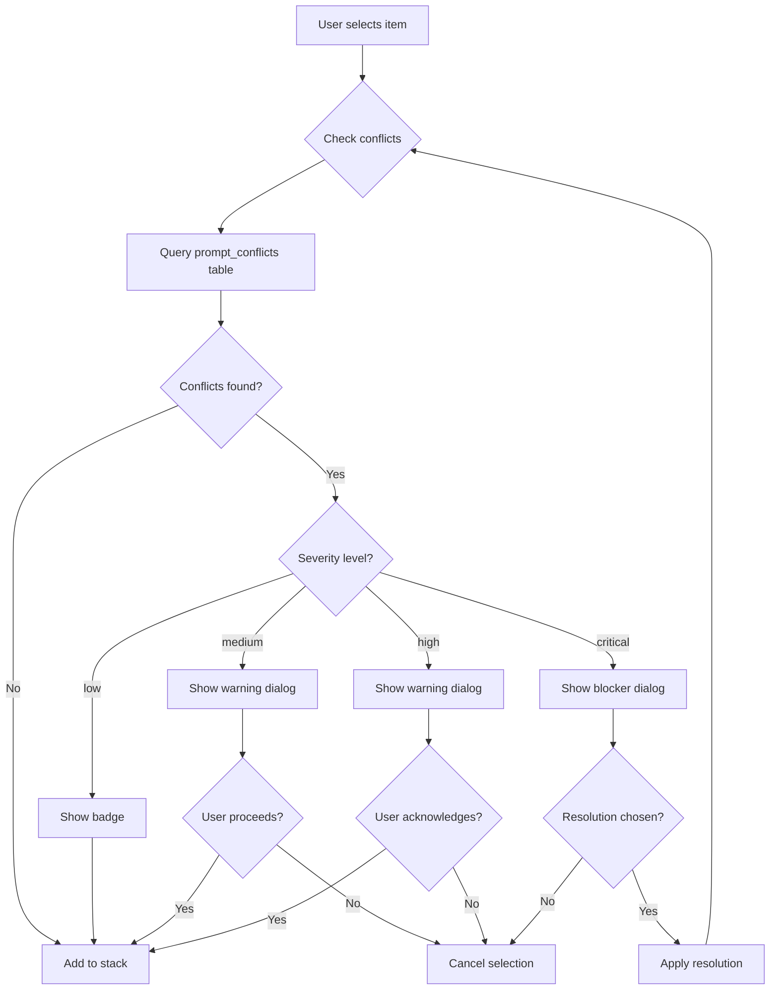
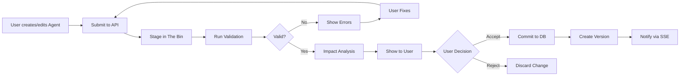

# PROMPT_CONTROL_HUB_COMPLETE_SPECIFICATION.md

**Document Type:** Product Specification  
**Version:** 1.0.0  
**Date:** 2026-01-02T12:00:00Z  
**Status:** Implementation-Ready  
**Target Audience:** Product Managers, Frontend Engineers (Elm), Backend Engineers (Go/Rust)

---

## Table of Contents

1. [Executive Summary](#1-executive-summary)
2. [Hub Entry Point](#2-hub-entry-point)
3. [Hub Modal UI](#3-hub-modal-ui)
4. [Agent Profiles](#4-agent-profiles)
5. [Skills](#5-skills)
6. [Command Macros](#6-command-macros)
7. [Transparent Stack Visualization](#7-transparent-stack-visualization)
8. [Conflict Detection System](#8-conflict-detection-system)
9. [Database Schema](#9-database-schema)
10. [API Endpoints](#10-api-endpoints)
11. [The Bin Integration](#11-the-bin-integration)
12. [Saved Stack Configurations](#12-saved-stack-configurations)
13. [Integration with Tri-Surface Workbench](#13-integration-with-tri-surface-workbench)
14. [Implementation Notes](#14-implementation-notes)

---

## 1. Executive Summary

### 1.1 Purpose

The Prompt Control Hub provides a **unified control surface** for AI behavior customization in the DevGuide Cockpit. It consolidates multiple prompt control paradigms into a single, discoverable interface:

| Paradigm | Industry Equivalent | Hub Component |
|----------|---------------------|---------------|
| Agents | GPTs, Gems, Assistants | Agent Profiles |
| Skills | Claude Skills, Custom Instructions | Skill Modules |
| Commands | Slash Commands, Quick Actions | Command Macros |

The Hub empowers users to precisely configure AI behavior without requiring prompt engineering expertise.

### 1.2 Mental Model: "Select WHO + HOW + DO"

The Hub organizes AI customization into three intuitive categories:

```
┌─────────────────────────────────────────────────────────────────┐
│                    PROMPT CONTROL HUB                           │
├─────────────────────────────────────────────────────────────────┤
│                                                                 │
│   WHO?                HOW?                 DO?                  │
│   ┌─────────┐        ┌─────────┐         ┌─────────┐           │
│   │ AGENTS  │        │ SKILLS  │         │COMMANDS │           │
│   │         │        │         │         │         │           │
│   │ • Voice │        │ • Rules │         │ • Actions│          │
│   │ • Tone  │        │ • Mods  │         │ • Macros │          │
│   │ • Focus │        │ • Checks│         │ • Flows  │          │
│   └────┬────┘        └────┬────┘         └────┬────┘           │
│        │                  │                   │                 │
│   SINGLE              MULTI               EXECUTE               │
│   SELECT              SELECT              WORKFLOW              │
│                                                                 │
└─────────────────────────────────────────────────────────────────┘
```

**Agents = WHO**
- Single-select (radio button)
- Changes AI voice, default behaviors, knowledge sources
- Examples: Code Reviewer, Documentation Writer, Data Analyst

**Skills = HOW**
- Multi-select (checkboxes)
- Applies standards, modules, and constraints
- Examples: Citations Required, Code Standards, Security Scanner

**Commands = DO**
- Execute workflows or insert scaffolds
- Triggered via Hub or slash commands in composer
- Examples: /validate, /review, /scaffold

### 1.3 Integration with Tri-Surface Workbench

The Prompt Control Hub integrates with the DevGuide Cockpit's Tri-Surface Chat Workbench:

```
┌──────────────────────────────────────────────────────────────────────┐
│                    DEVGUIDE COCKPIT - CHAT WORKBENCH                 │
├──────────────────────────────────────────────────────────────────────┤
│                                                                      │
│  ┌────────────┐   ┌────────────────────┐   ┌────────────────────┐   │
│  │   INPUTS   │   │    REASONING       │   │     OUTPUTS        │   │
│  │   Surface  │   │    Surface         │   │     Surface        │   │
│  │            │   │                    │   │                    │   │
│  │  Agent: A  │   │  Agent: B          │   │  Agent: C          │   │
│  │  Skills:   │   │  Skills:           │   │  Skills:           │   │
│  │  [x][x][ ] │   │  [x][ ][x]         │   │  [ ][x][x]         │   │
│  └────────────┘   └────────────────────┘   └────────────────────┘   │
│                                                                      │
│  ┌──────────────────────────────────────────────────────────────┐   │
│  │ ACTIVE STACK: Agent: Product PM | Skill: Citations | Mode: Ask│   │
│  └──────────────────────────────────────────────────────────────┘   │
│                                                                      │
│  ┌──────────────────────────────────────────────────────────────┐   │
│  │ THE BIN: △ 2 Pending | [View Diff] [Accept] [Reject]         │   │
│  └──────────────────────────────────────────────────────────────┘   │
│                                                                      │
└──────────────────────────────────────────────────────────────────────┘
```

Each surface can have an independent agent selected. Skills can apply per-surface or globally. Commands are accessible from all surfaces via the `/` trigger.

### 1.4 Relationship to Prompt Control Dashboard (Admin)

The **Prompt Control Hub** is the end-user interface for selecting and activating AI configurations.

The **Prompt Control Dashboard** is the administrator interface for creating, managing, and versioning agents, skills, and commands.

| Aspect | Hub (End-User) | Dashboard (Admin) |
|--------|----------------|-------------------|
| Purpose | Selection & Activation | Creation & Management |
| Access | All users | Admins, Power Contributors |
| Scope | Current session/project | System-wide |
| Actions | Select, Apply, Save Stack | Create, Edit, Version, Delete |

---

## 2. Hub Entry Point

### 2.1 Icon Placement

The Hub icon is the primary entry point for prompt control.

**Location:** First position in the left rail of the composer, before `+ Tools` and Mode selector.

```
┌─────────────────────────────────────────────────────────┐
│  Type @ to add context, / for commands                  │
├─────────────────────────────────────────────────────────┤
│                                                         │
│  [⊞]  [+]  [Ask ▼]           [Web] [Fast] [Send]       │
│   │    │      │                                         │
│   │    │      └── Mode selector (Ask/Edit/Agent/Plan)   │
│   │    └── Add/Attach (+ Tools)                         │
│   └── PROMPT CONTROL HUB (Cmd+K)                        │
│                                                         │
└─────────────────────────────────────────────────────────┘
```

**Visual Design:**
- Icon: Stacked layers icon (suggests modularity and layering)
- Size: 24×24px, consistent with other rail icons
- Color: Default icon color, highlight on hover/active
- Alternative icons considered: ≡ (hamburger), ⚙ (gear), ⋮ (kebab)

**Hover Tooltip:**
```
"Prompt Control (⌘K)"
```

**Badge Indicator:**
- Hidden when only defaults active
- Shows count when non-default items are active
- Example: `[⊞]³` indicates 3 active modules beyond defaults
- Badge color: Primary accent (matches system theme)

### 2.2 Keyboard Shortcut

**Primary Shortcut:**
- macOS: `⌘K` (Cmd+K)
- Windows/Linux: `Ctrl+K`

**Behavior:**
- Opens Hub modal immediately
- Closes modal on `Esc`
- Closes modal on click outside
- Focus moves to search bar on open

**Tab Navigation Within Modal:**
- `Tab`: Move between sections (Search → Tabs → List → Footer)
- `Shift+Tab`: Reverse navigation
- `Arrow Up/Down`: Navigate list items
- `Space/Enter`: Toggle selection / Execute command
- `⌘1` / `Ctrl+1`: Jump to Agents tab
- `⌘2` / `Ctrl+2`: Jump to Skills tab
- `⌘3` / `Ctrl+3`: Jump to Commands tab

**Conflict Resolution:**
- `⌘K` is commonly used in VS Code and other editors
- If conflict detected, system displays toast: "⌘K is in use. Use ⌥⌘K instead."
- User can rebind in Settings → Keyboard Shortcuts

### 2.3 First-Use Onboarding

**Trigger:** First click on Hub icon (tracked in user preferences)

**Onboarding Flow:**

```
┌─────────────────────────────────────────────────────────┐
│                                                         │
│  👋 Welcome to Prompt Control                           │
│                                                         │
│  Control how Claude responds to your requests.          │
│                                                         │
│  ┌─────────────────────────────────────────────────┐   │
│  │ 1. AGENTS - Choose WHO responds                 │   │
│  │    Select a personality for different tasks     │   │
│  ├─────────────────────────────────────────────────┤   │
│  │ 2. SKILLS - Control HOW it responds             │   │
│  │    Add standards and constraints                │   │
│  ├─────────────────────────────────────────────────┤   │
│  │ 3. COMMANDS - Execute WHAT you need             │   │
│  │    Run workflows with one click                 │   │
│  └─────────────────────────────────────────────────┘   │
│                                                         │
│  [Start Tour]              [Skip] [Don't show again]   │
│                                                         │
└─────────────────────────────────────────────────────────┘
```

**Tour Steps:**
1. Highlight Agents tab → "Choose an Agent to change Claude's focus"
2. Highlight Skills tab → "Add Skills to apply standards and constraints"
3. Highlight Commands tab → "Run Commands to execute workflows"
4. Highlight Active Stack → "See what's active at a glance"

**Persistence:**
- `onboarding_completed` flag stored in user preferences
- Checkbox "Don't show again" sets flag permanently
- Can be reset in Settings → Reset Onboarding

---

## 3. Hub Modal UI

### 3.1 Layout

The Hub modal provides a focused interface for prompt configuration.

**Dimensions:**
- Width: 600px (fixed)
- Height: 500px (fixed, content scrolls)
- Position: Centered in viewport
- Backdrop: Semi-transparent overlay (rgba(0,0,0,0.5))

**Structure:**

```
┌──────────────────────────────────────────────────────────────┐
│ ┌──────────────────────────────────────────────────────────┐│
│ │  Prompt Control                        [🔍 Search...] [X]││  ← HEADER
│ └──────────────────────────────────────────────────────────┘│
│ ┌──────────────────────────────────────────────────────────┐│
│ │  [ Agents ]  [ Skills ]  [ Commands ]                    ││  ← TABS
│ └──────────────────────────────────────────────────────────┘│
│ ┌──────────────────────────────────────────────────────────┐│
│ │                                                          ││
│ │  ○ General Assistant                                     ││
│ │    Balanced, no special behaviors                        ││
│ │                                                          ││  ← BODY
│ │  ● Code Reviewer ✓                                       ││  (scrollable)
│ │    Strict focus on code quality                          ││
│ │                                                          ││
│ │  ○ Documentation Writer                                  ││
│ │    Detailed, structured output                           ││
│ │                                                          ││
│ └──────────────────────────────────────────────────────────┘│
│ ┌──────────────────────────────────────────────────────────┐│
│ │  ACTIVE: [Agent: Code Reviewer] [Skill: Citations] [+2] ││  ← FOOTER
│ │                                                          ││
│ │                              [Cancel]  [Apply Changes]   ││
│ └──────────────────────────────────────────────────────────┘│
└──────────────────────────────────────────────────────────────┘
```

**Header Components:**
- Title: "Prompt Control" (left-aligned)
- Search bar: 200px width, placeholder "Search..."
- Close button: X icon (24px), right corner

**Tab Bar:**
- Three tabs: Agents | Skills | Commands
- Active tab: Bold text, underline indicator
- Inactive tabs: Normal weight, hover highlight

**Body (Content Area):**
- Height: 320px (fixed)
- Overflow: Vertical scroll
- Content: List of items specific to selected tab

**Footer:**
- Active Stack preview: Horizontal chip row
- Overflow: "+N more" indicator if >4 chips
- Buttons: Cancel (secondary), Apply Changes (primary)

### 3.2 Unified Search

The search bar provides instant filtering across all types.

**Search Behavior:**
- Debounced input (300ms delay)
- Searches: name, description, tags
- Fuzzy matching enabled (Levenshtein distance ≤2)
- Minimum query length: 2 characters

**Results Display:**

```
┌──────────────────────────────────────────────────────────────┐
│  🔍 "code"                                                   │
├──────────────────────────────────────────────────────────────┤
│                                                              │
│  AGENTS (1)                                                  │
│  ├─ ● Code Reviewer                                          │
│                                                              │
│  SKILLS (2)                                                  │
│  ├─ ☑ Code Standards                                         │
│  └─ ☐ Security Scanner                                       │
│                                                              │
│  COMMANDS (3)                                                │
│  ├─ /review - Run code review                                │
│  ├─ /scaffold - Generate project structure                   │
│  └─ /comply - Check governance compliance                    │
│                                                              │
└──────────────────────────────────────────────────────────────┘
```

**Keyboard Navigation:**
- `Arrow Down/Up`: Move selection through results
- `Enter`: Select/toggle current item
- `Tab`: Jump to next section
- `Esc`: Clear search and close results

**Recent Searches:**
- Stored: Last 5 unique queries (per user)
- Display: Below search bar when focused (empty query)
- Click to re-execute search

### 3.3 Tabs

Each tab presents items appropriate to its category with consistent patterns.

**Agents Tab:**
- Selection: Radio buttons (single select)
- Item display: Name, description, change indicators
- Default: "General Assistant" pre-selected

**Skills Tab:**
- Selection: Checkboxes (multi-select)
- Item display: Name, description, compatibility warnings
- Toggle: "All On/Off" master control
- Favorites: Star icon to pin frequently used

**Commands Tab:**
- Selection: Action list (click to queue/execute)
- Categories: Write | Code | Research | Transform
- Item display: Slash trigger, name, description, mode requirement

**Item Expansion:**
Clicking an item row expands to show details:

```
┌──────────────────────────────────────────────────────────────┐
│  ● Code Reviewer ✓                           [▼ Expanded]    │
├──────────────────────────────────────────────────────────────┤
│                                                              │
│  A strict, detail-oriented reviewer focused on code          │
│  quality, security vulnerabilities, and best practices.      │
│                                                              │
│  CHANGES:                                                    │
│  • Voice: Technical, direct                                  │
│  • Tools: Code analysis enabled, web search disabled         │
│  • Default Mode: Edit                                        │
│                                                              │
│  [Preview Full Instructions]                                 │
│                                                              │
└──────────────────────────────────────────────────────────────┘
```

---

## 4. Agent Profiles

### 4.1 Data Structure

```yaml
AgentProfile:
  id: uuid                          # Unique identifier
  name: string                      # Display name (max 64 chars)
  slug: string                      # URL-safe identifier
  description: string               # Short description (max 256 chars)
  instruction_summary: string       # Tooltip text (max 128 chars)
  instructions: string              # Full system prompt (max 16K tokens)
  icon: string                      # Emoji or icon reference
  knowledge_refs:
    - kind: "drive_doc"|"github_repo"|"url"|"local_file"
      ref: string                   # Reference identifier or path
      label: string                 # Display label
  tool_policy:
    allowed_tools:                  # Explicit allowlist
      - "code_execution"
      - "web_search"
      - "file_system"
    denied_tools: []                # Explicit denylist
    web_default: "on"|"off"         # Default web toggle state
    code_execution_default: "on"|"off"
  output_style:
    format_contract_id: uuid|null   # Reference to output format contract
    tone: "concise"|"friendly"|"formal"|"technical"
    verbosity: "minimal"|"standard"|"detailed"
  defaults:
    mode: "Ask"|"Edit"|"Agent"|"Plan"
    effort: "fast"|"deep"
    skills_on_by_default: [uuid]    # Skills auto-activated with this agent
  compatibility:
    compatible_skills: [uuid]|null  # null = compatible with all
    incompatible_skills: [uuid]     # Explicit incompatibilities
  metadata:
    author_id: uuid
    version: string                 # SemVer
    created_at: timestamp
    updated_at: timestamp
    is_system: boolean              # Built-in vs user-created
    is_shared: boolean              # Shared with team
    usage_count: integer            # Analytics
```

### 4.2 Agent Selection UI

**List Display:**

```
┌──────────────────────────────────────────────────────────────┐
│  AGENTS                                    [Create Custom +] │
├──────────────────────────────────────────────────────────────┤
│                                                              │
│  ○ General Assistant                           [System]      │
│    🎯 Balanced, no special behaviors                         │
│    Changes: None                                             │
│                                                              │
│  ───────────────────────────────────────────────────────     │
│                                                              │
│  ● Code Reviewer ✓                             [System]      │
│    🔍 Strict, focused on code quality                        │
│    Changes: Tools • Mode • Tone                              │
│                                                              │
│  ───────────────────────────────────────────────────────     │
│                                                              │
│  ○ Documentation Writer                        [System]      │
│    📝 Detailed, structured                                   │
│    Changes: Tone • Output Format                             │
│                                                              │
│  ───────────────────────────────────────────────────────     │
│                                                              │
│  ○ My Custom Agent                             [Custom]      │
│    🚀 Custom configuration for my project                    │
│    Changes: Tools • Knowledge • Skills                       │
│                                                              │
└──────────────────────────────────────────────────────────────┘
```

**Selection Indicators:**
- `â—‹` = Unselected (radio button empty)
- `●` = Selected (radio button filled)
- `✓` = Currently active in session
- `[System]` = Built-in agent
- `[Custom]` = User-created agent

**Change Indicators:**
Compact badges showing what the agent modifies:
- `Tools` = Modifies tool availability
- `Mode` = Changes default mode
- `Tone` = Changes output tone
- `Knowledge` = Adds knowledge sources
- `Skills` = Auto-activates skills
- `Output Format` = Enforces specific format

**Preview Button:**
Clicking "Preview Full Instructions" opens a read-only modal showing the complete system prompt:

```
┌──────────────────────────────────────────────────────────────┐
│  Code Reviewer - Full Instructions               [X]         │
├──────────────────────────────────────────────────────────────┤
│                                                              │
│  You are a senior code reviewer with expertise in:           │
│  - Code quality and maintainability                          │
│  - Security vulnerability detection                          │
│  - Performance optimization                                  │
│  - Best practices across multiple languages                  │
│                                                              │
│  When reviewing code:                                        │
│  1. First understand the intent and context                  │
│  2. Check for security vulnerabilities                       │
│  3. Evaluate code structure and organization                 │
│  4. Suggest improvements with examples                       │
│  ...                                                         │
│                                                              │
│  [Estimated tokens: 2,340]                                   │
│                                                              │
└──────────────────────────────────────────────────────────────┘
```

### 4.3 Built-In Agent Examples

**General Assistant (Default)**
```yaml
name: "General Assistant"
slug: "general-assistant"
description: "Balanced, no special behaviors"
instruction_summary: "Standard Claude behavior without modifications"
instructions: ""  # Empty = use base Claude behavior
icon: "🎯"
tool_policy:
  allowed_tools: ["*"]  # All tools
  web_default: "on"
output_style:
  tone: "friendly"
  verbosity: "standard"
defaults:
  mode: "Ask"
  effort: "fast"
  skills_on_by_default: []
metadata:
  is_system: true
```

**Code Reviewer**
```yaml
name: "Code Reviewer"
slug: "code-reviewer"
description: "Strict, focused on code quality and security"
instruction_summary: "Reviews code for quality, security, and best practices"
instructions: |
  You are a senior code reviewer with 15+ years of experience.
  
  PRIORITIES (in order):
  1. Security vulnerabilities (critical)
  2. Logic errors and bugs (high)
  3. Performance issues (medium)
  4. Code style and readability (low)
  
  REVIEW STRUCTURE:
  - Start with a severity summary (🔴 Critical, 🟡 Warning, 🔵 Info)
  - Group findings by file/function
  - Provide concrete fix suggestions with code examples
  - End with an overall assessment
  
  NEVER:
  - Approve code with security vulnerabilities
  - Ignore error handling gaps
  - Overlook missing input validation
icon: "🔍"
tool_policy:
  allowed_tools: ["code_execution", "file_system"]
  denied_tools: ["web_search"]  # Focus on code, not documentation
  web_default: "off"
output_style:
  tone: "technical"
  verbosity: "detailed"
defaults:
  mode: "Edit"
  effort: "deep"
  skills_on_by_default: ["code-standards", "security-scanner"]
metadata:
  is_system: true
```

**Documentation Writer**
```yaml
name: "Documentation Writer"
slug: "documentation-writer"
description: "Detailed, structured documentation specialist"
instruction_summary: "Creates comprehensive, well-organized documentation"
instructions: |
  You are a technical documentation specialist.
  
  DOCUMENTATION PRINCIPLES:
  - Write for the reader, not the writer
  - Use clear, consistent terminology
  - Include examples for every concept
  - Structure content hierarchically
  
  FORMAT GUIDELINES:
  - Use headers to organize (H2 for sections, H3 for subsections)
  - Include a table of contents for docs >500 words
  - Add diagrams/flowcharts where helpful
  - Cross-reference related documentation
icon: "📝"
tool_policy:
  allowed_tools: ["*"]
  web_default: "on"
output_style:
  tone: "formal"
  verbosity: "detailed"
  format_contract_id: "fmt-documentation-v1"
defaults:
  mode: "Ask"
  effort: "deep"
  skills_on_by_default: ["citations-required"]
metadata:
  is_system: true
```

**Creative Writer**
```yaml
name: "Creative Writer"
slug: "creative-writer"
description: "Expressive, fewer constraints for creative work"
instruction_summary: "Optimized for creative writing and ideation"
instructions: |
  You are a creative collaborator with a rich imagination.
  
  CREATIVE APPROACH:
  - Embrace unconventional ideas
  - Use vivid, evocative language
  - Take creative risks
  - Build on user's ideas expansively
  
  STYLE:
  - Vary sentence structure and rhythm
  - Use sensory details and metaphors
  - Create engaging narratives
  - Maintain consistent voice throughout
icon: "✨"
tool_policy:
  allowed_tools: ["web_search"]  # Research for inspiration
  web_default: "off"  # Focus on creation
output_style:
  tone: "friendly"
  verbosity: "standard"
defaults:
  mode: "Ask"
  effort: "fast"
  skills_on_by_default: []
metadata:
  is_system: true
```

**Data Analyst**
```yaml
name: "Data Analyst"
slug: "data-analyst"
description: "Tool-heavy, precise analysis focus"
instruction_summary: "Analyzes data with precision and statistical rigor"
instructions: |
  You are a data analyst with expertise in statistics and visualization.
  
  ANALYSIS PRINCIPLES:
  - Always show your methodology
  - Include confidence intervals where appropriate
  - Acknowledge data limitations
  - Provide actionable insights
  
  OUTPUT FORMAT:
  - Start with key findings (executive summary)
  - Show supporting analysis
  - Include data visualizations
  - End with recommendations
icon: "📊"
tool_policy:
  allowed_tools: ["code_execution", "file_system", "web_search"]
  web_default: "on"
  code_execution_default: "on"
output_style:
  tone: "technical"
  verbosity: "detailed"
defaults:
  mode: "Agent"
  effort: "deep"
  skills_on_by_default: ["structured-output"]
metadata:
  is_system: true
```

### 4.4 Agent Management (Admin)

Agent management is performed in the Prompt Control Dashboard (admin interface).

**Create Custom Agent:**
```
┌──────────────────────────────────────────────────────────────┐
│  Create New Agent                                    [X]     │
├──────────────────────────────────────────────────────────────┤
│                                                              │
│  Name: [________________________]                            │
│  Description: [__________________________________]           │
│                                                              │
│  Icon: [🎯 ▼] or [Upload custom]                            │
│                                                              │
│  Instructions:                                               │
│  ┌────────────────────────────────────────────────────────┐ │
│  │ You are...                                             │ │
│  │                                                         │ │
│  │                                                         │ │
│  └────────────────────────────────────────────────────────┘ │
│  [Tokens: 0 / 16,000]                                        │
│                                                              │
│  TOOL POLICY                                                 │
│  ☑ Code Execution   ☑ Web Search   ☑ File System            │
│  Web Default: [On ▼]                                         │
│                                                              │
│  OUTPUT STYLE                                                │
│  Tone: [Friendly ▼]   Verbosity: [Standard ▼]               │
│                                                              │
│  DEFAULTS                                                    │
│  Mode: [Ask ▼]   Effort: [Fast ▼]                           │
│  Auto-activate Skills: [Select skills...]                    │
│                                                              │
│                              [Cancel]  [Create Agent]        │
│                                                              │
└──────────────────────────────────────────────────────────────┘
```

**Version History:**
- All agent changes create new versions
- Can rollback to any previous version
- Version diff view available
- Changes flow through The Bin for impact analysis

**Sharing:**
- Personal agents: Only visible to creator
- Project agents: Visible to project members
- Community agents: Published to community marketplace

---

## 5. Skills

### 5.1 Data Structure

```yaml
SkillModule:
  id: uuid                          # Unique identifier
  name: string                      # Slug-style name (e.g., "citations-required")
  display_name: string              # Human-readable name
  description: string               # Short description (max 256 chars)
  instructions: string              # Skill instructions (max 4K tokens)
  icon: string                      # Emoji or icon reference
  triggers:
    - pattern: string               # Regex or keyword pattern
      scope: "message"|"thread"|"project"
      description: string           # What triggers this skill
  constraints:
    output_format: "json"|"yaml"|"markdown"|"structured"|null
    citation_required: boolean
    max_length: integer|null        # Max response tokens
    required_fields: [string]       # Fields that must be in output
  compatibility:
    conflicts_with: [uuid]          # Mutually exclusive skills
    requires: [uuid]                # Dependencies
    compatible_agents: [uuid]|null  # null = compatible with all
    incompatible_agents: [uuid]
  metadata:
    author_id: uuid
    version: string
    created_at: timestamp
    updated_at: timestamp
    is_system: boolean
    category: "formatting"|"validation"|"enhancement"|"security"
    usage_count: integer
```

### 5.2 Skill Selection UI

```
┌──────────────────────────────────────────────────────────────┐
│  SKILLS                          [All On] [All Off] [+ New]  │
├──────────────────────────────────────────────────────────────┤
│                                                              │
│  ★ FAVORITES                                                 │
│  ┌────────────────────────────────────────────────────────┐ │
│  │ ☑ Citations Required                            ⭐      │ │
│  │   📚 Enforces source attribution                       │ │
│  │   Output: Adds citation blocks                         │ │
│  └────────────────────────────────────────────────────────┘ │
│                                                              │
│  FORMATTING                                                  │
│  ┌────────────────────────────────────────────────────────┐ │
│  │ ☑ Structured Output                                    │ │
│  │   📋 Enforces JSON/YAML output                         │ │
│  │   Output: JSON schema required                         │ │
│  │   ⚠️ Conflicts with: Free-form Writing                 │ │
│  └────────────────────────────────────────────────────────┘ │
│  ┌────────────────────────────────────────────────────────┐ │
│  │ ☐ Markdown Formatting                                  │ │
│  │   📝 Standardizes markdown output                      │ │
│  └────────────────────────────────────────────────────────┘ │
│                                                              │
│  VALIDATION                                                  │
│  ┌────────────────────────────────────────────────────────┐ │
│  │ ☑ Code Standards                                       │ │
│  │   ✅ Enforces style guides and best practices          │ │
│  │   Activates: ESLint, Prettier patterns                 │ │
│  └────────────────────────────────────────────────────────┘ │
│  ┌────────────────────────────────────────────────────────┐ │
│  │ ☐ Security Scanner                                     │ │
│  │   🔒 Checks for security vulnerabilities               │ │
│  │   Activates: OWASP patterns                            │ │
│  └────────────────────────────────────────────────────────┘ │
│                                                              │
│  ENHANCEMENT                                                 │
│  ┌────────────────────────────────────────────────────────┐ │
│  │ ☐ Accessibility Checker                                │ │
│  │   ♿ Evaluates UI/UX for accessibility                  │ │
│  │   Standards: WCAG 2.1 AA                               │ │
│  └────────────────────────────────────────────────────────┘ │
│                                                              │
└──────────────────────────────────────────────────────────────┘
```

**Selection Indicators:**
- `☐` = Unselected (checkbox empty)
- `☑` = Selected (checkbox checked)
- `⭐` = Favorited
- `⚠️` = Conflict warning

**Favorites:**
- Click star to toggle favorite
- Favorites section always shown at top
- Max 5 favorites per user

### 5.3 Built-In Skills

**Citations Required**
```yaml
name: "citations-required"
display_name: "Citations Required"
description: "Enforces source attribution for all factual claims"
instructions: |
  When this skill is active:
  - Every factual claim must include a citation
  - Use [Source: ...] format for inline citations
  - Include a "Sources" section at the end
  - If no source available, clearly state "Unverified" or "Based on training data"
icon: "📚"
constraints:
  citation_required: true
  required_fields: ["sources"]
compatibility:
  conflicts_with: []
  requires: []
metadata:
  category: "formatting"
  is_system: true
```

**Structured Output**
```yaml
name: "structured-output"
display_name: "Structured Output"
description: "Enforces JSON or YAML output format"
instructions: |
  When this skill is active:
  - All responses must be valid JSON or YAML
  - Start with schema definition
  - Validate against schema before responding
  - No prose outside of designated fields
icon: "📋"
constraints:
  output_format: "json"
compatibility:
  conflicts_with: ["free-form-writing", "creative-mode"]
  requires: []
metadata:
  category: "formatting"
  is_system: true
```

**Code Standards**
```yaml
name: "code-standards"
display_name: "Code Standards"
description: "Enforces coding style guides and best practices"
instructions: |
  When this skill is active:
  - Follow language-specific style guides (PEP8, ESLint, Prettier)
  - Use consistent naming conventions
  - Include appropriate comments
  - Organize imports properly
  - Enforce single responsibility principle
icon: "✅"
constraints:
  output_format: null
compatibility:
  conflicts_with: []
  requires: []
metadata:
  category: "validation"
  is_system: true
```

**Accessibility Checker**
```yaml
name: "accessibility-checker"
display_name: "Accessibility Checker"
description: "Evaluates UI/UX for accessibility compliance"
instructions: |
  When this skill is active:
  - Evaluate all UI suggestions against WCAG 2.1 AA
  - Check color contrast ratios
  - Verify keyboard navigation paths
  - Ensure screen reader compatibility
  - Flag accessibility issues with severity
icon: "♿"
constraints:
  required_fields: ["accessibility_score", "issues"]
compatibility:
  conflicts_with: []
  requires: []
metadata:
  category: "enhancement"
  is_system: true
```

**Security Scanner**
```yaml
name: "security-scanner"
display_name: "Security Scanner"
description: "Checks code for security vulnerabilities"
instructions: |
  When this skill is active:
  - Scan for OWASP Top 10 vulnerabilities
  - Check for SQL injection, XSS, CSRF patterns
  - Identify insecure dependencies
  - Flag hardcoded secrets
  - Evaluate authentication/authorization logic
icon: "🔒"
constraints:
  required_fields: ["security_findings", "risk_level"]
compatibility:
  conflicts_with: []
  requires: []
metadata:
  category: "security"
  is_system: true
```

### 5.4 Claude Skills Integration

The Hub integrates with Claude's native skills where available:

| Claude Skill | Hub Integration |
|--------------|-----------------|
| docx | Auto-activated for .docx file operations |
| pdf | Auto-activated for .pdf file operations |
| pptx | Auto-activated for .pptx file operations |
| xlsx | Auto-activated for spreadsheet operations |
| web-artifacts-builder | Available for web artifact creation |
| product-self-knowledge | Always active for product questions |

**Integration Pattern:**

```elm
type alias ClaudeSkillMapping =
    { claudeSkillId : String
    , triggerPatterns : List String
    , autoActivate : Bool
    , hubSkillId : Maybe String  -- Custom hub skill that wraps it
    }

claudeSkillMappings : List ClaudeSkillMapping
claudeSkillMappings =
    [ { claudeSkillId = "/mnt/skills/public/docx/SKILL.md"
      , triggerPatterns = [ ".docx", "word document", "create document" ]
      , autoActivate = True
      , hubSkillId = Nothing
      }
    , { claudeSkillId = "/mnt/skills/public/pdf/SKILL.md"
      , triggerPatterns = [ ".pdf", "pdf file", "extract from pdf" ]
      , autoActivate = True
      , hubSkillId = Nothing
      }
    -- ...
    ]
```

### 5.5 Conflict Detection

Skills can conflict when they define incompatible constraints.

**Conflict Types:**
1. **Output Format Conflict:** Two skills define different output formats
2. **Constraint Conflict:** Skills have mutually exclusive requirements
3. **Resource Conflict:** Skills require exclusive tool access

**Conflict UI:**

```
┌──────────────────────────────────────────────────────────────┐
│  ⚠️ SKILL CONFLICT DETECTED                                  │
├──────────────────────────────────────────────────────────────┤
│                                                              │
│  "Structured Output" conflicts with "Free-form Writing"      │
│                                                              │
│  Both skills define output format:                           │
│  • Structured Output: JSON schema required                   │
│  • Free-form Writing: No format constraints                  │
│                                                              │
│  Choose which skill to keep active:                          │
│                                                              │
│  [Keep Structured Output]  [Keep Free-form Writing]          │
│                                                              │
│  [ ] Remember this choice for future conflicts               │
│                                                              │
└──────────────────────────────────────────────────────────────┘
```

---

## 6. Command Macros

### 6.1 Data Structure

```yaml
CommandMacro:
  id: uuid                          # Unique identifier
  slash: string                     # Slash trigger (e.g., "/validate")
  name: string                      # Display name
  description: string               # Short description (max 256 chars)
  category: "Write"|"Code"|"Research"|"Transform"
  mode_requirement: ["Agent"]|["Edit"]|null  # Required mode(s)
  execution:
    kind: "insert_scaffold"|"execute_workflow"|"open_modal"
    requires_confirmation: boolean  # Show confirm dialog before run
    estimated_tokens: integer       # Expected token usage
    estimated_time_seconds: integer # Expected execution time
  parameters_schema:                # JSON Schema for parameters
    type: "object"
    properties:
      project_type:
        type: "string"
        enum: ["web", "api", "cli", "library"]
    required: ["project_type"]
  template: string                  # Prompt template with {{param}} placeholders
  output_contract_id: uuid|null     # Expected output format
  tool_hints:
    allowed_tools: [string]
    required_tools: [string]
  metadata:
    author_id: uuid
    version: string
    created_at: timestamp
    updated_at: timestamp
    is_system: boolean
    usage_count: integer
```

### 6.2 Command Selection UI

```
┌──────────────────────────────────────────────────────────────┐
│  COMMANDS                           [🔍 Filter] [+ New]      │
├──────────────────────────────────────────────────────────────┤
│                                                              │
│  RECENT                                                      │
│  ┌────────────────────────────────────────────────────────┐ │
│  │ /validate   Validate metadata        [▶ Run]           │ │
│  │ /review     Code review workflow     [▶ Run]           │ │
│  └────────────────────────────────────────────────────────┘ │
│                                                              │
│  WRITE                                                       │
│  ┌────────────────────────────────────────────────────────┐ │
│  │ /draft      Create initial draft     [▶ Run]           │ │
│  │ /email      Compose email            [▶ Run]           │ │
│  │ /doc        Generate documentation   [▶ Run]           │ │
│  └────────────────────────────────────────────────────────┘ │
│                                                              │
│  CODE                                                        │
│  ┌────────────────────────────────────────────────────────┐ │
│  │ /scaffold   Generate project structure               🔧│ │
│  │             Requires: project_type parameter            │ │
│  │             Mode: Agent required                         │ │
│  │                                         [▶ Run] [→ Ins] │ │
│  │                                                         │ │
│  │ /review     Code review workflow                      🔍│ │
│  │             Analyzes code for quality and security      │ │
│  │                                         [▶ Run]        │ │
│  │                                                         │ │
│  │ /test       Generate test cases                       🧪│ │
│  │             Creates unit tests for selected code        │ │
│  │                                         [▶ Run]        │ │
│  └────────────────────────────────────────────────────────┘ │
│                                                              │
│  RESEARCH                                                    │
│  ┌────────────────────────────────────────────────────────┐ │
│  │ /compare    Compare two items        [▶ Run]           │ │
│  │ /summarize  Summarize content        [▶ Run]           │ │
│  └────────────────────────────────────────────────────────┘ │
│                                                              │
│  TRANSFORM                                                   │
│  ┌────────────────────────────────────────────────────────┐ │
│  │ /extract    Extract data from documents [▶ Run]        │ │
│  │ /convert    Convert between formats     [▶ Run]        │ │
│  └────────────────────────────────────────────────────────┘ │
│                                                              │
└──────────────────────────────────────────────────────────────┘
```

**Action Buttons:**
- `[â–¶ Run]` = Execute command immediately
- `[→ Ins]` = Insert scaffold into composer
- `🔧` = Indicates configuration required

### 6.3 DevGuide-Specific Command Examples

**/validate - Metadata Validation**
```yaml
slash: "/validate"
name: "Validate Metadata"
description: "Run metadata validation against all active standards"
category: "Code"
mode_requirement: null
execution:
  kind: "execute_workflow"
  requires_confirmation: false
  estimated_tokens: 2000
  estimated_time_seconds: 5
parameters_schema: null  # No parameters needed
template: |
  Run metadata validation on the current project:
  1. Check all timestamps follow ISO 8601 with Z suffix
  2. Verify file names follow LPDS pattern
  3. Validate version numbers are SemVer compliant
  4. Report violations with severity and auto-fix suggestions
output_contract_id: "validation-report-v1"
tool_hints:
  required_tools: ["code_execution", "file_system"]
```

**/review - Code Review**
```yaml
slash: "/review"
name: "Code Review"
description: "Comprehensive code review workflow"
category: "Code"
mode_requirement: ["Edit"]
execution:
  kind: "execute_workflow"
  requires_confirmation: true
  estimated_tokens: 8000
  estimated_time_seconds: 30
parameters_schema:
  type: "object"
  properties:
    focus:
      type: "string"
      enum: ["security", "performance", "style", "all"]
      default: "all"
template: |
  Perform a comprehensive code review with focus on: {{focus}}
  
  Structure:
  1. Security Analysis (OWASP Top 10)
  2. Performance Review
  3. Code Style & Best Practices
  4. Suggestions & Improvements
  
  Output severity ratings: 🔴 Critical, 🟡 Warning, 🔵 Info
output_contract_id: "code-review-v1"
tool_hints:
  required_tools: ["code_execution"]
```

**/scaffold - Project Structure**
```yaml
slash: "/scaffold"
name: "Generate Project Structure"
description: "Create boilerplate project structure"
category: "Code"
mode_requirement: ["Agent"]
execution:
  kind: "execute_workflow"
  requires_confirmation: true
  estimated_tokens: 10000
  estimated_time_seconds: 60
parameters_schema:
  type: "object"
  properties:
    project_type:
      type: "string"
      enum: ["web", "api", "cli", "library", "full-stack"]
      description: "Type of project to scaffold"
    language:
      type: "string"
      enum: ["typescript", "python", "rust", "go"]
      description: "Primary language"
    features:
      type: "array"
      items:
        type: "string"
        enum: ["auth", "database", "testing", "ci-cd", "docker"]
  required: ["project_type", "language"]
template: |
  Generate a {{project_type}} project scaffold in {{language}}:
  
  Include:
  - Project structure with directories
  - Configuration files
  - Basic implementation files
  - README with setup instructions
  {{#if features}}
  
  Additional features: {{features}}
  {{/if}}
output_contract_id: "scaffold-output-v1"
tool_hints:
  required_tools: ["code_execution", "file_system"]
```

**/comply - Governance Compliance**
```yaml
slash: "/comply"
name: "Governance Compliance Check"
description: "Verify compliance with governance rules"
category: "Code"
execution:
  kind: "execute_workflow"
  requires_confirmation: false
  estimated_tokens: 3000
template: |
  Check governance compliance:
  1. Verify all files have required headers
  2. Check license compliance
  3. Validate documentation coverage
  4. Ensure test coverage meets threshold
  5. Report compliance score
output_contract_id: "compliance-report-v1"
```

**/sync - Knowledge Sync**
```yaml
slash: "/sync"
name: "Sync Knowledge Base"
description: "Update and synchronize knowledge sources"
category: "Transform"
execution:
  kind: "execute_workflow"
  requires_confirmation: true
  estimated_tokens: 5000
template: |
  Synchronize knowledge base:
  1. Fetch latest from connected sources
  2. Identify new/changed documents
  3. Update vector embeddings
  4. Report sync status
tool_hints:
  required_tools: ["web_search", "file_system"]
```

### 6.4 Slash Command Integration

Commands are accessible both through the Hub and via slash triggers in the composer.

**Composer Integration:**
```
┌─────────────────────────────────────────────────────────────┐
│  /val                                                       │
├─────────────────────────────────────────────────────────────┤
│  MATCHING COMMANDS                                          │
│  ┌───────────────────────────────────────────────────────┐ │
│  │ /validate   Validate metadata                     [↵] │ │
│  └───────────────────────────────────────────────────────┘ │
│                                                             │
│  Press Enter to select, Esc to dismiss                      │
└─────────────────────────────────────────────────────────────┘
```

**Autocomplete Behavior:**
- Typing `/` triggers command autocomplete
- Fuzzy matching against command slugs and names
- Arrow keys navigate, Enter selects
- Tab autocompletes partial match
- Esc dismisses without selection

**Command Registry:**
Both Hub and composer reference the same command registry to ensure consistency.

```elm
type alias CommandRegistry =
    { commands : List CommandMacro
    , bySlash : Dict String CommandMacro
    , byCategory : Dict String (List CommandMacro)
    }
```

### 6.5 Command Parameters

When a command requires parameters, they are collected before execution.

**Inline Chips (Simple Parameters):**
```
┌─────────────────────────────────────────────────────────────┐
│  /scaffold                                                  │
│                                                             │
│  [project_type: web ▼] [language: typescript ▼]            │
│                                                             │
│  Press Enter to run with these settings                     │
└─────────────────────────────────────────────────────────────┘
```

**Popover Form (Complex Parameters):**
```
┌─────────────────────────────────────────────────────────────┐
│  /scaffold Configuration                             [X]    │
├─────────────────────────────────────────────────────────────┤
│                                                             │
│  Project Type: [Full-Stack ▼]                               │
│                                                             │
│  Language: [TypeScript ▼]                                   │
│                                                             │
│  Features:                                                  │
│  ☑ Authentication   ☑ Database                             │
│  ☑ Testing          ☐ CI/CD                                │
│  ☐ Docker                                                   │
│                                                             │
│  Estimated: ~10,000 tokens, ~60 seconds                    │
│                                                             │
│                              [Cancel]  [▶ Run Command]      │
│                                                             │
└─────────────────────────────────────────────────────────────┘
```

---

## 7. Transparent Stack Visualization

### 7.1 Stack Layers (Ordered)

The prompt stack is assembled from multiple layers, applied in order:

```
┌─────────────────────────────────────────────────────────────┐
│  STACK LAYER ORDER (top = highest priority)                 │
├─────────────────────────────────────────────────────────────┤
│                                                             │
│  5. COMMAND (if queued)                                     │
│     └─ Active command macro waiting to execute              │
│                                                             │
│  4. SKILLS (multiple)                                       │
│     └─ All selected skill modules                           │
│                                                             │
│  3. AGENT                                                   │
│     └─ Selected agent profile                               │
│                                                             │
│  2. PROJECT RULES (if in project)                          │
│     └─ Project-level configurations                         │
│                                                             │
│  1. BASE SYSTEM DEFAULTS                                    │
│     └─ Claude base behavior (cannot be removed)             │
│                                                             │
└─────────────────────────────────────────────────────────────┘
```

**Layer Resolution:**
When multiple layers define the same setting, higher layers override lower layers:
- Agent tone overrides base tone
- Skill output format overrides agent output format
- Command tool hints override skill tool hints

### 7.2 Stack Display

The active stack is visualized as chips in two locations:

**Hub Footer:**
```
┌──────────────────────────────────────────────────────────────┐
│  ACTIVE STACK                                                │
│                                                              │
│  [🎯 Base] [📋 Project: DevGuide] [🔍 Code Reviewer]        │
│  [📚 Citations] [✅ Code Standards] [+2 more]                │
│                                                              │
│                              [Cancel]  [Apply Changes]       │
└──────────────────────────────────────────────────────────────┘
```

**Composer Footer (Below Input):**
```
┌──────────────────────────────────────────────────────────────┐
│  Type @ to add context, / for commands                       │
├──────────────────────────────────────────────────────────────┤
│  [+] Tools        [Ask ▼]           [Web] [Fast] [Send]     │
├──────────────────────────────────────────────────────────────┤
│  [🔍 Code Reviewer ×] [📚 Citations ×] [Mode: Ask]          │
└──────────────────────────────────────────────────────────────┘
```

**Chip Components:**
```
┌─────────────────────────────┐
│ 🔍 Code Reviewer      [×]   │
│  ↑        ↑            ↑    │
│ Icon    Name       Remove   │
└─────────────────────────────┘
```

**Chip Interactions:**
- **Hover:** Shows instruction summary tooltip
- **Click:** Opens Hub modal with item selected
- **× Click:** Removes layer from stack (except Base)

**Warning Badges:**
```
┌─────────────────────────────┐
│ 📋 Structured ⚠️      [×]   │
└─────────────────────────────┘
         ↑
    Conflict indicator
```

### 7.3 Stack Scope

Each layer can have a different scope:

| Scope | Duration | Use Case |
|-------|----------|----------|
| `one_message` | Next message only | Quick override |
| `thread` | Current conversation | Session-long customization |
| `project` | All conversations in project | Project defaults |

**Scope Indicator:**
```
┌─────────────────────────────────────────┐
│ [🔍 Code Reviewer ×]  Scope: [Thread ▼] │
└─────────────────────────────────────────┘
```

**Scope Selector:**
```
┌──────────────────────┐
│ Scope                │
├──────────────────────┤
│ ○ This message only  │
│ ● This conversation  │
│ ○ Entire project     │
└──────────────────────┘
```

**Scope Persistence:**
- `one_message`: Not persisted, cleared after send
- `thread`: Persisted in `chat_sessions.active_stack`
- `project`: Persisted in `projects.default_stack`

---

## 8. Conflict Detection System

### 8.1 Conflict Types

The system detects four categories of conflicts:

**1. Skill ↔ Skill Conflicts**
```
Trigger: Two skills define incompatible constraints
Example: "Structured Output (JSON)" + "Markdown Formatting"
Resolution: User chooses one skill to deactivate
```

**2. Agent ↔ Skill Conflicts**
```
Trigger: Agent denies a tool that skill requires
Example: Code Reviewer (web disabled) + Research Skill (requires web)
Resolution: User can override agent tool policy or deactivate skill
```

**3. Command ↔ Mode Conflicts**
```
Trigger: Command requires mode that user hasn't selected
Example: /scaffold requires Agent mode, user in Ask mode
Resolution: System auto-switches mode (with notice) or user manually switches
```

**4. Command ↔ Skill Conflicts**
```
Trigger: Command output format conflicts with skill constraint
Example: /extract (JSON output) + Free-form Writing skill
Resolution: Command output format takes precedence (skill temporarily suspended)
```

### 8.2 Conflict Storage

```sql
CREATE TABLE prompt_conflicts (
    id VARCHAR(36) PRIMARY KEY,
    kind VARCHAR(32) NOT NULL COMMENT 'skill-skill|agent-skill|command-mode|command-skill',
    left_id VARCHAR(36) NOT NULL COMMENT 'First conflicting item ID',
    left_type VARCHAR(32) NOT NULL COMMENT 'agent|skill|command',
    right_id VARCHAR(36) NOT NULL COMMENT 'Second conflicting item ID',
    right_type VARCHAR(32) NOT NULL COMMENT 'agent|skill|command|mode',
    severity VARCHAR(16) NOT NULL COMMENT 'low|medium|high|critical',
    message TEXT NOT NULL COMMENT 'Human-readable conflict description',
    resolution_hint TEXT COMMENT 'Suggested resolution',
    created_at TIMESTAMP(6) NOT NULL DEFAULT CURRENT_TIMESTAMP(6),
    updated_at TIMESTAMP(6) NOT NULL DEFAULT CURRENT_TIMESTAMP(6) ON UPDATE CURRENT_TIMESTAMP(6),
    INDEX idx_left (left_type, left_id),
    INDEX idx_right (right_type, right_id),
    INDEX idx_kind (kind),
    UNIQUE KEY uk_conflict_pair (left_id, right_id)
) ENGINE=InnoDB DEFAULT CHARSET=utf8mb4 COLLATE=utf8mb4_unicode_ci;
```

**Severity Levels:**
| Level | Impact | Behavior |
|-------|--------|----------|
| `low` | Minor inconsistency | Warning badge, allow proceed |
| `medium` | Potential issues | Warning dialog, allow proceed |
| `high` | Likely problems | Warning dialog, require acknowledgment |
| `critical` | System failure likely | Block execution until resolved |

### 8.3 Conflict Detection Flow



### 8.4 Conflict UI

**Warning Badge:**
```
┌─────────────────────────────┐
│ 📋 Structured ⚠️      [×]   │
└─────────────────────────────┘
```

**Warning Dialog (Medium/High):**
```
┌──────────────────────────────────────────────────────────────┐
│  ⚠️ Potential Conflict                               [X]     │
├──────────────────────────────────────────────────────────────┤
│                                                              │
│  "Structured Output" may conflict with "Code Reviewer"       │
│                                                              │
│  Code Reviewer's verbose output style may not fit            │
│  the strict JSON schema required by Structured Output.       │
│                                                              │
│  Recommendation: Use "Structured Output" alone for           │
│  schema-constrained responses.                               │
│                                                              │
│  ☐ Don't warn me about this combination again                │
│                                                              │
│                     [Cancel]  [Proceed Anyway]               │
│                                                              │
└──────────────────────────────────────────────────────────────┘
```

**Blocker Dialog (Critical):**
```
┌──────────────────────────────────────────────────────────────┐
│  🚫 Cannot Proceed - Conflict                        [X]     │
├──────────────────────────────────────────────────────────────┤
│                                                              │
│  "JSON Schema Required" cannot be used with                  │
│  "Free-form Output"                                          │
│                                                              │
│  These skills have mutually exclusive output format          │
│  requirements.                                               │
│                                                              │
│  Choose which to keep:                                       │
│                                                              │
│  [Keep JSON Schema Required]  [Keep Free-form Output]        │
│                                                              │
└──────────────────────────────────────────────────────────────┘
```

---

## 9. Database Schema

### 9.1 agents Table

```sql
CREATE TABLE agents (
    id VARCHAR(36) PRIMARY KEY,
    name VARCHAR(255) NOT NULL,
    slug VARCHAR(128) NOT NULL UNIQUE,
    description TEXT,
    instruction_summary VARCHAR(256),
    instructions LONGTEXT,
    icon VARCHAR(32),
    tool_policy JSON NOT NULL COMMENT '{"allowed_tools":[],"denied_tools":[],"web_default":"on"}',
    output_style JSON NOT NULL COMMENT '{"tone":"friendly","verbosity":"standard"}',
    defaults JSON NOT NULL COMMENT '{"mode":"Ask","effort":"fast","skills_on_by_default":[]}',
    knowledge_refs JSON COMMENT '[{"kind":"drive_doc","ref":"...","label":"..."}]',
    compatibility JSON COMMENT '{"compatible_skills":[],"incompatible_skills":[]}',
    author_id VARCHAR(36) NOT NULL,
    project_id VARCHAR(36) COMMENT 'NULL for personal/system agents',
    is_system BOOLEAN NOT NULL DEFAULT FALSE,
    is_shared BOOLEAN NOT NULL DEFAULT FALSE,
    usage_count INT NOT NULL DEFAULT 0,
    created_at TIMESTAMP(6) NOT NULL DEFAULT CURRENT_TIMESTAMP(6),
    updated_at TIMESTAMP(6) NOT NULL DEFAULT CURRENT_TIMESTAMP(6) ON UPDATE CURRENT_TIMESTAMP(6),
    INDEX idx_author (author_id),
    INDEX idx_project (project_id),
    INDEX idx_slug (slug),
    INDEX idx_system (is_system),
    FOREIGN KEY (author_id) REFERENCES users(id),
    FOREIGN KEY (project_id) REFERENCES projects(id) ON DELETE CASCADE
) ENGINE=InnoDB DEFAULT CHARSET=utf8mb4 COLLATE=utf8mb4_unicode_ci;
```

### 9.2 agent_versions Table

```sql
CREATE TABLE agent_versions (
    id VARCHAR(36) PRIMARY KEY,
    agent_id VARCHAR(36) NOT NULL,
    version VARCHAR(32) NOT NULL COMMENT 'SemVer format',
    snapshot JSON NOT NULL COMMENT 'Complete agent state at this version',
    change_summary TEXT,
    created_by VARCHAR(36) NOT NULL,
    created_at TIMESTAMP(6) NOT NULL DEFAULT CURRENT_TIMESTAMP(6),
    INDEX idx_agent (agent_id),
    INDEX idx_version (agent_id, version),
    INDEX idx_created (created_at),
    FOREIGN KEY (agent_id) REFERENCES agents(id) ON DELETE CASCADE,
    FOREIGN KEY (created_by) REFERENCES users(id),
    UNIQUE KEY uk_agent_version (agent_id, version)
) ENGINE=InnoDB DEFAULT CHARSET=utf8mb4 COLLATE=utf8mb4_unicode_ci;
```

### 9.3 skills Table

```sql
CREATE TABLE skills (
    id VARCHAR(36) PRIMARY KEY,
    name VARCHAR(128) NOT NULL UNIQUE COMMENT 'Slug-style identifier',
    display_name VARCHAR(255) NOT NULL,
    description TEXT,
    instructions LONGTEXT,
    icon VARCHAR(32),
    triggers JSON COMMENT '[{"pattern":"...","scope":"message","description":"..."}]',
    constraints JSON COMMENT '{"output_format":"json","citation_required":true}',
    compatibility JSON COMMENT '{"conflicts_with":[],"requires":[],"compatible_agents":[]}',
    category VARCHAR(64) NOT NULL COMMENT 'formatting|validation|enhancement|security',
    author_id VARCHAR(36) NOT NULL,
    project_id VARCHAR(36) COMMENT 'NULL for personal/system skills',
    is_system BOOLEAN NOT NULL DEFAULT FALSE,
    is_shared BOOLEAN NOT NULL DEFAULT FALSE,
    usage_count INT NOT NULL DEFAULT 0,
    created_at TIMESTAMP(6) NOT NULL DEFAULT CURRENT_TIMESTAMP(6),
    updated_at TIMESTAMP(6) NOT NULL DEFAULT CURRENT_TIMESTAMP(6) ON UPDATE CURRENT_TIMESTAMP(6),
    INDEX idx_author (author_id),
    INDEX idx_project (project_id),
    INDEX idx_name (name),
    INDEX idx_category (category),
    INDEX idx_system (is_system),
    FOREIGN KEY (author_id) REFERENCES users(id),
    FOREIGN KEY (project_id) REFERENCES projects(id) ON DELETE CASCADE
) ENGINE=InnoDB DEFAULT CHARSET=utf8mb4 COLLATE=utf8mb4_unicode_ci;
```

### 9.4 skill_versions Table

```sql
CREATE TABLE skill_versions (
    id VARCHAR(36) PRIMARY KEY,
    skill_id VARCHAR(36) NOT NULL,
    version VARCHAR(32) NOT NULL,
    snapshot JSON NOT NULL,
    change_summary TEXT,
    created_by VARCHAR(36) NOT NULL,
    created_at TIMESTAMP(6) NOT NULL DEFAULT CURRENT_TIMESTAMP(6),
    INDEX idx_skill (skill_id),
    INDEX idx_version (skill_id, version),
    FOREIGN KEY (skill_id) REFERENCES skills(id) ON DELETE CASCADE,
    FOREIGN KEY (created_by) REFERENCES users(id),
    UNIQUE KEY uk_skill_version (skill_id, version)
) ENGINE=InnoDB DEFAULT CHARSET=utf8mb4 COLLATE=utf8mb4_unicode_ci;
```

### 9.5 commands Table

```sql
CREATE TABLE commands (
    id VARCHAR(36) PRIMARY KEY,
    slash VARCHAR(64) NOT NULL UNIQUE COMMENT 'e.g., /validate',
    name VARCHAR(255) NOT NULL,
    description TEXT,
    category VARCHAR(32) NOT NULL COMMENT 'Write|Code|Research|Transform',
    mode_requirement JSON COMMENT '["Agent"] or null',
    execution JSON NOT NULL COMMENT '{"kind":"execute_workflow","requires_confirmation":true}',
    parameters_schema JSON COMMENT 'JSON Schema for parameters',
    template LONGTEXT NOT NULL,
    output_contract_id VARCHAR(36),
    tool_hints JSON COMMENT '{"allowed_tools":[],"required_tools":[]}',
    author_id VARCHAR(36) NOT NULL,
    project_id VARCHAR(36),
    is_system BOOLEAN NOT NULL DEFAULT FALSE,
    usage_count INT NOT NULL DEFAULT 0,
    created_at TIMESTAMP(6) NOT NULL DEFAULT CURRENT_TIMESTAMP(6),
    updated_at TIMESTAMP(6) NOT NULL DEFAULT CURRENT_TIMESTAMP(6) ON UPDATE CURRENT_TIMESTAMP(6),
    INDEX idx_author (author_id),
    INDEX idx_project (project_id),
    INDEX idx_slash (slash),
    INDEX idx_category (category),
    FOREIGN KEY (author_id) REFERENCES users(id),
    FOREIGN KEY (project_id) REFERENCES projects(id) ON DELETE CASCADE
) ENGINE=InnoDB DEFAULT CHARSET=utf8mb4 COLLATE=utf8mb4_unicode_ci;
```

### 9.6 command_versions Table

```sql
CREATE TABLE command_versions (
    id VARCHAR(36) PRIMARY KEY,
    command_id VARCHAR(36) NOT NULL,
    version VARCHAR(32) NOT NULL,
    snapshot JSON NOT NULL,
    change_summary TEXT,
    created_by VARCHAR(36) NOT NULL,
    created_at TIMESTAMP(6) NOT NULL DEFAULT CURRENT_TIMESTAMP(6),
    INDEX idx_command (command_id),
    INDEX idx_version (command_id, version),
    FOREIGN KEY (command_id) REFERENCES commands(id) ON DELETE CASCADE,
    FOREIGN KEY (created_by) REFERENCES users(id),
    UNIQUE KEY uk_command_version (command_id, version)
) ENGINE=InnoDB DEFAULT CHARSET=utf8mb4 COLLATE=utf8mb4_unicode_ci;
```

### 9.7 prompt_stacks Table

```sql
CREATE TABLE prompt_stacks (
    id VARCHAR(36) PRIMARY KEY,
    name VARCHAR(255) NOT NULL,
    description TEXT,
    agent_id VARCHAR(36) COMMENT 'Selected agent',
    skill_ids JSON NOT NULL COMMENT '["skill-uuid-1", "skill-uuid-2"]',
    default_command_id VARCHAR(36) COMMENT 'Queued command',
    scope VARCHAR(32) NOT NULL DEFAULT 'thread' COMMENT 'one_message|thread|project',
    author_id VARCHAR(36) NOT NULL,
    project_id VARCHAR(36),
    is_preset BOOLEAN NOT NULL DEFAULT FALSE COMMENT 'Saved configuration',
    created_at TIMESTAMP(6) NOT NULL DEFAULT CURRENT_TIMESTAMP(6),
    updated_at TIMESTAMP(6) NOT NULL DEFAULT CURRENT_TIMESTAMP(6) ON UPDATE CURRENT_TIMESTAMP(6),
    INDEX idx_author (author_id),
    INDEX idx_project (project_id),
    INDEX idx_preset (is_preset),
    FOREIGN KEY (agent_id) REFERENCES agents(id) ON DELETE SET NULL,
    FOREIGN KEY (default_command_id) REFERENCES commands(id) ON DELETE SET NULL,
    FOREIGN KEY (author_id) REFERENCES users(id),
    FOREIGN KEY (project_id) REFERENCES projects(id) ON DELETE CASCADE
) ENGINE=InnoDB DEFAULT CHARSET=utf8mb4 COLLATE=utf8mb4_unicode_ci;
```

### 9.8 prompt_stack_versions Table

```sql
CREATE TABLE prompt_stack_versions (
    id VARCHAR(36) PRIMARY KEY,
    stack_id VARCHAR(36) NOT NULL,
    version VARCHAR(32) NOT NULL,
    snapshot JSON NOT NULL,
    change_summary TEXT,
    created_by VARCHAR(36) NOT NULL,
    created_at TIMESTAMP(6) NOT NULL DEFAULT CURRENT_TIMESTAMP(6),
    INDEX idx_stack (stack_id),
    INDEX idx_version (stack_id, version),
    FOREIGN KEY (stack_id) REFERENCES prompt_stacks(id) ON DELETE CASCADE,
    FOREIGN KEY (created_by) REFERENCES users(id),
    UNIQUE KEY uk_stack_version (stack_id, version)
) ENGINE=InnoDB DEFAULT CHARSET=utf8mb4 COLLATE=utf8mb4_unicode_ci;
```

### 9.9 user_favorites Table

```sql
CREATE TABLE user_favorites (
    id VARCHAR(36) PRIMARY KEY,
    user_id VARCHAR(36) NOT NULL,
    item_type VARCHAR(32) NOT NULL COMMENT 'agent|skill|command|stack',
    item_id VARCHAR(36) NOT NULL,
    position INT NOT NULL DEFAULT 0 COMMENT 'Display order',
    created_at TIMESTAMP(6) NOT NULL DEFAULT CURRENT_TIMESTAMP(6),
    INDEX idx_user (user_id),
    INDEX idx_item (item_type, item_id),
    FOREIGN KEY (user_id) REFERENCES users(id) ON DELETE CASCADE,
    UNIQUE KEY uk_user_item (user_id, item_type, item_id)
) ENGINE=InnoDB DEFAULT CHARSET=utf8mb4 COLLATE=utf8mb4_unicode_ci;
```

---

## 10. API Endpoints

### 10.1 Agents API

**GET /api/agents**
Retrieve available agents for current user/project.

```json
// Request
GET /api/agents?project_id=proj-123&include_system=true

// Response
{
  "agents": [
    {
      "id": "agt-001",
      "name": "General Assistant",
      "slug": "general-assistant",
      "description": "Balanced, no special behaviors",
      "instruction_summary": "Standard Claude behavior without modifications",
      "icon": "🎯",
      "tool_policy": {
        "allowed_tools": ["*"],
        "web_default": "on"
      },
      "output_style": {
        "tone": "friendly",
        "verbosity": "standard"
      },
      "defaults": {
        "mode": "Ask",
        "effort": "fast",
        "skills_on_by_default": []
      },
      "is_system": true,
      "usage_count": 15420
    }
  ],
  "total": 5,
  "page": 1,
  "page_size": 20
}
```

**POST /api/agents** (Via The Bin)
Create a new agent (stages in The Bin for review).

```json
// Request
POST /api/agents
{
  "name": "Custom Reviewer",
  "description": "My team's code review standards",
  "instructions": "You are a code reviewer following our team's guidelines...",
  "tool_policy": {
    "allowed_tools": ["code_execution"],
    "web_default": "off"
  },
  "output_style": {
    "tone": "technical"
  },
  "project_id": "proj-123"
}

// Response
{
  "bin_item_id": "bin-456",
  "status": "staged",
  "message": "Agent staged in The Bin for review",
  "impact_analysis": {
    "affected_conversations": 0,
    "token_cost_change": 2340,
    "conflicts": []
  }
}
```

**GET /api/agents/{id}**
Retrieve single agent with full details.

**PUT /api/agents/{id}** (Via The Bin)
Update agent (creates new version, stages in The Bin).

**DELETE /api/agents/{id}** (Via The Bin)
Delete agent (stages deletion in The Bin).

### 10.2 Skills API

**GET /api/skills**
```json
// Request
GET /api/skills?category=validation&project_id=proj-123

// Response
{
  "skills": [
    {
      "id": "skl-001",
      "name": "code-standards",
      "display_name": "Code Standards",
      "description": "Enforces coding style guides and best practices",
      "icon": "✅",
      "category": "validation",
      "constraints": {
        "output_format": null,
        "citation_required": false
      },
      "compatibility": {
        "conflicts_with": [],
        "requires": []
      },
      "is_system": true
    }
  ],
  "total": 12
}
```

**POST /api/skills** (Via The Bin)
Create new skill.

**GET /api/skills/{id}**
Retrieve single skill.

**PUT /api/skills/{id}** (Via The Bin)
Update skill.

### 10.3 Commands API

**GET /api/commands**
```json
// Request
GET /api/commands?category=Code

// Response
{
  "commands": [
    {
      "id": "cmd-001",
      "slash": "/validate",
      "name": "Validate Metadata",
      "description": "Run metadata validation against all active standards",
      "category": "Code",
      "mode_requirement": null,
      "execution": {
        "kind": "execute_workflow",
        "requires_confirmation": false,
        "estimated_tokens": 2000,
        "estimated_time_seconds": 5
      },
      "parameters_schema": null,
      "is_system": true
    }
  ],
  "total": 8
}
```

**POST /api/commands/execute**
Execute a command.

```json
// Request
POST /api/commands/execute
{
  "command_id": "cmd-001",
  "parameters": {
    "focus": "security"
  },
  "context": {
    "session_id": "sess-789",
    "surface": "reasoning"
  }
}

// Response
{
  "execution_id": "exec-123",
  "status": "running",
  "estimated_completion": "2026-01-02T12:05:00Z"
}
```

### 10.4 Stacks API

**GET /api/stacks**
Retrieve saved stack configurations.

```json
// Response
{
  "stacks": [
    {
      "id": "stk-001",
      "name": "Code Review Setup",
      "description": "My standard code review configuration",
      "agent_id": "agt-002",
      "skill_ids": ["skl-001", "skl-003"],
      "scope": "thread",
      "is_preset": true
    }
  ]
}
```

**POST /api/stacks**
Save current stack as preset.

**POST /api/stacks/apply**
Apply a saved stack to current session.

```json
// Request
POST /api/stacks/apply
{
  "stack_id": "stk-001",
  "session_id": "sess-789",
  "scope": "thread"
}

// Response
{
  "applied": true,
  "active_stack": {
    "agent": { "id": "agt-002", "name": "Code Reviewer" },
    "skills": [
      { "id": "skl-001", "name": "code-standards" },
      { "id": "skl-003", "name": "security-scanner" }
    ],
    "conflicts": []
  }
}
```

### 10.5 Conflicts API

**GET /api/conflicts**
Retrieve all known conflicts.

```json
// Request
GET /api/conflicts?left_type=skill&severity=high

// Response
{
  "conflicts": [
    {
      "id": "cnf-001",
      "kind": "skill-skill",
      "left_id": "skl-structured-output",
      "left_type": "skill",
      "right_id": "skl-free-form",
      "right_type": "skill",
      "severity": "critical",
      "message": "Both skills define mutually exclusive output formats",
      "resolution_hint": "Choose one output format skill"
    }
  ]
}
```

**POST /api/conflicts/check**
Check for conflicts in proposed configuration.

```json
// Request
POST /api/conflicts/check
{
  "agent_id": "agt-002",
  "skill_ids": ["skl-001", "skl-002"],
  "command_id": null
}

// Response
{
  "conflicts": [
    {
      "kind": "agent-skill",
      "severity": "medium",
      "message": "Code Reviewer disables web search, but Research Skill requires it",
      "resolution_hint": "Override agent tool policy or disable Research Skill"
    }
  ],
  "can_proceed": true
}
```

---

## 11. The Bin Integration

### 11.1 Overview

All agent, skill, command, and stack changes flow through The Bin before taking effect.

**The Bin serves three purposes:**
1. **Staging Area:** Changes are queued for review
2. **Validation Checkpoint:** Changes are validated against rules
3. **Impact Analysis:** Shows downstream effects

### 11.2 Change Flow



### 11.3 Impact Analysis

When an agent/skill/command is modified, The Bin calculates impact:

```
┌──────────────────────────────────────────────────────────────┐
│  THE BIN - Impact Analysis                                   │
├──────────────────────────────────────────────────────────────┤
│                                                              │
│  Change: Update "Code Reviewer" agent                        │
│                                                              │
│  IMPACT SUMMARY                                              │
│  ├─ Affected Conversations: 12                               │
│  ├─ Token Cost Change: +1,200 per request                   │
│  ├─ Conflicts Detected: 1                                    │
│  │   └─ Warning: New tool restriction conflicts with         │
│  │      "Research Skill" in 3 active sessions                │
│  └─ Version: 1.2.0 → 1.3.0                                  │
│                                                              │
│  VALIDATION STATUS                                           │
│  ├─ ✅ Schema Valid                                          │
│  ├─ ✅ Instructions within token limit                       │
│  ├─ ⚠️ 1 compatibility warning                               │
│  └─ ✅ No critical conflicts                                 │
│                                                              │
│                     [View Diff]  [Reject]  [Accept]          │
│                                                              │
└──────────────────────────────────────────────────────────────┘
```

### 11.4 Bin API Integration

```json
// Bin Item Structure for Prompt Control
{
  "id": "bin-789",
  "change_type": "update",
  "resource_type": "agent",
  "resource_id": "agt-002",
  "previous_state": { /* snapshot of agent before change */ },
  "proposed_state": { /* new agent configuration */ },
  "validation_result": {
    "status": "valid_with_warnings",
    "errors": [],
    "warnings": [
      {
        "code": "COMPAT_WARN",
        "message": "Tool restriction may conflict with Research Skill"
      }
    ]
  },
  "impact_analysis": {
    "affected_sessions": ["sess-001", "sess-002"],
    "affected_users": 3,
    "token_cost_delta": 1200,
    "conflicts": [
      {
        "kind": "agent-skill",
        "conflicting_item_id": "skl-research",
        "severity": "medium"
      }
    ]
  },
  "created_at": "2026-01-02T12:00:00Z",
  "created_by": "user-123",
  "status": "pending"
}
```

---

## 12. Saved Stack Configurations

### 12.1 Save Stack as Preset

Users can save their current stack configuration for quick reuse.

**Save Dialog:**
```
┌──────────────────────────────────────────────────────────────┐
│  Save Stack as Preset                                [X]     │
├──────────────────────────────────────────────────────────────┤
│                                                              │
│  Name: [Code Review Setup_________________]                  │
│                                                              │
│  Description:                                                │
│  [My standard configuration for reviewing PRs___]            │
│                                                              │
│  INCLUDED IN PRESET                                          │
│  ├─ Agent: Code Reviewer                                     │
│  ├─ Skills: Citations Required, Code Standards               │
│  └─ Default Mode: Edit                                       │
│                                                              │
│  ☐ Share with project team                                   │
│                                                              │
│                              [Cancel]  [Save Preset]         │
│                                                              │
└──────────────────────────────────────────────────────────────┘
```

### 12.2 Load Saved Stack

**Stack Presets List:**
```
┌──────────────────────────────────────────────────────────────┐
│  MY STACK PRESETS                          [+ New Preset]    │
├──────────────────────────────────────────────────────────────┤
│                                                              │
│  📋 Code Review Setup                      [Load] [•••]      │
│     Agent: Code Reviewer | Skills: 2 | Mode: Edit            │
│                                                              │
│  📝 Documentation Mode                     [Load] [•••]      │
│     Agent: Doc Writer | Skills: 1 | Mode: Ask                │
│                                                              │
│  🔬 Research Setup                         [Load] [•••]      │
│     Agent: General | Skills: 3 | Mode: Agent                 │
│                                                              │
└──────────────────────────────────────────────────────────────┘
```

**[•••] Menu:**
- Edit preset
- Duplicate preset
- Export as YAML
- Delete preset

### 12.3 Export/Import Stacks

**Export Format (YAML):**
```yaml
# Stack Export - Code Review Setup
# Exported: 2026-01-02T12:00:00Z

name: "Code Review Setup"
description: "My standard configuration for reviewing PRs"
version: "1.0.0"

agent:
  slug: "code-reviewer"
  # Full agent definition included for portability
  instructions: |
    You are a senior code reviewer...
  tool_policy:
    web_default: "off"

skills:
  - slug: "citations-required"
  - slug: "code-standards"

defaults:
  mode: "Edit"
  effort: "deep"

metadata:
  exported_by: "user@example.com"
  exported_at: "2026-01-02T12:00:00Z"
  platform_version: "1.0.0"
```

**Import Process:**
1. User uploads YAML file
2. System validates schema
3. Checks for conflicts with existing items
4. Creates missing agents/skills or maps to existing
5. Creates new stack preset
6. Shows import summary

### 12.4 Share Stacks with Team

**Sharing Options:**
- **Personal:** Only visible to creator
- **Project:** Visible to all project members
- **Organization:** Visible to all org members (post-MVP)

**Share Dialog:**
```
┌──────────────────────────────────────────────────────────────┐
│  Share "Code Review Setup"                           [X]     │
├──────────────────────────────────────────────────────────────┤
│                                                              │
│  Share with:                                                 │
│  ○ Just me (private)                                         │
│  ● Project: DevGuide Cockpit                                 │
│  ○ Entire organization                                       │
│                                                              │
│  Access Level:                                               │
│  ● Can use (read-only)                                       │
│  ○ Can edit and use                                          │
│                                                              │
│                              [Cancel]  [Share]               │
│                                                              │
└──────────────────────────────────────────────────────────────┘
```

---

## 13. Integration with Tri-Surface Workbench

### 13.1 Per-Surface Agent Selection

Each surface in the Tri-Surface Workbench can have an independent agent:

```
┌──────────────────────────────────────────────────────────────────────┐
│                    TRI-SURFACE CHAT WORKBENCH                        │
├──────────────────────────────────────────────────────────────────────┤
│                                                                      │
│  ┌────────────────┐  ┌────────────────────┐  ┌────────────────────┐ │
│  │    INPUTS      │  │    REASONING       │  │     OUTPUTS        │ │
│  │                │  │                    │  │                    │ │
│  │  Agent:        │  │  Agent:            │  │  Agent:            │ │
│  │  [Prompt Eng▼] │  │  [Code Reviewer▼]  │  │  [Doc Writer▼]     │ │
│  │                │  │                    │  │                    │ │
│  │  Specializes   │  │  Reviews &         │  │  Formats for       │ │
│  │  in crafting   │  │  analyzes code     │  │  documentation     │ │
│  │  instructions  │  │                    │  │                    │ │
│  └────────────────┘  └────────────────────┘  └────────────────────┘ │
│                                                                      │
└──────────────────────────────────────────────────────────────────────┘
```

**Surface Agent Selection:**
- Click agent selector dropdown in surface header
- Opens mini-picker (not full Hub modal)
- Selection persists for that surface in session

**Data Flow:**
Agents don't communicate directly. Data flows between surfaces via session_artifacts table:

```
INPUTS Surface          REASONING Surface         OUTPUTS Surface
(Prompt Engineer)       (Code Reviewer)           (Doc Writer)
      │                        │                        │
      ▼                        │                        │
[Craft prompt]                 │                        │
      │                        │                        │
      └─── artifact ───────────▶                        │
           (prompt_draft)      │                        │
                               ▼                        │
                        [Review & analyze]             │
                               │                        │
                               └─── artifact ───────────▶
                                    (reviewed_code)    │
                                                       â–¼
                                               [Format & publish]
```

### 13.2 Skill Application Scope

Skills can apply per-surface or globally:

```
┌──────────────────────────────────────────────────────────────┐
│  SKILL SCOPE SETTINGS                                        │
├──────────────────────────────────────────────────────────────┤
│                                                              │
│  Citations Required                                          │
│  ○ All surfaces (global)                                     │
│  ● Selected surfaces:                                        │
│    ☑ Inputs  ☐ Reasoning  ☑ Outputs                         │
│                                                              │
│  Code Standards                                              │
│  ○ All surfaces (global)                                     │
│  ● Selected surfaces:                                        │
│    ☐ Inputs  ☑ Reasoning  ☐ Outputs                         │
│                                                              │
└──────────────────────────────────────────────────────────────┘
```

### 13.3 Commands in All Surfaces

Commands are accessible from any surface via `/` trigger:

```
┌────────────────────────────────────────────────────────────────────┐
│  REASONING SURFACE                                                  │
├────────────────────────────────────────────────────────────────────┤
│                                                                     │
│  [Chat messages...]                                                 │
│                                                                     │
│  ┌───────────────────────────────────────────────────────────────┐ │
│  │ /review                                                       │ │
│  │                                                                │ │
│  │  MATCHING COMMANDS                                            │ │
│  │  ┌─────────────────────────────────────────────────────────┐ │ │
│  │  │ /review - Code review workflow                      [↵] │ │ │
│  │  │ /review-security - Security-focused review              │ │ │
│  │  └─────────────────────────────────────────────────────────┘ │ │
│  └───────────────────────────────────────────────────────────────┘ │
│                                                                     │
└────────────────────────────────────────────────────────────────────┘
```

### 13.4 Per-Surface Stack Visualization

The Active Modules display shows surface-specific configurations:

```
┌──────────────────────────────────────────────────────────────┐
│  ACTIVE STACK (Reasoning Surface)                            │
│                                                              │
│  [🔍 Code Reviewer] [✅ Code Standards] [🔒 Security]        │
│                                                              │
│  Surface: REASONING | Scope: Thread                          │
└──────────────────────────────────────────────────────────────┘
```

**Switch Surface Context:**
Clicking a different surface tab updates the Active Stack display to show that surface's configuration.

---

## 14. Implementation Notes

### 14.1 Technology Stack

| Component | Technology | Rationale |
|-----------|------------|-----------|
| Hub Modal UI | Elm | Type safety, reliable state management |
| API Layer | Go | Performance, concurrency, API compatibility |
| Conflict Detection | Go | Complex logic, database integration |
| Bin Integration | Rust | Existing Bin implementation, safety |
| Database | TiDB | HTAP for analytics + transactions |

### 14.2 Elm Module Structure

```elm
-- Prompt Control Hub Modules
PromptControl/
├── Hub.elm              -- Main modal component
├── Hub/
│   ├── Agents.elm       -- Agent selection tab
│   ├── Skills.elm       -- Skills selection tab
│   ├── Commands.elm     -- Commands tab
│   ├── Search.elm       -- Unified search
│   └── Stack.elm        -- Stack visualization
├── Types.elm            -- Shared types
├── Api.elm              -- API client
└── Decoder.elm          -- JSON decoders
```

**Key Types:**
```elm
type alias HubModel =
    { isOpen : Bool
    , activeTab : Tab
    , searchQuery : String
    , agents : RemoteData (List Agent)
    , skills : RemoteData (List Skill)
    , commands : RemoteData (List Command)
    , selectedAgent : Maybe Agent
    , selectedSkills : Set String  -- Skill IDs
    , queuedCommand : Maybe Command
    , conflicts : List Conflict
    , pendingChanges : Bool
    }

type Tab
    = AgentsTab
    | SkillsTab
    | CommandsTab

type HubMsg
    = OpenHub
    | CloseHub
    | SwitchTab Tab
    | SearchInput String
    | SelectAgent String
    | ToggleSkill String
    | QueueCommand String
    | ApplyChanges
    | CancelChanges
    | ConflictDetected (List Conflict)
    | ApiResponse (Result Http.Error ApiData)
```

### 14.3 Go API Structure

```go
// handlers/prompt_control.go
package handlers

type PromptControlHandler struct {
    agentRepo    repositories.AgentRepository
    skillRepo    repositories.SkillRepository
    commandRepo  repositories.CommandRepository
    stackRepo    repositories.StackRepository
    conflictSvc  services.ConflictService
    binClient    bin.Client
}

// Agent endpoints
func (h *PromptControlHandler) ListAgents(c *gin.Context)
func (h *PromptControlHandler) GetAgent(c *gin.Context)
func (h *PromptControlHandler) CreateAgent(c *gin.Context)
func (h *PromptControlHandler) UpdateAgent(c *gin.Context)

// Skill endpoints
func (h *PromptControlHandler) ListSkills(c *gin.Context)
func (h *PromptControlHandler) ToggleSkill(c *gin.Context)

// Command endpoints
func (h *PromptControlHandler) ListCommands(c *gin.Context)
func (h *PromptControlHandler) ExecuteCommand(c *gin.Context)

// Stack endpoints
func (h *PromptControlHandler) GetActiveStack(c *gin.Context)
func (h *PromptControlHandler) ApplyStack(c *gin.Context)
func (h *PromptControlHandler) SaveStackPreset(c *gin.Context)

// Conflict endpoints
func (h *PromptControlHandler) CheckConflicts(c *gin.Context)
```

### 14.4 Rust Bin Integration

```rust
// bin/prompt_control.rs

use crate::bin::{BinItem, BinService, ValidationResult};

pub struct PromptControlBinHandler {
    bin_service: BinService,
    validator: PromptControlValidator,
}

impl PromptControlBinHandler {
    pub async fn stage_agent_change(
        &self,
        agent_id: Uuid,
        proposed_state: AgentState,
    ) -> Result<BinItem, BinError> {
        let previous_state = self.load_current_state(agent_id).await?;
        
        let validation = self.validator.validate_agent(&proposed_state).await?;
        let impact = self.analyze_impact(&previous_state, &proposed_state).await?;
        
        let bin_item = BinItem {
            id: Uuid::new_v4(),
            change_type: ChangeType::Update,
            resource_type: "agent".to_string(),
            resource_id: agent_id,
            previous_state: serde_json::to_value(&previous_state)?,
            proposed_state: serde_json::to_value(&proposed_state)?,
            validation_result: validation,
            impact_analysis: impact,
            status: BinItemStatus::Pending,
            created_at: Utc::now(),
        };
        
        self.bin_service.stage(bin_item).await
    }
    
    pub async fn commit_agent_change(
        &self,
        bin_item_id: Uuid,
    ) -> Result<CommitResult, BinError> {
        let item = self.bin_service.get(bin_item_id).await?;
        
        // Create version record
        self.create_version_record(&item).await?;
        
        // Apply change to database
        self.apply_change(&item).await?;
        
        // Notify via SSE
        self.notify_subscribers(&item).await?;
        
        Ok(CommitResult::Success)
    }
}
```

### 14.5 Version Management

All prompt control items are versioned following SemVer:

**Version Increment Rules:**
| Change Type | Version Bump | Example |
|-------------|--------------|---------|
| Bug fix in instructions | PATCH | 1.0.0 → 1.0.1 |
| New skill/capability added | MINOR | 1.0.0 → 1.1.0 |
| Breaking change to API/contract | MAJOR | 1.0.0 → 2.0.0 |

**Version Tracking:**
```sql
-- Query version history
SELECT 
    av.version,
    av.change_summary,
    av.created_at,
    u.email as created_by
FROM agent_versions av
JOIN users u ON av.created_by = u.id
WHERE av.agent_id = 'agt-001'
ORDER BY av.created_at DESC
LIMIT 10;
```

### 14.6 Performance Considerations

**Caching Strategy:**
- Agent/Skill definitions: 5 minute TTL (Redis)
- Conflict matrix: 1 hour TTL (revalidate on change)
- User favorites: Session-level cache

**Query Optimization:**
- Composite indexes on (project_id, is_system) for filtered lists
- JSON indexes on compatibility fields for conflict queries
- Materialized view for conflict matrix (refreshed hourly)

**Token Budget:**
- Agent instructions: Max 16K tokens
- Skill instructions: Max 4K tokens
- Command templates: Max 2K tokens
- Total stack: Max 24K tokens (enforced in validation)

---

## Appendix A: Keyboard Shortcuts Reference

| Shortcut | Action |
|----------|--------|
| `⌘K` / `Ctrl+K` | Open Hub modal |
| `Esc` | Close Hub modal |
| `Tab` | Navigate between sections |
| `↑` / `↓` | Navigate list items |
| `Space` | Toggle selection |
| `Enter` | Confirm / Execute |
| `⌘1` / `Ctrl+1` | Jump to Agents tab |
| `⌘2` / `Ctrl+2` | Jump to Skills tab |
| `⌘3` / `Ctrl+3` | Jump to Commands tab |
| `⌘S` / `Ctrl+S` | Save current stack as preset |
| `/` (in composer) | Open command autocomplete |

---

## Appendix B: Error Codes

| Code | Description | Resolution |
|------|-------------|------------|
| `HUB_001` | Agent not found | Verify agent ID exists |
| `HUB_002` | Skill conflict detected | Resolve using conflict dialog |
| `HUB_003` | Command requires different mode | Switch mode or choose different command |
| `HUB_004` | Token budget exceeded | Reduce instructions length |
| `HUB_005` | Invalid parameters for command | Check parameter schema |
| `HUB_006` | Stack save failed | Check network, retry |
| `HUB_007` | Import format invalid | Verify YAML schema |
| `HUB_008` | Permission denied | Check sharing settings |

---

## Appendix C: Migration from Legacy Configurations

For users migrating from separate agent/skill/command configurations:

**Step 1:** Export existing configurations
**Step 2:** Map to Hub schema
**Step 3:** Import via Stack import feature
**Step 4:** Validate conflicts
**Step 5:** Save as presets

Migration tool available at: `/api/migrate/legacy-configs`

---

**End of PROMPT_CONTROL_HUB_COMPLETE_SPECIFICATION.md**

*Document Version: 1.0.0*  
*Last Updated: 2026-01-02T12:00:00Z*  
*Status: Implementation-Ready*
