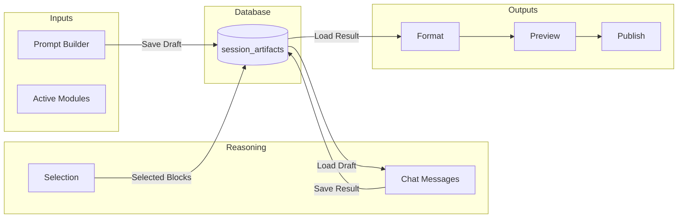
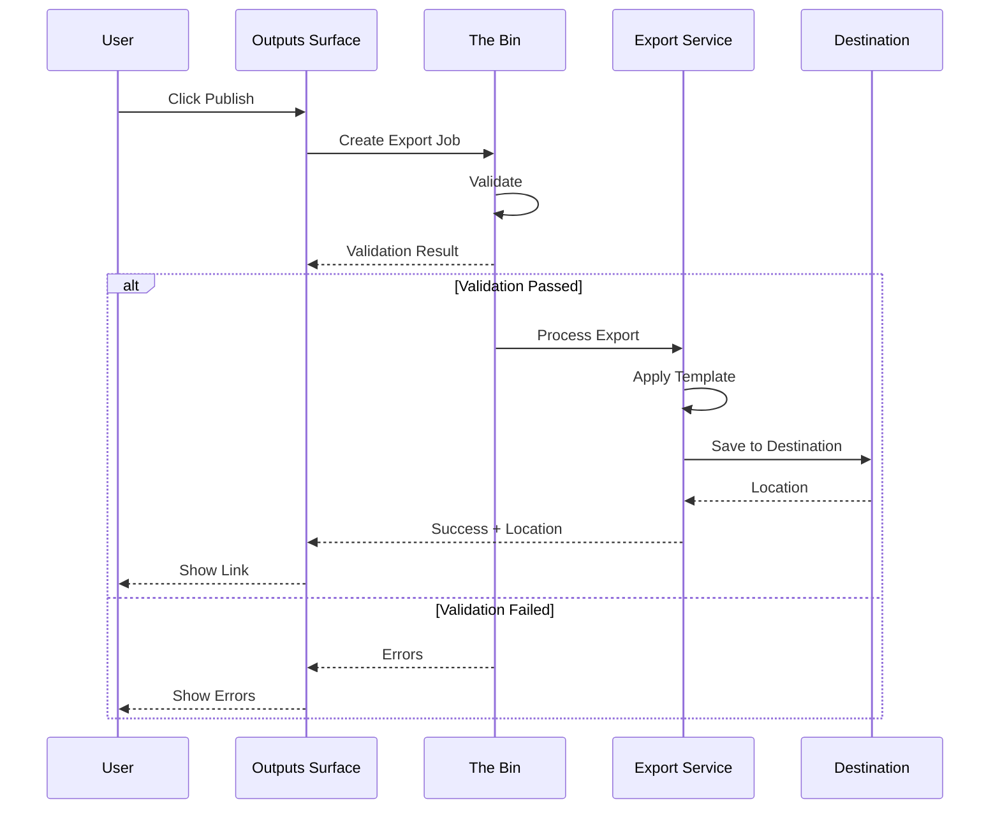

# TRI-SURFACE WORKBENCH COMPLETE SPECIFICATION

**Document Type:** Technical Specification  
**Version:** 1.0.0  
**Date:** 2026-01-02T00:00:00Z  
**Status:** APPROVED FOR IMPLEMENTATION  
**Dependencies:** ARTIFACT_03 (The Bin), ARTIFACT_05 (Data Model), ARTIFACT_06 (Master Control)

---

## Table of Contents

1. [Executive Summary](#1-executive-summary)
2. [Surface Switching System](#2-surface-switching-system)
3. [Inputs Surface Specification](#3-inputs-surface-specification)
4. [Reasoning Surface Specification](#4-reasoning-surface-specification)
5. [Outputs Surface Specification](#5-outputs-surface-specification)
6. [Database Schema](#6-database-schema)
7. [API Endpoints](#7-api-endpoints)
8. [SSE Real-Time Updates](#8-sse-real-time-updates)
9. [The Bin Integration](#9-the-bin-integration)
10. [Error Handling & Edge Cases](#10-error-handling--edge-cases)
11. [Performance Optimization](#11-performance-optimization)
12. [Implementation Notes](#12-implementation-notes)

---

## 1. Executive Summary

### 1.1 Feature Purpose

The **Tri-Surface Chat Workbench** is a three-panel chat interface that enables structured AI-assisted workflows with independent agents per surface. Users can craft prompts in Inputs, execute reasoning in Reasoning, and package outputs in Outputs—each with their own selected AI agent.

**Key Value Proposition:**
- **Separation of Concerns:** Dedicated surfaces for different workflow phases
- **Agent Flexibility:** Choose optimal AI for each task (e.g., Claude Opus for reasoning, Haiku for formatting)
- **Structured Output:** Select, format, and publish chat content with templates
- **Database-Mediated:** Surfaces share state through database, not real-time orchestration

### 1.2 Architecture Overview

```
┌─────────────────────────────────────────────────────────────────────────┐
│                     TRI-SURFACE CHAT WORKBENCH                          │
├─────────────────────────────────────────────────────────────────────────┤
│                                                                          │
│  ┌──────────────┐  ┌──────────────────┐  ┌──────────────────┐          │
│  │   INPUTS     │  │    REASONING     │  │    OUTPUTS       │          │
│  │              │  │                  │  │                  │          │
│  │  Agent A     │  │   Agent B        │  │   Agent C        │          │
│  │  (Prompt     │  │   (Problem       │  │   (Formatting)   │          │
│  │   Crafting)  │  │    Solving)      │  │                  │          │
│  │              │  │                  │  │                  │          │
│  │  Save Draft  │  │  Load Draft      │  │  Load Result     │          │
│  │      ↓       │  │  Save Result     │  │  Format+Export   │          │
│  └──────┬───────┘  └────────┬─────────┘  └────────┬─────────┘          │
│         │                   │                     │                     │
│         └───────────────────┼─────────────────────┘                     │
│                             ↓                                            │
│                  ┌─────────────────────┐                                │
│                  │  TiDB Database      │                                │
│                  │  - session_artifacts│                                │
│                  │  - chat_messages    │                                │
│                  │  - export_jobs      │                                │
│                  └─────────────────────┘                                │
│                                                                          │
├─────────────────────────────────────────────────────────────────────────┤
│  THE BIN  │  ⚠ Update formatter: markdown_yaml_v2  │  2 Pending         │
└─────────────────────────────────────────────────────────────────────────┘
```

**Critical Design Decision:** Surfaces communicate through the database (`session_artifacts` table), NOT through real-time orchestration. This dramatically reduces complexity while maintaining workflow benefits.

### 1.3 User Mental Model

**"Three Chrome tabs with a shared clipboard"**

Think of each surface as a separate browser tab with its own AI chat:
- Users work in one surface at a time (default) or multiple (advanced)
- Data moves between surfaces via database saves/loads
- User controls when data transfers occur
- No automatic coordination between agents

### 1.4 Layout Modes

| Mode | Description | Default |
|------|-------------|---------|
| **Simple** | One surface visible at a time | ✓ Yes |
| **Advanced** | Multiple surfaces visible with resizable columns | No |

---

## 2. Surface Switching System

### 2.1 Three Pills UI

The surface selector appears at the top of the workbench as three pill-shaped buttons:

```
┌──────────────────────────────────────────────────────────────────┐
│  ┌─────────────┐  ┌──────────────────┐  ┌─────────────────┐     │
│  │   INPUTS    │  │    REASONING     │  │    OUTPUTS      │     │
│  └─────────────┘  └──────────────────┘  └─────────────────┘     │
└──────────────────────────────────────────────────────────────────┘
```

#### 2.1.1 Visual Design

| State | Background | Text Color | Border |
|-------|-----------|------------|--------|
| **Active** | `#F97316` (orange-500) | `#FFFFFF` (white) | `2px solid #F97316` |
| **Inactive** | `transparent` | `#9CA3AF` (gray-400) | `1px solid #4B5563` |
| **Hover** | `#374151` (gray-700) | `#E5E7EB` (gray-200) | `1px solid #6B7280` |

#### 2.1.2 CSS Specification

```css
.surface-pills {
  display: flex;
  gap: 8px;
  justify-content: center;
  margin-bottom: 16px;
}

.surface-pill {
  padding: 8px 24px;
  border-radius: 9999px;
  font-size: 12px;
  font-weight: 600;
  letter-spacing: 0.05em;
  text-transform: uppercase;
  cursor: pointer;
  transition: all 200ms ease-in-out;
}

.surface-pill--active {
  background-color: #F97316;
  color: #FFFFFF;
  border: 2px solid #F97316;
}

.surface-pill--inactive {
  background-color: transparent;
  color: #9CA3AF;
  border: 1px solid #4B5563;
}

.surface-pill--inactive:hover {
  background-color: #374151;
  color: #E5E7EB;
  border-color: #6B7280;
}
```

#### 2.1.3 Click Behavior

```elm
type Msg
    = SwitchSurface Surface

type Surface
    = Inputs
    | Reasoning
    | Outputs

update : Msg -> Model -> ( Model, Cmd Msg )
update msg model =
    case msg of
        SwitchSurface surface ->
            ( { model | activeSurface = surface }
            , Cmd.batch
                [ saveCurrentSurfaceState model
                , loadSurfaceState surface
                , triggerSlideAnimation model.activeSurface surface
                ]
            )
```

#### 2.1.4 Keyboard Shortcuts

| Shortcut | Action |
|----------|--------|
| `Cmd/Ctrl + 1` | Switch to Inputs |
| `Cmd/Ctrl + 2` | Switch to Reasoning |
| `Cmd/Ctrl + 3` | Switch to Outputs |

### 2.2 Sliding Panel Behavior

When switching surfaces, panels slide with animation rather than instant transition.

#### 2.2.1 Animation Timing

| Property | Value |
|----------|-------|
| **Duration** | 300ms |
| **Easing** | `cubic-bezier(0.4, 0, 0.2, 1)` (ease-out) |
| **Transform** | `translateX()` |

#### 2.2.2 Slide Directions

```
FROM REASONING TO INPUTS:
┌─────────────┐┌────────────────────────┐┌─────────────┐
│   INPUTS    ││       REASONING        ││   OUTPUTS   │
│  ◄──────────││      (compresses)      ││  (hidden)   │
│  (expands)  ││       ──────►          ││             │
└─────────────┘└────────────────────────┘└─────────────┘

FROM REASONING TO OUTPUTS:
┌─────────────┐┌────────────────────────┐┌─────────────┐
│   INPUTS    ││       REASONING        ││   OUTPUTS   │
│  (hidden)   ││      (compresses)      ││ ──────────► │
│             ││       ◄──────          ││  (expands)  │
└─────────────┘└────────────────────────┘└─────────────┘

FROM INPUTS/OUTPUTS TO REASONING:
┌─────────────┐┌────────────────────────┐┌─────────────┐
│   INPUTS    ││       REASONING        ││   OUTPUTS   │
│ ◄─────────  ││      (expands)         ││ ─────────►  │
│ (collapses) ││                        ││ (collapses) │
└─────────────┘└────────────────────────┘└─────────────┘
```

#### 2.2.3 CSS Animation

```css
.surfaces-container {
  display: flex;
  width: 100%;
  overflow: hidden;
}

.surface-panel {
  flex-shrink: 0;
  transition: width 300ms cubic-bezier(0.4, 0, 0.2, 1),
              transform 300ms cubic-bezier(0.4, 0, 0.2, 1),
              opacity 200ms ease-in-out;
}

.surface-panel--active {
  width: 100%;
  opacity: 1;
}

.surface-panel--collapsed {
  width: 48px;
  opacity: 0.6;
  overflow: hidden;
}

.surface-panel--hidden {
  width: 0;
  opacity: 0;
  pointer-events: none;
}
```

### 2.3 Collapsed State Indicators

When a surface is collapsed (Simple mode), a vertical label indicates its presence.

```
┌────┐┌──────────────────────────────────────────┐┌────┐
│ I  ││                                          ││ O  │
│ N  ││        REASONING (Active)                ││ U  │
│ P  ││                                          ││ T  │
│ U  ││                                          ││ P  │
│ T  ││                                          ││ U  │
│ S  ││                                          ││ T  │
│    ││                                          ││ S  │
└────┘└──────────────────────────────────────────┘└────┘
```

#### 2.3.1 Collapsed Label Specification

| Property | Value |
|----------|-------|
| **Width** | 48px |
| **Text Orientation** | `writing-mode: vertical-rl` |
| **Font Size** | 11px |
| **Font Weight** | 600 |
| **Color** | `#6B7280` (gray-500) |
| **Hover Color** | `#F97316` (orange-500) |
| **Cursor** | `pointer` |
| **Background on Hover** | `#1F2937` (gray-800) |

#### 2.3.2 Click to Expand

Clicking a collapsed label:
1. Triggers `SwitchSurface` message
2. Animates the slide transition
3. Updates the active pill

### 2.4 Advanced Mode: Multi-Surface View

Users can opt into advanced mode to view multiple surfaces simultaneously.

#### 2.4.1 Enabling Advanced Mode

```elm
type LayoutMode
    = Simple
    | Advanced

type alias LayoutConfig =
    { mode : LayoutMode
    , surfaceWidths : Dict String Float  -- Percentage widths
    , minWidth : Float  -- Minimum 20%
    , maxWidth : Float  -- Maximum 60%
    }
```

#### 2.4.2 Resizable Splitters

```
┌─────────────────┐╎┌────────────────────┐╎┌─────────────────┐
│     INPUTS      │╎│     REASONING      │╎│    OUTPUTS      │
│                 │╎│                    │╎│                 │
│                 │╎│                    │╎│                 │
│                 │╎│                    │╎│                 │
│                 │◄──────── drag ────────►│                 │
└─────────────────┘╎└────────────────────┘╎└─────────────────┘
```

| Property | Value |
|----------|-------|
| **Splitter Width** | 4px |
| **Splitter Color** | `#4B5563` (gray-600) |
| **Splitter Hover** | `#F97316` (orange-500) |
| **Min Panel Width** | 20% |
| **Max Panel Width** | 60% |
| **Cursor** | `col-resize` |

#### 2.4.3 User Preference Persistence

Layout configurations are saved to `user_composer_layouts` table:

```json
{
  "mode": "advanced",
  "surfaceWidths": {
    "inputs": 25,
    "reasoning": 50,
    "outputs": 25
  },
  "lastActiveSurface": "reasoning"
}
```

---

## 3. Inputs Surface Specification

### 3.1 Surface Overview

The **Inputs Surface** is a prompt engineering workspace where users craft structured instructions before sending them to the Reasoning surface.

```
┌────────────────────────────────────────────────────────────────┐
│  INPUTS (active)     REASONING          OUTPUTS                │
├────────────────────────────────────────────────────────────────┤
│                                                                │
│  Prompt Builder                                                │
│  Structure instructions before sending to the Reasoning panel. │
│                                                                │
│  ┌──────────────────────────────────────────────────────────┐  │
│  │ ROLE                                                      │  │
│  │ Senior engineer reviewer                                  │  │
│  └──────────────────────────────────────────────────────────┘  │
│                                                                │
│  ┌──────────────────────────────────────────────────────────┐  │
│  │ OBJECTIVE                                                 │  │
│  │ Draft a production-safe prompt stack                      │  │
│  └──────────────────────────────────────────────────────────┘  │
│                                                                │
│  ┌──────────────────────────────────────────────────────────┐  │
│  │ CONSTRAINTS                                               │  │
│  │ JSON output, no hallucinations                            │  │
│  └──────────────────────────────────────────────────────────┘  │
│                                                                │
│  ┌──────────────────────────────────────────────────────────┐  │
│  │ EXAMPLES                                                  │  │
│  │ Add 1-2 few-shot pairs                                    │  │
│  └──────────────────────────────────────────────────────────┘  │
│                                                                │
│  ┌──────────────────────────────────────────────────────────┐  │
│  │ OUTPUT CONTRACT                                           │  │
│  │ YAML front matter + Markdown body                         │  │
│  └──────────────────────────────────────────────────────────┘  │
│                                                                │
│  ACTIVE MODULES                                                │
│  ┌───────────────┐ ┌─────────────────┐ ┌────────────────────┐ │
│  │ 🤖Agent:      │ │ 📚Skill:        │ │ 📋Template:        │ │
│  │ Product PM  ✕ │ │ Citations     ✕ │ │ Extract→Validate ✕│ │
│  └───────────────┘ └─────────────────┘ └────────────────────┘ │
│  ┌──────────────────┐                                          │
│  │ 📐Schema:        │                                          │
│  │ output_v2      ✕ │                                          │
│  └──────────────────┘                                          │
│                                                                │
│                          ┌─────────────────────────────────┐   │
│                          │     Send to Reasoning →         │   │
│                          └─────────────────────────────────┘   │
│                                                                │
└────────────────────────────────────────────────────────────────┘
```

### 3.2 Prompt Builder Form

#### 3.2.1 Field Specifications

| Field | Type | Max Length | Placeholder | Required |
|-------|------|------------|-------------|----------|
| **ROLE** | text input | 100 chars | "e.g., Senior engineer reviewer" | No |
| **OBJECTIVE** | textarea | 500 chars | "What should the AI accomplish?" | Yes |
| **CONSTRAINTS** | textarea | 500 chars | "e.g., JSON output, no hallucinations" | No |
| **EXAMPLES** | textarea | 1000 chars | "Add 1-2 few-shot pairs" | No |
| **OUTPUT CONTRACT** | textarea | 300 chars | "Expected output format" | No |

#### 3.2.2 Elm Model

```elm
type alias PromptBuilderState =
    { role : String
    , objective : String
    , constraints : String
    , examples : String
    , outputContract : String
    , isDirty : Bool
    , lastSaved : Maybe Time.Posix
    }

type PromptBuilderMsg
    = UpdateRole String
    | UpdateObjective String
    | UpdateConstraints String
    | UpdateExamples String
    | UpdateOutputContract String
    | AutoSave
    | ClearForm
    | PreviewPrompt
```

#### 3.2.3 Auto-Save Behavior

```elm
-- Auto-save to localStorage every 30 seconds if dirty
autoSaveSubscription : Model -> Sub Msg
autoSaveSubscription model =
    if model.promptBuilder.isDirty then
        Time.every 30000 (\_ -> AutoSave)
    else
        Sub.none

-- localStorage key format
localStorageKey : String -> String
localStorageKey sessionId =
    "devguide.inputs.draft." ++ sessionId
```

#### 3.2.4 Clear/Reset Button

```elm
viewClearButton : Html Msg
viewClearButton =
    button 
        [ class "btn-secondary"
        , onClick ClearForm
        ]
        [ text "Clear All" ]

-- Confirmation dialog before clearing
handleClearForm : Model -> ( Model, Cmd Msg )
handleClearForm model =
    if model.promptBuilder.isDirty then
        ( model, showConfirmDialog "Clear all fields? This cannot be undone." )
    else
        ( { model | promptBuilder = emptyPromptBuilder }, Cmd.none )
```

#### 3.2.5 Preview Button

Shows the assembled prompt in a modal:

```elm
assemblePrompt : PromptBuilderState -> String
assemblePrompt pb =
    String.join "\n\n"
        [ if String.isEmpty pb.role then "" else "## Role\n" ++ pb.role
        , if String.isEmpty pb.objective then "" else "## Objective\n" ++ pb.objective
        , if String.isEmpty pb.constraints then "" else "## Constraints\n" ++ pb.constraints
        , if String.isEmpty pb.examples then "" else "## Examples\n" ++ pb.examples
        , if String.isEmpty pb.outputContract then "" else "## Output Contract\n" ++ pb.outputContract
        ]
        |> String.trim
```

### 3.3 Active Modules Display

Active configuration displayed as chips below the form.

#### 3.3.1 Chip Types

| Chip Type | Icon | Example |
|-----------|------|---------|
| **Agent** | 🤖 | `Agent: Product PM` |
| **Skill** | 📚 | `Skill: Citations` |
| **Template** | 📋 | `Template: Extract→Validate` |
| **Schema** | 📐 | `Schema: output_v2` |

#### 3.3.2 Chip Component

```elm
type alias ModuleChip =
    { chipType : ChipType
    , name : String
    , id : String
    }

type ChipType
    = AgentChip
    | SkillChip
    | TemplateChip
    | SchemaChip

viewChip : ModuleChip -> Html Msg
viewChip chip =
    div [ class "module-chip" ]
        [ span [ class "chip-icon" ] [ text (chipIcon chip.chipType) ]
        , span [ class "chip-label" ] [ text (chipLabel chip) ]
        , button 
            [ class "chip-remove"
            , onClick (RemoveChip chip.id)
            , ariaLabel "Remove"
            ]
            [ text "✕" ]
        ]
```

#### 3.3.3 Chip Styling

```css
.module-chip {
  display: inline-flex;
  align-items: center;
  gap: 6px;
  padding: 6px 10px;
  background-color: #374151;
  border-radius: 16px;
  font-size: 13px;
  color: #E5E7EB;
}

.chip-remove {
  width: 18px;
  height: 18px;
  border-radius: 50%;
  display: flex;
  align-items: center;
  justify-content: center;
  background-color: transparent;
  color: #9CA3AF;
  cursor: pointer;
}

.chip-remove:hover {
  background-color: #4B5563;
  color: #F97316;
}
```

### 3.4 Send to Reasoning Button

#### 3.4.1 Visual Design

| Property | Value |
|----------|-------|
| **Background** | `#F97316` (orange-500) |
| **Text Color** | `#FFFFFF` (white) |
| **Padding** | `12px 24px` |
| **Border Radius** | `8px` |
| **Font Weight** | `600` |
| **Hover Background** | `#EA580C` (orange-600) |

#### 3.4.2 Click Behavior

```elm
handleSendToReasoning : Model -> ( Model, Cmd Msg )
handleSendToReasoning model =
    let
        assembledPrompt = assemblePrompt model.promptBuilder
        
        artifact =
            { sessionId = model.sessionId
            , artifactType = "prompt_draft"
            , content = assembledPrompt
            , metadata = 
                { activeModules = model.activeModules
                , createdAt = model.currentTime
                }
            }
    in
    ( model
    , Cmd.batch
        [ saveArtifact artifact  -- POST /api/sessions/{id}/artifacts
        , showToast "Draft saved! Switch to Reasoning to use it."
        , optionallySwitchSurface Reasoning  -- Based on user preference
        ]
    )
```

#### 3.4.3 API Call

```bash
curl -X POST /api/sessions/{session_id}/artifacts \
  -H "Content-Type: application/json" \
  -d '{
    "artifact_type": "prompt_draft",
    "content": "## Role\nSenior engineer...\n\n## Objective\n...",
    "metadata": {
      "active_modules": ["agent_pm", "skill_citations"],
      "source_surface": "inputs"
    }
  }'
```

### 3.5 Agent Selection

#### 3.5.1 Agent Selector Component

```elm
viewAgentSelector : Model -> Html Msg
viewAgentSelector model =
    div [ class "agent-selector" ]
        [ label [] [ text "Agent" ]
        , div [ class "agent-display", onClick OpenAgentModal ]
            [ img [ src (agentAvatar model.inputsAgent), class "agent-avatar" ] []
            , span [ class "agent-name" ] [ text (agentName model.inputsAgent) ]
            , span [ class "agent-model" ] [ text (agentModel model.inputsAgent) ]
            , button [ class "change-agent-btn" ] [ text "Change" ]
            ]
        ]
```

#### 3.5.2 Agent Modal Content

Shows when user clicks "Change Agent":

| Field | Description |
|-------|-------------|
| **Agent Name** | Human-readable name |
| **Model** | Underlying LLM (Claude Opus 4, GPT-4, etc.) |
| **Capabilities** | List of skills/abilities |
| **Cost Estimate** | Approximate cost per 1K tokens |
| **Latency** | Typical response time |

---

## 4. Reasoning Surface Specification

### 4.1 Surface Overview

The **Reasoning Surface** is the main chat interface where users converse with AI agents to solve problems, generate code, and produce content.

```
┌────────────────────────────────────────────────────────────────┐
│  INPUTS          REASONING (active)          OUTPUTS           │
├────────────────────────────────────────────────────────────────┤
│                                                                │
│  Reasoning                                                     │
│  Chat + tools + trace. Select blocks to export→               │
│                                                                │
│  ┌──────────────────────────────────────────────────────────┐ │
│  │ ☑ You                                          10:23 AM │ │
│  │   I need a tri-surface chat UI: Inputs / Reasoning /    │ │
│  │   Outputs. Default one open at a time; Advanced allows  │ │
│  │   custom layouts.                                        │ │
│  └──────────────────────────────────────────────────────────┘ │
│                                                                │
│  ┌──────────────────────────────────────────────────────────┐ │
│  │ ☐ Reasoning Agent                              10:24 AM │ │
│  │   Understood. I'll create a spec with sliding panels,   │ │
│  │   transparent stack, and an Outputs pipeline for        │ │
│  │   formatting + publish. I'll keep all mutations gated   │ │
│  │   via The Bin.                                          │ │
│  └──────────────────────────────────────────────────────────┘ │
│                                                                │
│  ┌──────────────────────────────────────────────────────────┐ │
│  │ ☑ You                                          10:25 AM │ │
│  │   Great. Also let me select chat snippets with          │ │
│  │   checkboxes and export them as Markdown with YAML      │ │
│  │   front matter.                                          │ │
│  └──────────────────────────────────────────────────────────┘ │
│                                                                │
│  ┌──────────────────────────────────────────────────────────┐ │
│  │ Type @ to add context, / for commands                    │ │
│  │                                                          │ │
│  │  + Tools                         Web   Fast   [Send]     │ │
│  └──────────────────────────────────────────────────────────┘ │
│                                                                │
│  ┌─────────┐ ┌────────────────┐ ┌──────────────┐ ┌──────────┐│
│  │@PRD.md  │ │@prompt_spec.yaml│ │Skill:citations│ │Mode: Ask ││
│  └─────────┘ └────────────────┘ └──────────────┘ └──────────┘│
│                                                                │
└────────────────────────────────────────────────────────────────┘
```

### 4.2 Chat Message Display

#### 4.2.1 Message Structure

```elm
type alias ChatMessage =
    { id : String
    , role : MessageRole
    , content : String
    , timestamp : Time.Posix
    , agentId : Maybe String
    , blocks : List ContentBlock
    , isSelected : Bool
    }

type MessageRole
    = User
    | Assistant

type alias ContentBlock =
    { id : String
    , blockType : BlockType
    , content : String
    , isSelected : Bool
    }

type BlockType
    = Paragraph
    | CodeBlock String  -- Language
    | List
    | Table
    | Heading Int
```

#### 4.2.2 Message Component

```elm
viewMessage : ChatMessage -> Html Msg
viewMessage msg =
    div 
        [ class "chat-message"
        , classList [ ("selected", msg.isSelected) ]
        ]
        [ div [ class "message-checkbox" ]
            [ input 
                [ type_ "checkbox"
                , checked msg.isSelected
                , onCheck (SelectMessage msg.id)
                , class (if msg.isSelected then "checkbox-selected" else "")
                ]
                []
            ]
        , div [ class "message-avatar" ]
            [ img [ src (avatarUrl msg.role) ] [] ]
        , div [ class "message-content" ]
            [ div [ class "message-header" ]
                [ span [ class "message-role" ] [ text (roleLabel msg.role) ]
                , span [ class "message-time", title (fullTimestamp msg.timestamp) ] 
                    [ text (shortTime msg.timestamp) ]
                ]
            , div [ class "message-body" ]
                [ renderMarkdown msg.content ]
            ]
        ]
```

#### 4.2.3 Timestamp Format

| Format | Example | Usage |
|--------|---------|-------|
| **Short** | `10:23 AM` | Displayed inline |
| **Full** | `2026-01-02T10:23:45Z` | Tooltip on hover |

#### 4.2.4 Virtual Scrolling

For conversations with 100+ messages, use virtual scrolling:

```elm
type alias VirtualScrollConfig =
    { itemHeight : Int  -- Average message height (120px)
    , bufferSize : Int  -- Render 10 extra items above/below viewport
    , containerHeight : Int
    }

-- Only render visible messages + buffer
visibleMessages : VirtualScrollConfig -> Int -> List ChatMessage -> List ChatMessage
visibleMessages config scrollTop messages =
    let
        startIndex = max 0 (scrollTop // config.itemHeight - config.bufferSize)
        endIndex = min (List.length messages) 
            ((scrollTop + config.containerHeight) // config.itemHeight + config.bufferSize)
    in
    messages
        |> List.drop startIndex
        |> List.take (endIndex - startIndex)
```

### 4.3 Selection System

#### 4.3.1 Selection State

```elm
type alias SelectionModel =
    { selectedMessageIds : Set String
    , selectedBlockIds : Set String
    , totalTokens : Int
    , blockCount : Int
    }
```

#### 4.3.2 Checkbox Styling

```css
.checkbox-wrapper input[type="checkbox"] {
  width: 18px;
  height: 18px;
  border: 2px solid #4B5563;
  border-radius: 4px;
  cursor: pointer;
}

.checkbox-wrapper input[type="checkbox"]:checked {
  background-color: #F97316;
  border-color: #F97316;
}

.chat-message.selected {
  background-color: rgba(249, 115, 22, 0.1);
  border-left: 3px solid #F97316;
}
```

#### 4.3.3 Selection Counter

```
┌──────────────────────────────────────────────────────────┐
│  Selected: 3 messages • ~1.2k tokens     [Clear All]    │
└──────────────────────────────────────────────────────────┘
```

```elm
viewSelectionCounter : SelectionModel -> Html Msg
viewSelectionCounter selection =
    if selection.blockCount > 0 then
        div [ class "selection-counter", onClick JumpToOutputs ]
            [ span [] 
                [ text <| "Selected: " 
                    ++ String.fromInt selection.blockCount 
                    ++ " messages • ~" 
                    ++ formatTokens selection.totalTokens 
                    ++ " tokens"
                ]
            , button [ class "clear-selection", onClick ClearSelection ]
                [ text "Clear All" ]
            ]
    else
        text ""
```

#### 4.3.4 Block-Level Selection (Optional)

When enabled, users can select individual blocks within a message:

```elm
viewBlockWithCheckbox : ContentBlock -> Html Msg
viewBlockWithCheckbox block =
    div [ class "selectable-block" ]
        [ input 
            [ type_ "checkbox"
            , checked block.isSelected
            , onCheck (SelectBlock block.id)
            , class "block-checkbox"
            ]
            []
        , renderBlock block
        ]
```

### 4.4 Load Draft from Inputs

#### 4.4.1 Button Placement

Located above the composer input:

```
┌─────────────────────────────────────────────────────┐
│  [Load Draft from Inputs]  [Save Result]            │
├─────────────────────────────────────────────────────┤
│  Type @ to add context...                           │
└─────────────────────────────────────────────────────┘
```

#### 4.4.2 Click Behavior

```elm
handleLoadDraft : Model -> ( Model, Cmd Msg )
handleLoadDraft model =
    ( model
    , Http.get
        { url = "/api/sessions/" ++ model.sessionId ++ "/artifacts/prompt_draft"
        , expect = Http.expectJson DraftLoaded artifactDecoder
        }
    )

handleDraftLoaded : Result Http.Error Artifact -> Model -> ( Model, Cmd Msg )
handleDraftLoaded result model =
    case result of
        Ok artifact ->
            ( { model 
                | composerText = artifact.content
                , draftProvenance = Just 
                    { loadedAt = model.currentTime
                    , sourceArtifact = artifact.id
                    }
              }
            , showToast <| "Loaded from Inputs • " ++ formatTime artifact.createdAt
            )
        
        Err Http.NotFound ->
            ( model
            , showToast "No draft found. Save one in Inputs surface first."
            )
        
        Err _ ->
            ( model
            , showToast "Failed to load draft. Please try again."
            )
```

### 4.5 Composer Controls

The Reasoning surface uses the standard composer with these integrations:

| Control | Description |
|---------|-------------|
| **@ Trigger** | Add context files (@PRD.md, @spec.yaml) |
| **/ Trigger** | Run commands (/search, /template) |
| **+ Tools** | Expand tool palette |
| **Web Toggle** | Enable/disable web search |
| **Fast Toggle** | Use faster model (Haiku vs Opus) |
| **Send** | Submit message |

#### 4.5.1 Context Chips

```
┌─────────┐ ┌────────────────┐ ┌──────────────┐ ┌──────────┐
│@PRD.md  │ │@prompt_spec.yaml│ │Skill:citations│ │Mode: Ask │
└─────────┘ └────────────────┘ └──────────────┘ └──────────┘
```

Each chip represents attached context or active configuration.

### 4.6 Save Result Button

#### 4.6.1 Behavior

```elm
handleSaveResult : Model -> ( Model, Cmd Msg )
handleSaveResult model =
    case getLastAssistantMessage model.messages of
        Just lastMsg ->
            let
                artifact =
                    { sessionId = model.sessionId
                    , artifactType = "reasoning_result"
                    , content = lastMsg.content
                    , metadata = 
                        { messageId = lastMsg.id
                        , agentId = model.reasoningAgent
                        , timestamp = model.currentTime
                        }
                    }
            in
            ( model
            , Cmd.batch
                [ saveArtifact artifact
                , showToast "Result saved! Available in Outputs."
                ]
            )
        
        Nothing ->
            ( model
            , showToast "No assistant message to save."
            )
```

### 4.7 Agent Selection

Same pattern as Inputs surface, but **independent agent selection**:

```elm
type alias ReasoningModel =
    { messages : List ChatMessage
    , agentId : Maybe String  -- Different from inputs.agentId!
    , ...
    }
```

---

## 5. Outputs Surface Specification

### 5.1 Surface Overview

The **Outputs Surface** is where users format, preview, and publish selected content from the Reasoning surface.

```
┌────────────────────────────────────────────────────────────────┐
│  INPUTS          REASONING          OUTPUTS (active)           │
├────────────────────────────────────────────────────────────────┤
│                                                                │
│  Outputs                                                       │
│  Select → format → validate → publish.                        │
│                                                                │
│  SELECTION    3 blocks • ~1.2k tokens                         │
│                                                                │
│  FORMAT                                                        │
│  ┌──────────────────────────────────────────────────────────┐ │
│  │ Markdown + YAML front matter                           ▼ │ │
│  └──────────────────────────────────────────────────────────┘ │
│                                                                │
│  AUTO-APPLY FORMAT AFTER RUN                           [ON]   │
│                                                                │
│  PREVIEW                                                       │
│  ┌──────────────────────────────────────────────────────────┐ │
│  │ ---                                                      │ │
│  │ title: Tri-Surface Chat Workbench                        │ │
│  │ format: markdown                                         │ │
│  │ ---                                                      │ │
│  │                                                          │ │
│  │ ## Export                                                │ │
│  │ - Selected blocks: 3                                     │ │
│  │ - Source: Reasoning panel                                │ │
│  │                                                          │ │
│  └──────────────────────────────────────────────────────────┘ │
│                                                                │
│  DESTINATION                                                   │
│  ┌──────────────┐ ┌────────────┐ ┌────────┐ ┌───────────┐    │
│  │ Download(.md)│ │ GitHub PR  │ │  TiDB  │ │   Drive   │    │
│  └──────────────┘ └────────────┘ └────────┘ └───────────┘    │
│                                                                │
│  ┌────────────────┐                   ┌───────────────────┐   │
│  │    Preview     │                   │    Publish →      │   │
│  └────────────────┘                   └───────────────────┘   │
│                                                                │
└────────────────────────────────────────────────────────────────┘
```

### 5.2 Load Result from Reasoning

#### 5.2.1 Button and Behavior

```elm
handleLoadResult : Model -> ( Model, Cmd Msg )
handleLoadResult model =
    ( model
    , Http.get
        { url = "/api/sessions/" ++ model.sessionId ++ "/artifacts/reasoning_result"
        , expect = Http.expectJson ResultLoaded artifactDecoder
        }
    )

handleResultLoaded : Result Http.Error Artifact -> Model -> ( Model, Cmd Msg )
handleResultLoaded result model =
    case result of
        Ok artifact ->
            ( { model 
                | outputContent = artifact.content
                , resultProvenance = Just
                    { loadedAt = model.currentTime
                    , sourceArtifact = artifact.id
                    }
              }
            , Cmd.batch
                [ showToast <| "Loaded from Reasoning • " ++ formatTime artifact.createdAt
                , maybeApplyAutoFormat model
                ]
            )
        
        Err _ ->
            ( model
            , showToast "No result found. Save one in Reasoning surface first."
            )
```

### 5.3 Selection Summary

#### 5.3.1 Display Component

```elm
viewSelectionSummary : SelectionModel -> Html Msg
viewSelectionSummary selection =
    div [ class "selection-summary" ]
        [ span [ class "summary-label" ] [ text "SELECTION" ]
        , span [ class "summary-value" ] 
            [ text <| String.fromInt selection.blockCount ++ " blocks • ~"
                ++ formatTokens selection.totalTokens ++ " tokens"
            ]
        , button [ class "edit-selection", onClick (SwitchSurface Reasoning) ]
            [ text "Edit" ]
        ]
```

### 5.4 Format Template Selector

#### 5.4.1 Template Options

| Template | Description | Output |
|----------|-------------|--------|
| **Markdown** | Plain markdown | `.md` |
| **Markdown + YAML** | YAML front matter + markdown | `.md` |
| **SKILL.md** | DevGuide skill format | `SKILL.md` |
| **XML Wrapper** | Content in XML tags | `.xml` |
| **Custom** | User-created templates | varies |

#### 5.4.2 Template Preview

When user selects a template, show a preview of the structure:

```elm
templatePreview : TemplateId -> Html msg
templatePreview templateId =
    case templateId of
        YamlMarkdown ->
            pre []
                [ text """---
title: [Generated from selection]
date: 2026-01-02T00:00:00Z
tags: []
---

[Content goes here]"""
                ]
        
        SkillFile ->
            pre []
                [ text """# SKILL.md

## Overview
[Description]

## Usage
[Instructions]

## Examples
[Code examples]"""
                ]
        
        _ ->
            text ""
```

### 5.5 Auto-Apply Format Toggle

#### 5.5.1 Toggle Behavior

```elm
type alias OutputsModel =
    { autoApplyFormat : Bool
    , ...
    }

-- When toggled ON and new content loaded
maybeApplyAutoFormat : Model -> Cmd Msg
maybeApplyAutoFormat model =
    if model.outputs.autoApplyFormat && model.outputs.selectedTemplate /= Nothing then
        applyFormat model.outputs.content model.outputs.selectedTemplate
    else
        Cmd.none
```

### 5.6 Preview Panel

#### 5.6.1 Preview Features

| Feature | Description |
|---------|-------------|
| **Syntax Highlighting** | Language-appropriate colors |
| **Line Numbers** | Numbered lines for reference |
| **Copy Button** | Copy to clipboard |
| **Edit Button** | Open in modal for manual tweaks |

#### 5.6.2 Preview Component

```elm
viewPreview : FormattedContent -> Html Msg
viewPreview content =
    div [ class "preview-panel" ]
        [ div [ class "preview-header" ]
            [ span [] [ text "PREVIEW" ]
            , div [ class "preview-actions" ]
                [ button [ onClick CopyPreview, title "Copy to clipboard" ]
                    [ icon "copy" ]
                , button [ onClick EditPreview, title "Edit in modal" ]
                    [ icon "edit" ]
                ]
            ]
        , div [ class "preview-content" ]
            [ pre [ class "code-block" ]
                [ code [ class "language-markdown" ]
                    [ text content.formatted ]
                ]
            ]
        ]
```

### 5.7 Destination Selector

#### 5.7.1 Destination Buttons

```
┌──────────────┐ ┌────────────┐ ┌────────┐ ┌───────────┐
│ 📥 Download  │ │ 🐙 GitHub  │ │ 🗄 TiDB │ │ 📁 Drive  │
│    (.md)     │ │    PR      │ │        │ │           │
└──────────────┘ └────────────┘ └────────┘ └───────────┘
```

#### 5.7.2 Destination States

| State | Appearance | Behavior |
|-------|------------|----------|
| **Available** | Full color, clickable | Can select |
| **Selected** | Orange border | Active destination |
| **Unavailable** | Grayed out | Show "Configure" tooltip |

#### 5.7.3 Destination Configuration

```elm
type alias Destination =
    { id : String
    , name : String
    , destinationType : DestinationType
    , isConfigured : Bool
    , config : Maybe DestinationConfig
    }

type DestinationType
    = Download
    | GitHubPR
    | TiDB
    | GoogleDrive

type alias DestinationConfig =
    { -- GitHub
      repo : Maybe String
    , branch : Maybe String
    , token : Maybe String
      -- TiDB
    , table : Maybe String
      -- Drive
    , folderId : Maybe String
    }
```

### 5.8 Publish Button

#### 5.8.1 Visual Design

Same as "Send to Reasoning" button:

| Property | Value |
|----------|-------|
| **Background** | `#F97316` (orange-500) |
| **Text** | "Publish →" |
| **Width** | 160px |

#### 5.8.2 Click Behavior

```elm
handlePublish : Model -> ( Model, Cmd Msg )
handlePublish model =
    case ( model.outputs.formattedContent, model.outputs.selectedDestination ) of
        ( Just content, Just dest ) ->
            let
                exportJob =
                    { sessionId = model.sessionId
                    , selectionSetId = model.selectionId
                    , templateId = model.outputs.selectedTemplate
                    , destinationId = dest.id
                    , content = content
                    }
            in
            ( { model | publishStatus = Publishing }
            , Cmd.batch
                [ createExportJob exportJob  -- Goes through The Bin
                , trackProgress model.sessionId
                ]
            )
        
        _ ->
            ( model
            , showToast "Select a template and destination first."
            )
```

#### 5.8.3 Progress Indicator

```
Publishing... • Step 2/5
[████████░░░░░░░░░░░░] 40%
```

```elm
type PublishStatus
    = NotStarted
    | Publishing { step : Int, total : Int, message : String }
    | Completed String  -- Location/URL
    | Failed String  -- Error message

viewPublishProgress : PublishStatus -> Html Msg
viewPublishProgress status =
    case status of
        Publishing { step, total, message } ->
            div [ class "publish-progress" ]
                [ span [] [ text <| "Publishing... • Step " ++ String.fromInt step ++ "/" ++ String.fromInt total ]
                , div [ class "progress-bar" ]
                    [ div 
                        [ class "progress-fill"
                        , style "width" (String.fromFloat (toFloat step / toFloat total * 100) ++ "%")
                        ]
                        []
                    ]
                , span [ class "progress-message" ] [ text message ]
                ]
        
        Completed location ->
            div [ class "publish-success" ]
                [ icon "check-circle"
                , span [] [ text "Published successfully!" ]
                , a [ href location, target "_blank" ] [ text location ]
                ]
        
        Failed error ->
            div [ class "publish-error" ]
                [ icon "x-circle"
                , span [] [ text error ]
                , button [ onClick RetryPublish ] [ text "Retry" ]
                ]
        
        NotStarted ->
            text ""
```

### 5.9 Agent Selection

Optional agent for formatting assistance:

```elm
-- Outputs surface can use a fast agent for formatting
type alias OutputsModel =
    { agentId : Maybe String  -- e.g., Claude Haiku for speed
    , ...
    }
```

---

## 6. Database Schema

### 6.1 Schema Overview

The Tri-Surface Workbench requires 7 tables:

| Table | Purpose |
|-------|---------|
| `chat_sessions` | Session metadata |
| `chat_messages` | Messages per surface |
| `session_artifacts` | Database "clipboard" for inter-surface data |
| `export_templates` | Format templates (Markdown, YAML, etc.) |
| `export_destinations` | Destination configurations |
| `export_jobs` | Export pipeline tracking |
| `user_composer_layouts` | User layout preferences |

### 6.2 chat_sessions

```sql
CREATE TABLE chat_sessions (
    id VARCHAR(36) PRIMARY KEY,
    project_id VARCHAR(36),
    title VARCHAR(255),
    created_at TIMESTAMP(6) NOT NULL DEFAULT CURRENT_TIMESTAMP(6),
    updated_at TIMESTAMP(6) NOT NULL DEFAULT CURRENT_TIMESTAMP(6) ON UPDATE CURRENT_TIMESTAMP(6),
    
    FOREIGN KEY (project_id) REFERENCES projects(id) ON DELETE CASCADE,
    INDEX idx_project (project_id),
    INDEX idx_updated (updated_at)
) ENGINE=InnoDB DEFAULT CHARSET=utf8mb4 COLLATE=utf8mb4_unicode_ci;
```

**Column Descriptions:**

| Column | Type | Description |
|--------|------|-------------|
| `id` | VARCHAR(36) | UUID primary key |
| `project_id` | VARCHAR(36) | Associated project (nullable for standalone) |
| `title` | VARCHAR(255) | User-editable session title |
| `created_at` | TIMESTAMP(6) | Creation timestamp (Zulu) |
| `updated_at` | TIMESTAMP(6) | Last modification timestamp |

**Example Data:**

```sql
INSERT INTO chat_sessions (id, project_id, title, created_at, updated_at) VALUES
('ses_abc123', 'proj_001', 'API Spec Review', '2026-01-02T10:00:00.000000Z', '2026-01-02T12:30:00.000000Z'),
('ses_def456', 'proj_001', 'Database Schema Design', '2026-01-02T14:00:00.000000Z', '2026-01-02T15:45:00.000000Z'),
('ses_ghi789', NULL, 'Quick Question', '2026-01-02T09:00:00.000000Z', '2026-01-02T09:05:00.000000Z');
```

### 6.3 chat_messages

```sql
CREATE TABLE chat_messages (
    id VARCHAR(36) PRIMARY KEY,
    session_id VARCHAR(36) NOT NULL,
    surface VARCHAR(32) NOT NULL,  -- 'inputs' | 'reasoning' | 'outputs'
    agent_id VARCHAR(36),
    role VARCHAR(32) NOT NULL,  -- 'user' | 'assistant'
    content LONGTEXT,
    metadata JSON,
    created_at TIMESTAMP(6) NOT NULL DEFAULT CURRENT_TIMESTAMP(6),
    
    FOREIGN KEY (session_id) REFERENCES chat_sessions(id) ON DELETE CASCADE,
    INDEX idx_session_surface (session_id, surface),
    INDEX idx_agent (agent_id),
    INDEX idx_created (created_at)
) ENGINE=InnoDB DEFAULT CHARSET=utf8mb4 COLLATE=utf8mb4_unicode_ci;
```

**Column Descriptions:**

| Column | Type | Description |
|--------|------|-------------|
| `id` | VARCHAR(36) | UUID primary key |
| `session_id` | VARCHAR(36) | Parent session |
| `surface` | VARCHAR(32) | Which surface: inputs, reasoning, outputs |
| `agent_id` | VARCHAR(36) | Agent that generated (for assistant messages) |
| `role` | VARCHAR(32) | user or assistant |
| `content` | LONGTEXT | Message content (markdown) |
| `metadata` | JSON | Blocks, token count, etc. |
| `created_at` | TIMESTAMP(6) | Message timestamp |

**Example Data:**

```sql
INSERT INTO chat_messages (id, session_id, surface, agent_id, role, content, metadata, created_at) VALUES
('msg_001', 'ses_abc123', 'reasoning', NULL, 'user', 
 'I need a tri-surface chat UI...', 
 '{"token_count": 45}', '2026-01-02T10:23:00.000000Z'),
 
('msg_002', 'ses_abc123', 'reasoning', 'agent_opus', 'assistant', 
 'Understood. I''ll create a spec with sliding panels...', 
 '{"token_count": 128, "blocks": [{"type": "paragraph", "id": "blk_001"}]}', '2026-01-02T10:24:00.000000Z'),
 
('msg_003', 'ses_abc123', 'inputs', NULL, 'user', 
 '## Role\nSenior engineer...', 
 '{"is_draft": true}', '2026-01-02T10:20:00.000000Z');
```

### 6.4 session_artifacts

**THE KEY TABLE** for inter-surface communication.

```sql
CREATE TABLE session_artifacts (
    id VARCHAR(36) PRIMARY KEY,
    session_id VARCHAR(36) NOT NULL,
    artifact_type VARCHAR(64) NOT NULL,  -- 'prompt_draft' | 'reasoning_result' | 'selected_blocks' | 'formatted_output'
    content LONGTEXT,
    metadata JSON,
    created_from_surface VARCHAR(32),
    created_at TIMESTAMP(6) NOT NULL DEFAULT CURRENT_TIMESTAMP(6),
    
    FOREIGN KEY (session_id) REFERENCES chat_sessions(id) ON DELETE CASCADE,
    INDEX idx_session_type (session_id, artifact_type),
    INDEX idx_surface (created_from_surface),
    INDEX idx_created (created_at)
) ENGINE=InnoDB DEFAULT CHARSET=utf8mb4 COLLATE=utf8mb4_unicode_ci;
```

**Artifact Types:**

| Type | Created By | Used By | Description |
|------|------------|---------|-------------|
| `prompt_draft` | Inputs | Reasoning | Assembled prompt from Prompt Builder |
| `reasoning_result` | Reasoning | Outputs | Saved assistant response |
| `selected_blocks` | Reasoning | Outputs | Selection set with message/block IDs |
| `formatted_output` | Outputs | Export | Final formatted content |

**Example Data:**

```sql
INSERT INTO session_artifacts (id, session_id, artifact_type, content, metadata, created_from_surface, created_at) VALUES
('art_001', 'ses_abc123', 'prompt_draft', 
 '## Role\nSenior engineer reviewer\n\n## Objective\nReview the API spec...', 
 '{"active_modules": ["agent_pm", "skill_citations"]}', 
 'inputs', '2026-01-02T10:22:00.000000Z'),
 
('art_002', 'ses_abc123', 'reasoning_result', 
 'Based on my analysis, the API spec has the following issues:\n\n1. Missing error codes...',
 '{"source_message_id": "msg_002", "token_count": 450}',
 'reasoning', '2026-01-02T10:45:00.000000Z'),
 
('art_003', 'ses_abc123', 'selected_blocks',
 NULL,
 '{"message_ids": ["msg_001", "msg_003"], "block_ids": [], "total_tokens": 173}',
 'reasoning', '2026-01-02T10:50:00.000000Z');
```

### 6.5 export_templates

```sql
CREATE TABLE export_templates (
    id VARCHAR(36) PRIMARY KEY,
    name VARCHAR(255) NOT NULL UNIQUE,
    description TEXT,
    template_type VARCHAR(64) NOT NULL,  -- 'markdown' | 'yaml_markdown' | 'skill' | 'xml' | 'custom'
    template_content TEXT NOT NULL,
    is_active BOOLEAN DEFAULT TRUE,
    is_system BOOLEAN DEFAULT FALSE,  -- System templates cannot be deleted
    created_at TIMESTAMP(6) NOT NULL DEFAULT CURRENT_TIMESTAMP(6),
    updated_at TIMESTAMP(6) NOT NULL DEFAULT CURRENT_TIMESTAMP(6) ON UPDATE CURRENT_TIMESTAMP(6),
    version INT NOT NULL DEFAULT 1,
    
    INDEX idx_type (template_type),
    INDEX idx_active (is_active)
) ENGINE=InnoDB DEFAULT CHARSET=utf8mb4 COLLATE=utf8mb4_unicode_ci;
```

**Example Data:**

```sql
INSERT INTO export_templates (id, name, description, template_type, template_content, is_active, is_system, version) VALUES
('tpl_001', 'Markdown', 'Plain markdown output', 'markdown', 
 '{{ content }}', TRUE, TRUE, 1),
 
('tpl_002', 'Markdown + YAML', 'YAML front matter with markdown body', 'yaml_markdown',
 '---\ntitle: {{ title | default: "Untitled" }}\ndate: {{ timestamp }}\ntags: {{ tags | default: [] }}\n---\n\n{{ content }}',
 TRUE, TRUE, 1),
 
('tpl_003', 'SKILL.md', 'DevGuide skill file format', 'skill',
 '# {{ name }}\n\n## Overview\n{{ overview }}\n\n## Usage\n{{ usage }}\n\n## Examples\n```\n{{ examples }}\n```',
 TRUE, TRUE, 1);
```

### 6.6 export_destinations

```sql
CREATE TABLE export_destinations (
    id VARCHAR(36) PRIMARY KEY,
    name VARCHAR(255) NOT NULL,
    destination_type VARCHAR(64) NOT NULL,  -- 'download' | 'github' | 'tidb' | 'drive'
    configuration JSON NOT NULL,
    is_active BOOLEAN DEFAULT TRUE,
    created_at TIMESTAMP(6) NOT NULL DEFAULT CURRENT_TIMESTAMP(6),
    updated_at TIMESTAMP(6) NOT NULL DEFAULT CURRENT_TIMESTAMP(6) ON UPDATE CURRENT_TIMESTAMP(6),
    
    INDEX idx_type (destination_type),
    INDEX idx_active (is_active)
) ENGINE=InnoDB DEFAULT CHARSET=utf8mb4 COLLATE=utf8mb4_unicode_ci;
```

**Configuration JSON Schema:**

```json
// GitHub
{
  "repo": "org/repo-name",
  "branch": "main",
  "base_path": "docs/",
  "create_pr": true
}

// TiDB
{
  "table": "exported_documents",
  "id_column": "id",
  "content_column": "content"
}

// Google Drive
{
  "folder_id": "abc123xyz",
  "shared": false
}
```

**Example Data:**

```sql
INSERT INTO export_destinations (id, name, destination_type, configuration, is_active) VALUES
('dest_001', 'Download', 'download', '{}', TRUE),
('dest_002', 'My GitHub Repo', 'github', 
 '{"repo": "myorg/docs", "branch": "main", "base_path": "specs/", "create_pr": true}', TRUE),
('dest_003', 'TiDB Documents', 'tidb',
 '{"table": "exported_docs", "id_column": "id", "content_column": "content"}', TRUE);
```

### 6.7 export_jobs

```sql
CREATE TABLE export_jobs (
    id VARCHAR(36) PRIMARY KEY,
    session_id VARCHAR(36) NOT NULL,
    selection_set_id VARCHAR(36),
    template_id VARCHAR(36) NOT NULL,
    destination_id VARCHAR(36) NOT NULL,
    status VARCHAR(32) NOT NULL DEFAULT 'queued',  -- 'queued' | 'running' | 'validating' | 'completed' | 'failed'
    output_location TEXT,
    error_message TEXT,
    metadata JSON,
    created_at TIMESTAMP(6) NOT NULL DEFAULT CURRENT_TIMESTAMP(6),
    started_at TIMESTAMP(6),
    completed_at TIMESTAMP(6),
    
    FOREIGN KEY (session_id) REFERENCES chat_sessions(id) ON DELETE CASCADE,
    FOREIGN KEY (template_id) REFERENCES export_templates(id),
    FOREIGN KEY (destination_id) REFERENCES export_destinations(id),
    INDEX idx_session (session_id),
    INDEX idx_status (status),
    INDEX idx_created (created_at)
) ENGINE=InnoDB DEFAULT CHARSET=utf8mb4 COLLATE=utf8mb4_unicode_ci;
```

**Example Data:**

```sql
INSERT INTO export_jobs (id, session_id, selection_set_id, template_id, destination_id, status, output_location, created_at, completed_at) VALUES
('job_001', 'ses_abc123', 'art_003', 'tpl_002', 'dest_002', 'completed',
 'https://github.com/myorg/docs/pull/42', '2026-01-02T11:00:00.000000Z', '2026-01-02T11:00:45.000000Z'),
 
('job_002', 'ses_abc123', NULL, 'tpl_001', 'dest_001', 'completed',
 '/downloads/api-review-2026-01-02.md', '2026-01-02T11:05:00.000000Z', '2026-01-02T11:05:02.000000Z'),
 
('job_003', 'ses_def456', 'art_005', 'tpl_002', 'dest_002', 'failed',
 NULL, '2026-01-02T15:30:00.000000Z', '2026-01-02T15:30:30.000000Z');

UPDATE export_jobs SET error_message = 'GitHub API rate limit exceeded' WHERE id = 'job_003';
```

### 6.8 user_composer_layouts

```sql
CREATE TABLE user_composer_layouts (
    id VARCHAR(36) PRIMARY KEY,
    user_id VARCHAR(36) NOT NULL,
    layout_name VARCHAR(255),
    configuration JSON NOT NULL,
    is_active BOOLEAN DEFAULT TRUE,
    created_at TIMESTAMP(6) NOT NULL DEFAULT CURRENT_TIMESTAMP(6),
    updated_at TIMESTAMP(6) NOT NULL DEFAULT CURRENT_TIMESTAMP(6) ON UPDATE CURRENT_TIMESTAMP(6),
    
    INDEX idx_user (user_id),
    INDEX idx_user_active (user_id, is_active)
) ENGINE=InnoDB DEFAULT CHARSET=utf8mb4 COLLATE=utf8mb4_unicode_ci;
```

**Configuration JSON Schema:**

```json
{
  "mode": "simple",  // or "advanced"
  "surfaceWidths": {
    "inputs": 25,
    "reasoning": 50,
    "outputs": 25
  },
  "lastActiveSurface": "reasoning",
  "autoApplyFormat": true,
  "defaultTemplate": "tpl_002",
  "defaultDestination": "dest_001"
}
```

---

## 7. API Endpoints

### 7.1 Sessions

#### GET /api/chat/sessions

List all chat sessions for current user/project.

**Request:**
```bash
curl -X GET /api/chat/sessions?project_id=proj_001&limit=20&offset=0 \
  -H "Authorization: Bearer {token}"
```

**Response:**
```json
{
  "sessions": [
    {
      "id": "ses_abc123",
      "project_id": "proj_001",
      "title": "API Spec Review",
      "created_at": "2026-01-02T10:00:00.000000Z",
      "updated_at": "2026-01-02T12:30:00.000000Z",
      "message_count": 15
    }
  ],
  "total": 42,
  "limit": 20,
  "offset": 0
}
```

**Error Codes:**

| Code | Description |
|------|-------------|
| 401 | Unauthorized |
| 403 | Project access denied |

---

#### POST /api/chat/sessions

Create a new chat session.

**Request:**
```bash
curl -X POST /api/chat/sessions \
  -H "Authorization: Bearer {token}" \
  -H "Content-Type: application/json" \
  -d '{
    "project_id": "proj_001",
    "title": "New Session"
  }'
```

**Response:**
```json
{
  "id": "ses_xyz789",
  "project_id": "proj_001",
  "title": "New Session",
  "created_at": "2026-01-02T16:00:00.000000Z",
  "updated_at": "2026-01-02T16:00:00.000000Z"
}
```

---

#### GET /api/chat/sessions/{id}/messages

Get messages for a session, optionally filtered by surface.

**Request:**
```bash
curl -X GET "/api/chat/sessions/ses_abc123/messages?surface=reasoning&limit=50" \
  -H "Authorization: Bearer {token}"
```

**Response:**
```json
{
  "messages": [
    {
      "id": "msg_001",
      "session_id": "ses_abc123",
      "surface": "reasoning",
      "agent_id": null,
      "role": "user",
      "content": "I need a tri-surface chat UI...",
      "metadata": {"token_count": 45},
      "created_at": "2026-01-02T10:23:00.000000Z"
    },
    {
      "id": "msg_002",
      "session_id": "ses_abc123",
      "surface": "reasoning",
      "agent_id": "agent_opus",
      "role": "assistant",
      "content": "Understood. I'll create a spec...",
      "metadata": {"token_count": 128},
      "created_at": "2026-01-02T10:24:00.000000Z"
    }
  ],
  "total": 15
}
```

---

#### POST /api/chat/sessions/{id}/messages

Send a new message to a session.

**Request:**
```bash
curl -X POST "/api/chat/sessions/ses_abc123/messages" \
  -H "Authorization: Bearer {token}" \
  -H "Content-Type: application/json" \
  -d '{
    "surface": "reasoning",
    "content": "Can you also add error handling?",
    "agent_id": "agent_opus"
  }'
```

**Response:**
```json
{
  "user_message": {
    "id": "msg_004",
    "role": "user",
    "content": "Can you also add error handling?",
    "created_at": "2026-01-02T10:30:00.000000Z"
  },
  "assistant_message": {
    "id": "msg_005",
    "role": "assistant",
    "content": "Certainly! Here's how to add comprehensive error handling...",
    "agent_id": "agent_opus",
    "created_at": "2026-01-02T10:30:15.000000Z"
  }
}
```

### 7.2 Artifacts

#### POST /api/sessions/{id}/artifacts

Save an artifact to the session.

**Request:**
```bash
curl -X POST "/api/sessions/ses_abc123/artifacts" \
  -H "Authorization: Bearer {token}" \
  -H "Content-Type: application/json" \
  -d '{
    "artifact_type": "prompt_draft",
    "content": "## Role\nSenior engineer...",
    "metadata": {
      "active_modules": ["agent_pm", "skill_citations"],
      "source_surface": "inputs"
    }
  }'
```

**Response:**
```json
{
  "id": "art_004",
  "session_id": "ses_abc123",
  "artifact_type": "prompt_draft",
  "created_from_surface": "inputs",
  "created_at": "2026-01-02T10:35:00.000000Z"
}
```

---

#### GET /api/sessions/{id}/artifacts/{type}

Load the latest artifact of a specific type.

**Request:**
```bash
curl -X GET "/api/sessions/ses_abc123/artifacts/prompt_draft" \
  -H "Authorization: Bearer {token}"
```

**Response:**
```json
{
  "id": "art_004",
  "session_id": "ses_abc123",
  "artifact_type": "prompt_draft",
  "content": "## Role\nSenior engineer...",
  "metadata": {
    "active_modules": ["agent_pm", "skill_citations"],
    "source_surface": "inputs"
  },
  "created_from_surface": "inputs",
  "created_at": "2026-01-02T10:35:00.000000Z"
}
```

**Error Codes:**

| Code | Description |
|------|-------------|
| 404 | Artifact not found (no draft saved yet) |

---

#### GET /api/sessions/{id}/artifacts

List all artifacts in a session.

**Request:**
```bash
curl -X GET "/api/sessions/ses_abc123/artifacts" \
  -H "Authorization: Bearer {token}"
```

**Response:**
```json
{
  "artifacts": [
    {
      "id": "art_004",
      "artifact_type": "prompt_draft",
      "created_from_surface": "inputs",
      "created_at": "2026-01-02T10:35:00.000000Z"
    },
    {
      "id": "art_002",
      "artifact_type": "reasoning_result",
      "created_from_surface": "reasoning",
      "created_at": "2026-01-02T10:45:00.000000Z"
    }
  ]
}
```

### 7.3 Export

#### GET /api/export/templates

List available export templates.

**Request:**
```bash
curl -X GET /api/export/templates \
  -H "Authorization: Bearer {token}"
```

**Response:**
```json
{
  "templates": [
    {
      "id": "tpl_001",
      "name": "Markdown",
      "description": "Plain markdown output",
      "template_type": "markdown",
      "is_system": true
    },
    {
      "id": "tpl_002",
      "name": "Markdown + YAML",
      "description": "YAML front matter with markdown body",
      "template_type": "yaml_markdown",
      "is_system": true
    }
  ]
}
```

---

#### POST /api/export/templates

Create a custom template (via The Bin).

**Request:**
```bash
curl -X POST /api/export/templates \
  -H "Authorization: Bearer {token}" \
  -H "Content-Type: application/json" \
  -d '{
    "name": "My Custom Template",
    "description": "Custom format for my team",
    "template_type": "custom",
    "template_content": "# {{ title }}\n\n{{ content }}\n\n---\nGenerated: {{ timestamp }}"
  }'
```

**Response:**
```json
{
  "change_id": "change_abc123",
  "status": "pending",
  "message": "Template creation queued for validation in The Bin"
}
```

---

#### GET /api/export/destinations

List configured destinations.

**Response:**
```json
{
  "destinations": [
    {
      "id": "dest_001",
      "name": "Download",
      "destination_type": "download",
      "is_configured": true
    },
    {
      "id": "dest_002",
      "name": "My GitHub Repo",
      "destination_type": "github",
      "is_configured": true
    },
    {
      "id": "dest_003",
      "name": "Google Drive",
      "destination_type": "drive",
      "is_configured": false
    }
  ]
}
```

---

#### POST /api/export/jobs

Create an export job.

**Request:**
```bash
curl -X POST /api/export/jobs \
  -H "Authorization: Bearer {token}" \
  -H "Content-Type: application/json" \
  -d '{
    "session_id": "ses_abc123",
    "selection_set_id": "art_003",
    "template_id": "tpl_002",
    "destination_id": "dest_002",
    "filename": "api-review.md",
    "metadata": {
      "title": "API Review Results",
      "tags": ["api", "review"]
    }
  }'
```

**Response:**
```json
{
  "job_id": "job_004",
  "status": "queued",
  "message": "Export job created and queued for processing"
}
```

---

#### GET /api/export/jobs/{id}

Get export job status.

**Request:**
```bash
curl -X GET /api/export/jobs/job_004 \
  -H "Authorization: Bearer {token}"
```

**Response (in progress):**
```json
{
  "id": "job_004",
  "status": "running",
  "step": 3,
  "total_steps": 5,
  "message": "Validating through The Bin..."
}
```

**Response (completed):**
```json
{
  "id": "job_004",
  "status": "completed",
  "output_location": "https://github.com/myorg/docs/pull/43",
  "completed_at": "2026-01-02T16:05:30.000000Z"
}
```

**Response (failed):**
```json
{
  "id": "job_004",
  "status": "failed",
  "error_message": "GitHub API rate limit exceeded. Please try again in 15 minutes.",
  "completed_at": "2026-01-02T16:05:30.000000Z"
}
```

---

## 8. SSE Real-Time Updates

### 8.1 Event Stream

```
GET /api/sse/chat-workbench?session_id=ses_abc123

Accept: text/event-stream
```

### 8.2 Event Types

#### selection_updated

Fired when user changes selection in Reasoning surface.

```
event: selection_updated
data: {"session_id":"ses_abc123","selected_count":3,"total_tokens":1247,"message_ids":["msg_001","msg_003"]}
```

#### export_completed

Fired when export job completes successfully.

```
event: export_completed
data: {"job_id":"job_004","session_id":"ses_abc123","destination":"github","location":"https://github.com/myorg/docs/pull/43"}
```

#### export_failed

Fired when export job fails.

```
event: export_failed
data: {"job_id":"job_004","session_id":"ses_abc123","error":"GitHub API rate limit exceeded"}
```

#### agent_switched

Fired when user changes agent for a surface.

```
event: agent_switched
data: {"session_id":"ses_abc123","surface":"reasoning","agent_id":"agent_gpt4","agent_name":"GPT-4"}
```

#### artifact_saved

Fired when artifact is saved (inter-surface data).

```
event: artifact_saved
data: {"session_id":"ses_abc123","artifact_type":"prompt_draft","artifact_id":"art_005","surface":"inputs"}
```

### 8.3 Client-Side Handling (Elm)

```elm
subscriptions : Model -> Sub Msg
subscriptions model =
    SSE.listen 
        ("/api/sse/chat-workbench?session_id=" ++ model.sessionId)
        handleSSEEvent

handleSSEEvent : SSE.Event -> Msg
handleSSEEvent event =
    case event.eventType of
        "selection_updated" ->
            case Decode.decodeString selectionDecoder event.data of
                Ok selection -> SelectionUpdated selection
                Err _ -> NoOp
        
        "export_completed" ->
            case Decode.decodeString exportResultDecoder event.data of
                Ok result -> ExportCompleted result
                Err _ -> NoOp
        
        "export_failed" ->
            case Decode.decodeString exportErrorDecoder event.data of
                Ok error -> ExportFailed error
                Err _ -> NoOp
        
        "artifact_saved" ->
            case Decode.decodeString artifactDecoder event.data of
                Ok artifact -> ArtifactSaved artifact
                Err _ -> NoOp
        
        _ ->
            NoOp
```

---

## 9. The Bin Integration

### 9.1 Overview

All mutations in the Tri-Surface Workbench flow through The Bin for validation, impact analysis, and audit logging.

### 9.2 Change Types

| Change Type | Description | Impact Level |
|-------------|-------------|--------------|
| `CreateSession` | New chat session | LOW |
| `SaveArtifact` | Save prompt_draft, reasoning_result, etc. | LOW |
| `CreateExportJob` | Export to destination | MEDIUM |
| `UpdateTemplate` | Modify export template | HIGH |
| `UpdateDestination` | Modify destination config | HIGH |
| `DeleteSession` | Delete session and all data | HIGH |

### 9.3 Validation Pipeline

```rust
pub async fn validate_workbench_change(
    change: &WorkbenchChange,
    db: &Database,
) -> ValidationResult {
    let mut results = Vec::new();
    
    // Layer 0: Metadata validation (timestamps, naming)
    results.push(metadata_validator.validate(&change));
    
    // Layer 1: Schema validation
    results.push(schema_validator.validate(&change));
    
    // Layer 2: Business rules
    match change.change_type {
        CreateExportJob => {
            // Validate template exists
            // Validate destination is configured
            // Check export quota
            results.push(export_rules_validator.validate(&change));
        }
        UpdateTemplate => {
            // Validate template syntax
            // Check for breaking changes
            results.push(template_validator.validate(&change));
        }
        _ => {}
    }
    
    // Layer 3: AI-assisted validation (optional)
    if change.impact_level >= High {
        results.push(ai_validator.validate(&change).await);
    }
    
    aggregate_results(results)
}
```

### 9.4 Impact Analysis

```rust
pub fn analyze_impact(change: &WorkbenchChange) -> ImpactAnalysis {
    match change.change_type {
        CreateSession => ImpactAnalysis {
            level: Low,
            affected_count: 0,
            message: "Creating new chat session"
        },
        
        SaveArtifact => ImpactAnalysis {
            level: Low,
            affected_count: 1,
            message: "Saving artifact to session"
        },
        
        CreateExportJob => ImpactAnalysis {
            level: Medium,
            affected_count: 1,
            message: format!("Exporting to {}", change.destination_name),
            warnings: check_export_warnings(&change)
        },
        
        UpdateTemplate { template_id, breaking_changes } => {
            let usage_count = count_template_usage(template_id);
            ImpactAnalysis {
                level: if breaking_changes { High } else { Medium },
                affected_count: usage_count,
                message: format!("Updating template used by {} exports", usage_count)
            }
        },
        
        _ => default_impact()
    }
}
```

### 9.5 Accept/Reject Workflow

```elm
type BinAction
    = Accept ChangeId
    | Reject ChangeId String  -- with reason

handleBinAction : BinAction -> Model -> ( Model, Cmd Msg )
handleBinAction action model =
    case action of
        Accept changeId ->
            ( model
            , Http.post
                { url = "/api/bin/accept"
                , body = jsonBody (encodeChangeId changeId)
                , expect = expectJson BinActionResult binResultDecoder
                }
            )
        
        Reject changeId reason ->
            ( model
            , Http.post
                { url = "/api/bin/reject"
                , body = jsonBody (encodeRejection changeId reason)
                , expect = expectJson BinActionResult binResultDecoder
                }
            )
```

---

## 10. Error Handling & Edge Cases

### 10.1 Session Not Found

**Scenario:** User navigates to non-existent session.

**Response:**
```json
{
  "error": "SESSION_NOT_FOUND",
  "message": "Session 'ses_xyz' does not exist or has been deleted.",
  "code": 404
}
```

**UI Behavior:**
- Show error message
- Offer to create new session
- Redirect to session list

### 10.2 Artifact Not Found

**Scenario:** Clicking "Load Draft from Inputs" but no draft exists.

**Response:**
```json
{
  "error": "ARTIFACT_NOT_FOUND",
  "message": "No prompt_draft found for this session.",
  "code": 404
}
```

**UI Behavior:**
- Show toast: "No draft found. Save one in Inputs surface first."
- Keep current surface state unchanged

### 10.3 Export Job Failures

#### GitHub API Down

```json
{
  "error": "DESTINATION_UNAVAILABLE",
  "message": "GitHub API is currently unavailable. Status: 503.",
  "code": 503,
  "retry_after": 300
}
```

#### Rate Limit Exceeded

```json
{
  "error": "RATE_LIMIT_EXCEEDED",
  "message": "GitHub API rate limit exceeded. Resets at 2026-01-02T17:00:00Z.",
  "code": 429,
  "retry_after": 1800
}
```

#### Authentication Failed

```json
{
  "error": "AUTHENTICATION_FAILED",
  "message": "GitHub token expired or revoked. Please reconfigure destination.",
  "code": 401
}
```

### 10.4 Network Issues During Save

**Scenario:** Network drops while saving artifact.

**Handling:**
1. Retry with exponential backoff (3 attempts)
2. If all retries fail, save to IndexedDB
3. Show offline indicator
4. Sync when connection restored

```elm
type SaveStatus
    = Saving
    | SaveSucceeded
    | SaveFailed { retrying : Bool, attempt : Int }
    | SavedOffline  -- Queued for sync

handleSaveError : Http.Error -> Int -> ( Model, Cmd Msg )
handleSaveError error attempt model =
    if attempt < 3 then
        ( { model | saveStatus = SaveFailed { retrying = True, attempt = attempt } }
        , Process.sleep (2 ^ attempt * 1000) |> Task.perform (\_ -> RetrySave)
        )
    else
        ( { model | saveStatus = SavedOffline }
        , saveToIndexedDB model.pendingArtifact
        )
```

### 10.5 Concurrent Modifications

**Scenario:** Two users editing same session.

**Detection:**
- Include `version` or `updated_at` in requests
- Server returns 409 Conflict if mismatch

**Response:**
```json
{
  "error": "CONCURRENT_MODIFICATION",
  "message": "Session was modified by another user.",
  "code": 409,
  "server_version": "2026-01-02T16:30:00.000000Z",
  "client_version": "2026-01-02T16:25:00.000000Z"
}
```

**UI Behavior:**
- Show conflict dialog
- Options: "Reload", "Force Save", "Merge"

### 10.6 Token Limits Exceeded

**Scenario:** Selection exceeds context window.

```json
{
  "error": "TOKEN_LIMIT_EXCEEDED",
  "message": "Selection exceeds 100K token limit. Current: 125,340 tokens.",
  "code": 400,
  "limit": 100000,
  "current": 125340
}
```

**UI Behavior:**
- Show warning in selection counter
- Disable Send button
- Suggest reducing selection

### 10.7 Validation Errors

**Scenario:** Template has invalid syntax.

```json
{
  "error": "VALIDATION_FAILED",
  "message": "Template validation failed.",
  "code": 422,
  "details": [
    {
      "field": "template_content",
      "error": "Unclosed template tag at line 5"
    }
  ]
}
```

---

## 11. Performance Optimization

### 11.1 Lazy Loading Surfaces

Only load surface content when activated:

```elm
type SurfaceLoadState
    = NotLoaded
    | Loading
    | Loaded SurfaceData
    | Failed String

loadSurfaceIfNeeded : Surface -> Model -> Cmd Msg
loadSurfaceIfNeeded surface model =
    case getSurfaceLoadState surface model of
        NotLoaded ->
            loadSurfaceData surface model.sessionId
        
        _ ->
            Cmd.none
```

### 11.2 Virtual Scrolling

For message lists exceeding 50 items:

```elm
virtualScrollConfig : VirtualScrollConfig
virtualScrollConfig =
    { itemHeight = 120
    , bufferSize = 10
    , containerHeight = 600
    , overscan = 3
    }
```

### 11.3 Debounced Selection Updates

```elm
-- Debounce selection changes by 300ms
selectionDebouncer : Debouncer Msg
selectionDebouncer =
    Debounce.init 300 UpdateSelectionSummary
```

### 11.4 Cached Artifact Queries

```go
// Cache artifact lookups for 30 seconds
func (s *Service) GetArtifact(sessionID, artifactType string) (*Artifact, error) {
    cacheKey := fmt.Sprintf("artifact:%s:%s", sessionID, artifactType)
    
    if cached, ok := s.cache.Get(cacheKey); ok {
        return cached.(*Artifact), nil
    }
    
    artifact, err := s.db.GetLatestArtifact(sessionID, artifactType)
    if err != nil {
        return nil, err
    }
    
    s.cache.Set(cacheKey, artifact, 30*time.Second)
    return artifact, nil
}
```

### 11.5 Optimistic UI Updates

```elm
handleSaveArtifact : Artifact -> Model -> ( Model, Cmd Msg )
handleSaveArtifact artifact model =
    -- Immediately update UI
    ( { model | lastSavedArtifact = Just artifact }
    -- Then send to server
    , Cmd.batch
        [ saveArtifactToServer artifact
        , showToast "Saving..."
        ]
    )

handleSaveResult : Result Http.Error () -> Model -> ( Model, Cmd Msg )
handleSaveResult result model =
    case result of
        Ok () ->
            ( model, showToast "Saved!" )
        
        Err _ ->
            -- Rollback optimistic update
            ( { model | lastSavedArtifact = Nothing }
            , showToast "Save failed. Please try again."
            )
```

---

## 12. Implementation Notes

### 12.1 Elm Architecture Patterns

**File Structure:**

```
src/
├── Workbench/
│   ├── Model.elm          -- WorkbenchModel, all types
│   ├── Msg.elm            -- WorkbenchMsg union type
│   ├── Update.elm         -- Main update function
│   ├── View.elm           -- Main view function
│   ├── Subscriptions.elm  -- SSE, timers
│   ├── Surface/
│   │   ├── Inputs.elm
│   │   ├── Reasoning.elm
│   │   └── Outputs.elm
│   ├── Selection/
│   │   ├── Model.elm
│   │   └── View.elm
│   └── Export/
│       ├── Templates.elm
│       └── Destinations.elm
```

**Model Organization:**

```elm
type alias WorkbenchModel =
    { sessionId : String
    , activeSurface : Surface
    , layoutMode : LayoutMode
    , inputs : InputsModel
    , reasoning : ReasoningModel
    , outputs : OutputsModel
    , selection : SelectionModel
    , binPendingChanges : List PendingChange
    , connectionStatus : ConnectionStatus
    }
```

### 12.2 Go Service Structure

```
internal/
├── workbench/
│   ├── handler.go       -- HTTP handlers
│   ├── service.go       -- Business logic
│   ├── repository.go    -- Database access
│   ├── sse.go           -- SSE event streaming
│   ├── export/
│   │   ├── pipeline.go
│   │   ├── templates.go
│   │   └── destinations/
│   │       ├── download.go
│   │       ├── github.go
│   │       └── tidb.go
│   └── validation/
│       └── bin.go       -- The Bin integration
```

### 12.3 Database Migration Strategy

**Migration Order:**

1. `001_create_chat_sessions.sql`
2. `002_create_chat_messages.sql`
3. `003_create_session_artifacts.sql`
4. `004_create_export_templates.sql`
5. `005_create_export_destinations.sql`
6. `006_create_export_jobs.sql`
7. `007_create_user_composer_layouts.sql`
8. `008_seed_default_templates.sql`

**Rollback Support:**

Each migration includes `up` and `down` scripts.

### 12.4 Testing Approach

**Unit Tests:**
- Elm: `elm-test` for update functions, JSON decoders
- Go: Table-driven tests for handlers, services

**Integration Tests:**
- API endpoint tests with test database
- SSE event delivery tests
- Export pipeline end-to-end tests

**E2E Tests:**
- Cypress tests for full user workflows
- Surface switching, selection, export flow

---

## Appendix A: Keyboard Shortcuts Reference

| Shortcut | Action |
|----------|--------|
| `Cmd/Ctrl + 1` | Switch to Inputs |
| `Cmd/Ctrl + 2` | Switch to Reasoning |
| `Cmd/Ctrl + 3` | Switch to Outputs |
| `Cmd/Ctrl + Enter` | Send message (Reasoning) |
| `Cmd/Ctrl + S` | Save current work |
| `Cmd/Ctrl + Shift + E` | Export selection |
| `Escape` | Cancel current action |
| `Cmd/Ctrl + A` | Select all messages |
| `Cmd/Ctrl + Shift + A` | Clear selection |

---

## Appendix B: CSS Variables

```css
:root {
  /* Colors */
  --color-orange-500: #F97316;
  --color-orange-600: #EA580C;
  --color-gray-700: #374151;
  --color-gray-600: #4B5563;
  --color-gray-500: #6B7280;
  --color-gray-400: #9CA3AF;
  --color-gray-200: #E5E7EB;
  --color-gray-800: #1F2937;
  
  /* Spacing */
  --spacing-xs: 4px;
  --spacing-sm: 8px;
  --spacing-md: 16px;
  --spacing-lg: 24px;
  --spacing-xl: 32px;
  
  /* Transitions */
  --transition-fast: 150ms ease-in-out;
  --transition-normal: 300ms ease-in-out;
  --transition-slide: 300ms cubic-bezier(0.4, 0, 0.2, 1);
  
  /* Z-index layers */
  --z-surface: 1;
  --z-collapsed-label: 10;
  --z-modal: 100;
  --z-toast: 200;
}
```

---

## Appendix C: Mermaid Diagrams

### Data Flow



### Export Pipeline



---

**End of TRI_SURFACE_WORKBENCH_COMPLETE_SPECIFICATION.md v1.0.0**

*Document generated: 2026-01-02T00:00:00Z*  
*Approved for implementation*
